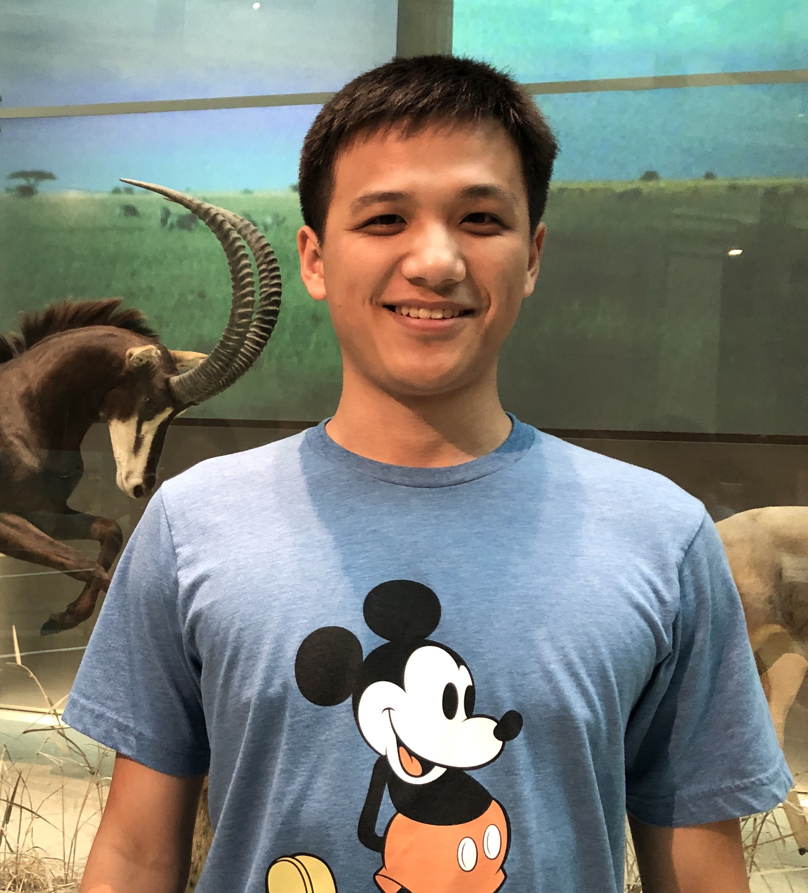

```{r setup, echo=FALSE, message=FALSE, warning=FALSE}
rm(list=objects()) # start with a clean workspace
source("knitr_setup.R")
```

---

# Teaching Team

## Meet your instructor!

Dr. John Helveston, Assistant Professor in Engineering Management & Systems Engineering

{ width=250 }

Background:

- 2016 PhD in Engineering & Public Policy at Carnegie Mellon University
- 2015 MS in Engineering & Public Policy at Carnegie Mellon University
- 2010 BS in Engineering Science & Mechanics at Virginia Tech

## Meet your tutors!

Yanjie He, Masters student in Data Analytics

{ width=250 }

Lingmei Zhao, Masters student in Statistics

{ width=250 }

## Meet your classmates!

Get to know your neighbor! Choose someone to go first. In [2 minutes](https://www.youtube.com/watch?v=48z7nQaehWI), share:

- Your name
- Your program
- Something notable you did over the summer

Then switch for another two minutes.

Afterwards: let's here from a few of you - tell us something you learned!

---

# The syllabus

Let's go over the [syllabus](syllabus.html) and the course assignments.

---

# Course Mantras

Here are some philosophies that will get you far in data analytic work. We will be revisiting these over and over again.

- Embrace plain text (as opposed to rich text).
- Everything you do should be reproducible.

**Example**: RMarkdown -> HTML. This webpage was generated from [this markdown source file](https://raw.githubusercontent.com/emse6574-gwu/2019-Fall/master/L1.1-course-introduction.Rmd) on GitHub.

If you want to generate the HTML page, download the `.Rmd` file and run the following code in R:

```{r eval=FALSE}
rmarkdown::render('L1.1-course-introduction.Rmd')
```

---

# Communication & Help

All course communication will be managed through [Slack](https://6574-s11-f19.slack.com/) - Sign up [**HERE**](https://join.slack.com/t/6574-s11-f19/shared_invite/enQtNzIxNzQ2OTU1MjAwLWZiYjFlOTlhMjAxNDEwMjQ0MDcwYmMxOTAyZGVhNWM4YzFhY2U2ZDIyYzMxZGQwYjMxNDBiYzMzNWRmZmQxMDY)

**Please don't email the instructors** - just use Slack.

> [Watch this 2-minute video for a quick summary of Slack](https://youtu.be/9RJZMSsH7-g)

**You can use Slack to**:

- Ask questions.
- Ask for help with an assignment.
- Send direct, private messages to each other or the instructors (just like email...but better!)

**Asking for help on Slack**:

Slack can be used to ask quick questions and receive quick responses without attending office hours in person. This also enables other students to see answers to common questions. Questions should be specific and include all needed information. For example, if your code has an error you don't understand, **include the code and the error message** in your question.

**Other Help Resources**:

- **Office Hours**: Office hours let you ask questions to TAs and professors directly, and can help you understand concepts and debug programs that you're struggling with alone.
- **Library Services**: While the University Library is not a stand in for TAs, you can schedule a consultation for general help with Coding, Programming, Data, Statistical, and GIS. See more at https://academiccommons.gwu.edu/writing-research-help
