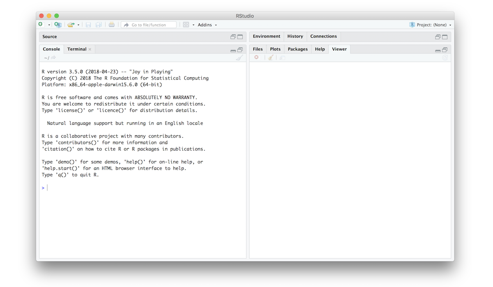
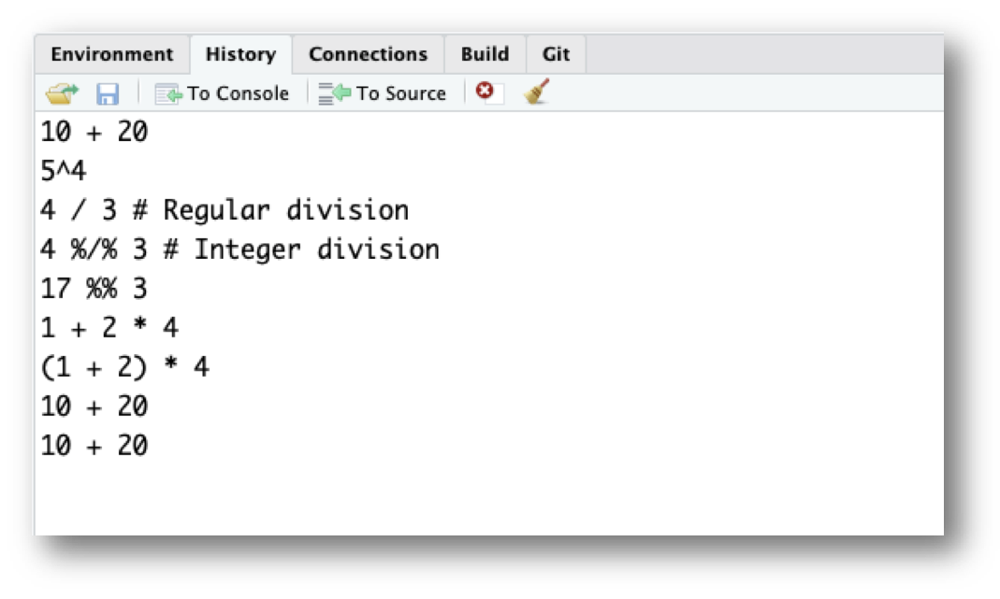
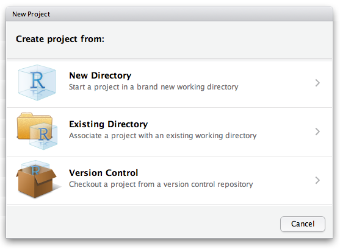

```{r setup, echo=FALSE, message=FALSE, warning=FALSE}
rm(list=objects()) # start with a clean workspace
source("knitr_setup.R")
```

---

# R and RStudio

## What's the difference?

R is a programming language that runs computations while RStudio is an *integrated development environment (IDE)* - an interface for working in R with many convenient features and tools.

You can think of the two like this:

* R is like a car's _engine_.
* RStudio is like a car's _dashboard_.

R: Engine            |  RStudio: Dashboard
:-------------------------:|:-------------------------:
{ width=200 }  |  { width=250 }

Your car needs an engine (R) to run, but having a speedometer and rear view mirrors (RStudio) makes driving a lot easier.

## Installing R and RStudio

You will first need to download and install both R and RStudio (Desktop version) on your computer.

1. [Download and install R](https://cloud.r-project.org).
2. [Download and install RStudio (Desktop version)](https://www.rstudio.com/products/rstudio/download/preview/).

## Using R via RStudio

After you install R and RStudio on your computer, you'll have two new applications you can open. **We will always work in RStudio**. In other words:

<div class="tableMedium">
R: Do not open this          |  RStudio: Open this
:-------------------------:|:-------------------------:
{ width=50 }  |  { width=50 }
</div>

After you open RStudio, you should see the following:



Notice the default panes:

  * Console (entire left)
  * Environment/History (tabbed in upper right)
  * Files/Plots/Packages/Help (tabbed in lower right)

FYI: you can change the default location of the panes, among many other things: [Customizing RStudio](https://support.rstudio.com/hc/en-us/articles/200549016-Customizing-RStudio).

Go into the Console on the left with the `>` (that's the *command prompt*), and let's get started!

---

# R as a calculator

At its core, R is a calculator. You can use arithmetic, relational, and logical operators to evaluate a wide variety of computations.

## Arithmetic operators

R can handle simple arithmetic using the following arithmetic operators:

- Addition: `+`
- Subtraction: `-`
- Multiplication: `*`
- Division: `/`
- Powers: `^`
- Integer division: `%/%`
- Modulus: `%%`

The first four basic operators (`+`, `-`, `*`, `/`) are pretty straightforward and behave as expected:

```{r}
7 + 5 # Addition
7 - 5 # Subtraction
7 * 5 # Multiplication
7 / 5 # Division
```

Not a lot of surprises (you can ignore the `[1]` you see in the returned values...that's just R saying there's only one value to return). The other three arithmetic operators (`^`, `%/%`, `%%`) are a little more subtle, so let's examine them more closely.

**Powers**:

Powers (i.e. $x^n$) are represented using the `^` symbol. For example, to calculate $5^4$ in R, we would type:

```{r}
5^4
```

**Integer division**:

Integer division is division in which the remainder is discarded. Note the difference between regular (`/`) and integer (`%/%`) division:

```{r}
4 / 3 # Regular division
```

```{r}
4 %/% 3 # Integer division
```

With integer division, 3 can only go into 4 once, so `4 %/% 3` returns `1`. If you try to integer divide a number by a larger number, you'll get `0`:

```{r}
4 %/% 5 # Will return 0
```

**Modulus operator**:

The **modulus** (aka "mod" operator) returns the remainder after doing integer division. For example:

```{r}
17 %% 3
```

This returns `2` because because 17 / 3 is equal to 5 with a remainder of 2. The modulus returns any remainder, including decimals:

```{r}
3.1415 %% 3
```

If you mod a number by itself, you'll get `0` (because there's no remainder):

```{r}
17 %% 17 # Will return 0
```

Finally, if you mod a number by a larger number, you'll get the smaller number back since it's the remainder:

```{r}
17 %% 20 # Will return 17
```

## Relational operators

R assesses whether a comparison of two values is `TRUE` or `FALSE` using the following relational operators:

- Less than: `<`
- Less than or equal to : `<=`
- Greater than or equal to: `>=`
- Greater than: `>`
- Equal: `==`
- Not equal: `!=`

The *less than* operator `<` can be used to test whether one number is smaller than another number:

```{r}
2 < 5
```

If the two values are equal, the `<` operator will return `FALSE`, while the `<=` operator will return `TRUE`: :

```{r}
2 < 2
2 <= 2
```

The "greater than" (`>`) and "greater than or equal to" (`>=`) operators work the same way but in reverse:

```{r}
2 > 5
2 > 2
2 >= 2
```

To assess whether two values are equal, we have to use a double equal sign (`==`):

```{r}
(2 + 2) == 4
(2 + 2) == 5
```

To assess whether two values are _not_ equal, we have to use an exclamation point sign with an equal sign (`!=`):

```{r}
(2 + 2) != 4
(2 + 2) != 5
```

It's worth noting that you can also apply equality operations to strings. R understands that a `"penguin"` is a `"penguin"` so you get this:

```{r}
"penguin" == "penguin"
```

However, R is very particular about what counts as equality. For two pieces of text to be equal, they must be _precisely_ the same:

```{r, results='hold'}
"penguin" == "PENGUIN"        # Returns FALSE
"penguin" == "p e n g u i n"  # Returns FALSE
"penguin" == "penguin "       # Returns FALSE
```

## Logical operators

R assesses logical statements using the following logical operators:

- And: `&`
- Or: `|`
- Not: `!`

**And**:

A logical expression `x & y` is `TRUE` only if *both* `x` and `y` are `TRUE`.

```{r}
(2 == 2) & (2 == 3)
```
```{r}
(2 == 2) & (3 == 3)
```

**Or**:

A logical expression `x | y` is `TRUE` if *either* `x` or `y` are `TRUE`.

```{r}
(2 == 2) | (2 == 3)
```

**Not**:

The `!` operator behaves like the word *"not"* in everyday language. If a statement is "not true", then it must be "false". For example:

```{r}
!TRUE
```

In practice, it is often helpful to include parentheses to clarify the statement being made. Consider the following example:

```{r}
!3 == 5
```

This returns `TRUE`, but it's a bit confusing. Reading from left to right, you start by saying "not 3"...what does that mean?

What is really going on here is R first evaluates whether 3 is equal to 5 (`3 == 5`), and then returns the "not" (`!`) of that. A better version of the same thing would be:

```{r}
!(3 == 5)
```

## Order of operations

R follows the typical BEDMAS order of operations. That is, you first calculate things inside **B**rackets, then calculate **E**xponents, then **D**ivision and **M**ultiplication, then **A**ddition and **S**ubtraction. For a more precise statement, see the [operator precedence](http://stat.ethz.ch/R-manual/R-devel/library/base/html/Syntax.html) for R. For example, if I type:

```{r}
1 + 2 * 4
```

R first computes `2 * 4` and then adds `1`. If what you actually wanted was for R to first add `2` to `1`, then you should have added parentheses around `1` and `2`:

```{r}
(1 + 2) * 4
```

A helpful rule of thumb to remember is that **brackets always come first**. So, if you're ever unsure about what order R will do things in, an easy solution is to enclose the thing you want it to do first in brackets.

## R ignores excess spacing

When I typed `10 + 20` before, I could equally have done this

```{r}
10        + 20
```

or this

```{r}
            10   + 20
```

and get exactly the same answer.

## Using comments

In R, the `#` symbol is a special symbol that denotes a comment. R will ignore anything on the same line that follows the `#` symbol. This enables us to write comments around our code to explain what we're doing:

```{r}
2 + 2 # This is a comment explaining that I'm adding two numbers
```

Notice that R ignores the whole sentence after the `#` symbol.

---

# Staying organized

## The history pane

R keeps track of your “command history”. If you hit the up key, the R console will show you the most recent command that you've typed. Hit it again, and it will show you the command before that.

The second way to get access to your command history is to look at the history panel in Rstudio. On the upper right hand side of the Rstudio window you'll see a tab labelled “History”. Click on that, and you'll see a list of all your recent commands displayed in that panel. It should look something like this:

<center>
{ width=400 }
</center>

If you double click on one of the commands, it will be copied to the R console.

## Working directory

Any process running on your computer has a notion of its "working directory". In R, this is where R will look for files you ask it to load. It's also where any files you write to disk will go.

You can explicitly check your working directory with:

```{r eval = FALSE}
getwd()
```

It is also displayed at the top of the RStudio console.

As a beginning R user, it's OK let your home directory or any other weird directory on your computer be R's working directory. _Very soon_, I urge you to evolve to the next level, where you organize your analytical projects into directories and, when working on project A, set R's working directory to the associated directory.

__Although I do not recommend it__, in case you're curious, you can set R's working directory at the command line like so:

```{r eval = FALSE}
setwd("~/myCoolProject")
```

__Although I do not recommend it__, you can also use RStudio's Files pane to navigate to a directory and then set it as working directory from the menu:

> Session > Set Working Directory > To Files Pane Location.

You'll see even more options there). Or within the Files pane, choose __More__ and __Set As Working Directory__.

But there's a better way. A way that also puts you on the path to managing your R work like an expert.

## RStudio projects

Keeping all the files associated with a project organized together -- input data, R scripts, analytical results, figures -- is such a wise and common practice that RStudio has built-in support for this via its _projects_.

[Using Projects](https://support.rstudio.com/hc/en-us/articles/200526207-Using-Projects)

Let's make one for practice. Do this:

> File > New Project ....

You should see the following pane:

<center>
{ width=400 }
</center>

Choose "New Directory". The directory name you choose here will be the project name. Call it whatever you want. RStudio will create a folder with that name to put all your project files.

As a demo, I created a project on my Desktop called "demo". RStudio created a new project called "demo", and in this folder there is a file called "demo.Rproj". If I double-click on this file, RStudio will open up, and my working directory will be automatically set to this folder! You can double check this by typing:

```{r eval = FALSE}
getwd()
```

## Save your code in .R Files

It is traditional to save R scripts with a `.R` or `.r` suffix. Any code you wish to re-run again later should be saved in this way and stored within your project folder. For example, if you wanted to re-run all of the code in this tutorial, open a new `.R` file and save it to your R project folder. Do this:

> File > New File > R Script

Copy-paste all of the code we've typed so far into this file:

```{r eval = FALSE}
10 + 20
5^4
4 / 3 # Regular division
4 %/% 3 # Integer division
17 %% 3
3.1415 %% 3
1 + 2 * 4
(1 + 2) * 4
10        + 20
10   + 20
2 + 2 # This is a comment explaining that I'm adding two numbers
getwd()
```

Then save this new R script with some name. Do this:

> File > Save

I called the file "tutorial.R" and saved it in my R project folder called "demo".

Now when I open the "demo.Rproj" file, I see in my files pane the "tutorial.R" code script. I can click on that file and continue editing it!

I can also run any line in the script by typing "Command + Enter" (Mac) or "Control + Enter" (Windows).

---

# Tips

## "Chopping" up numbers with `%%` and `%/%` of 10s

When you use the mod operator (`%%`) on a positive number **with factors of 10**, it "chops" a number at a particular digit and returns everything to the _right_. For example:
```{r}

123456 %% 1 # Chops to the right of the ones digit
123456 %% 10 # Chops to the right of the tens digit
123456 %% 100 # Chops to the right of the hundreds digit
```

Integer division (`%/%`) does the opposite - it returns everything to the _left_ of the "chop" point. For example:

```{r}
123456 %/% 1 # "Chops to the right of the ones digit
123456 %/% 10 # "Chops to the right of the tens digit
123456 %/% 100 # "Chops to the right of the hundreds digit
```

This works with non-integers too:

```{r}
3.1415 %% 1
3.1415 %/% 1
```

But **be careful** - this "trick" only works with _positive_ numbers:

```{r}
-123.456 %% 10
-123.456 %/% 10
```

Here's some mental notes to remember how this works:

- `%%` returns everything to the _right_ (`<chop> ->`)
- `%/%` returns everything to the _left_ (`<- <chop>`)
- The "chop" point is always just to the _right_ of the chopping digit:

<div class="tableMedium">
Example         | "Chop" point | "Chop" point description
----------------|--------------|----------------------------
`1234 %% 1`     | `1234 | `    | Right of the `1`'s digit
`1234 %% 10`    | `123 | 4`    | Right of the `10`'s digit
`1234 %% 100`   | `12 | 34`    | Right of the `100`'s digit
`1234 %% 1000`  | `1 | 234`    | Right of the `1,000`'s digit
`1234 %% 10000` | ` | 1234`    | Right of the `10,000`'s digit
</div>

## Odds and evens with `%%`

You can tell if an integer is even or odd by using mod `2`. If you get `0`, it's even; if you `1`, it's odd:

```{r}
10 %% 2 # Even
11 %% 2 # Odd
12 %% 2 # Even
13 %% 2 # Odd
```

---

**Page sources**:

Some content on this page has been modified from other courses, including:

- Danielle Navarro's website ["R for Psychological Science"](https://psyr.org/index.html)
- Jenny Bryan's [STAT 545 Course](http://stat545.com/)
- [Modern Dive](https://moderndive.netlify.com/), by Chester Ismay & Albert Y. Kim
