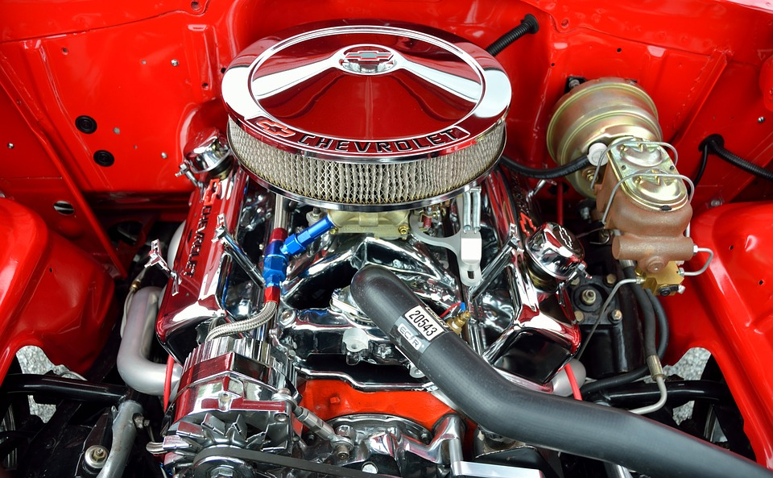

```{r setup, include=FALSE}
library(knitr)
knitr::opts_chunk$set(echo = TRUE)
```

<!--
https://psyr.org/getting-started.html
- Installing
- R commands
- Operations
- Functions
- RStudio helps

http://stat545.com/block002_hello-r-workspace-wd-project.html
- Assignments & objects
- Working Directories & Projects
-->


# R and RStudio

## What's the difference?

R is a programming language that runs computations while RStudio is an *integrated development environment (IDE)* - an interface for working in R with many convenient features and tools.

You can think of the two like this:

* R is like a car's _engine_.
* RStudio is like a car's _dashboard_.

R: Engine            |  RStudio: Dashboard
:-------------------------:|:-------------------------:
{ width=200 }  |  { width=250 }

Your car needs an engine (R) to run, but having a speedometer and rear view mirrors (RStudio) makes driving a lot easier.

## Installing R and RStudio

You will first need to download and install both R and RStudio (Desktop version) on your computer.

1. [Download and install R](https://cloud.r-project.org).
2. [Download and install RStudio](https://www.rstudio.com/products/rstudio/download/preview/).

## Using R via RStudio

After you install R and RStudio on your computer, you'll have two new applications you can open. **We will always work in RStudio**. In other words:

R: Do not open this          |  RStudio: Open this
:-------------------------:|:-------------------------:
{ width=50 }  |  { width=50 }

After you open RStudio, you should see the following:


Note the three panes, which are three panels dividing the screen: The *Console pane*, the *Files pane*, and the *Environment pane*.

