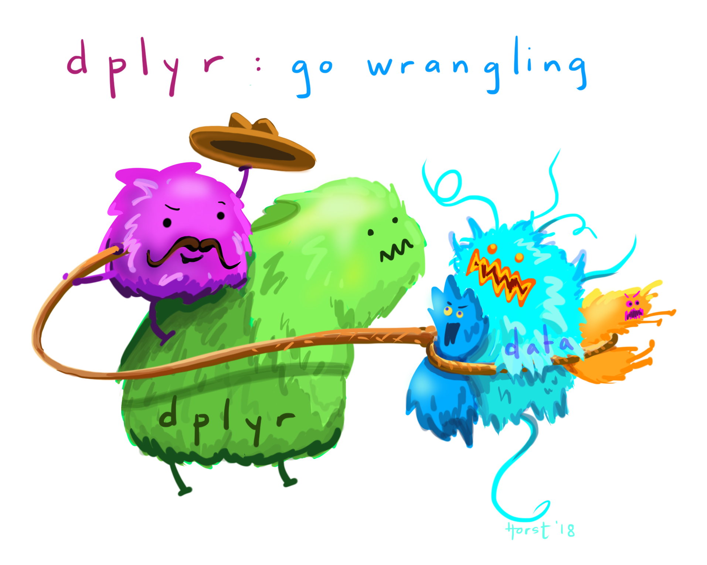

```{r setup, echo=FALSE, message=FALSE, warning=FALSE}
rm(list=objects()) # start with a clean workspace
source("knitr_setup.R")
```

> ### Learning Objectives
>
> * Describe the purpose of the `dplyr` package.
> * Select certain _columns_ in a data frame with the `select` function.
> * Select certain _rows_ in a data frame according to filtering conditions with the `filter` function.
> * Link the output of one `dplyr` function to the input of another function with the "pipe" operator `%>%`.
> * Add new columns to a data frame that are functions of existing columns with the `mutate` function.
> * Sort data frames using the `arrange()` function.
> * Use the split-apply-combine concept for data analysis.
> * Use `summarize`, `group_by`, and `count` to split a data frame into groups of observations, apply summary statistics for each group, and then combine the results.
> * Export a data frame to a .csv file.
>
> ### Suggested Readings
>
> * [Chapter 5](https://r4ds.had.co.nz/transform.html) of "R for Data Science", by Garrett Grolemund and Hadley Wickham
> * [`dplyr` cheatsheet](https://resources.rstudio.com/the-essentials-of-data-science/data-transformation)

---

# R Setup

Before we get started, let's set up our analysis environment:

1) Open up your "data-analysis-tutorial" R Project that you created in the last lesson - if you didn't do this, [go back and do it now](L10-data-analysis-1-data-frames.html#41_r_setup).
2) Create a new `.R` file (File > New File > R Script), and save it as "`data_wrangling.R`" inside your "data-analysis-tutorial" R Project folder.
3) Use the `download.file()` function to download the `wildlife_impacts.csv` dataset, and save it in the `data` folder in your R Project:

```{r, eval=FALSE}
download.file(
    url = "https://github.com/emse6574-gwu/2019-Fall/raw/gh-pages/data/wildlife_impacts.csv",
    destfile = file.path('data', 'wildlife_impacts.csv')
)
```

For this lesson, we are going to use the [FAA Wildlife Strike Database](https://wildlife.faa.gov/), which contains records of reported wildlife strikes with aircraft since 1990. Since aircraft-wildlife impacts are voluntarily reported, the database only contains information from airlines, airports, pilots, and other sources and does not represent all strikes. Each row in the dataset holds information for a single strike event with the following columns:

Variable              |Class     |Description
----------------|----------|----------------------------------------
incident_date         | date     | Date of incident
state                 |character | State
airport_id            |character | ICAO Airport ID
airport               |character | Airport Name
operator              |character | Operator/Airline
atype                 |character | Airline type
type_eng              |character | Engine type
species_id            |character | Species ID
species               |character | Species
damage                |character | Damage: N None M Minor, M Uncertain, S Substantial, D Destroyed
num_engs              |character | Number of engines
incident_month        |double    | Incident month
incident_year         |double    | Incident year
time_of_day           |character |  Incident Time of day
time                  |double    | Incident time
height                |double    | Plane height at impact (feet)
speed                 |double    | Plane speed at impact (knots)
phase_of_flt          |character | Phase of flight at impact
sky                   |character | Sky condition
precip                |character | Precipitation
cost_repairs_infl_adj |double    | Cost of repairs adjusted for inflation

Let's load our libraries and read in the data:

```{r, message=FALSE}
library(readr)
library(dplyr)
df <- read_csv(file.path('data', 'wildlife_impacts.csv'))
```

Just like in the last lesson, a good starting point when working with a new dataset is to view some quick summaries. Here's another summary function (`glimpse()`) that is similar to `str()`:

```{r}
glimpse(df)
```

Wow, there have been 56,978 reported wildlife strikes over the 29 period from 1990 to 2019! On a daily average that comes out to:

```{r}
nrow(df) / (2019 - 1990) / 365
```

...over 5 strikes per day!

# Data wrangling with `dplyr`

{ width=500 }
[[Art by Allison Horst]](https://github.com/allisonhorst)

"Data Wrangling" refers to the art of getting your data into R in a useful form for visualization and modeling. Wrangling is the first step in the general data science process:

<center>

</center>

## What is `dplyr`

As we saw in the last section, we can use brackets (`[]`) to access elements of a data frame. While this is handy, it can be cumbersome and difficult to read, especially for complicated operations.

**Enter `dplyr`**

The `dplyr` package was designed to make tabular data wrangling easier to perform and read. It pairs nicely with other libraries, such as **`ggplot2`** for visualizing data (which we'll cover next week). Together, `dplyr`, `ggplot2`, and a handful of other packages make up what is known as the ["Tidyverse"](https://www.tidyverse.org/) - an opinionated collection of R packages designed for data science. You can load all of the tidyverse packages at once using the `library(tidyverse)` command, but for now we're just going to install and use each package one at a time - starting with `dplyr`:

```{r, eval=FALSE}
install.packages("dplyr")
```

In this lesson, we are going to learn some of the most common `dplyr` functions:

- `select()`: subset columns
- `filter()`: subset rows on conditions
- `mutate()`: create new columns by using information from other columns
- `arrange()`: sort results
- `group_by()`: group data to perform grouped operations
- `summarize()`: create summary statistics (usually on grouped data)
- `count()`: count discrete rows

## Select columns with `select()`

{ width=500 }

To select specific columns, use `select()`. The first argument
to this function is the data frame (`df`), and the subsequent
arguments are the columns to keep:

```{r}
# Select only a few columns
select(df, state, damage, time_of_day)
```

To select all columns *except* certain ones, put a `-` sign in front of
the variable to exclude it:

```{r}
select(df, -state, -damage, -time_of_day)
```

Some additional options to select columns based on a specific criteria include:

1) `ends_with()` = Select columns that end with a character string
2) `contains()` = Select columns that contain a character string
3) `matches()` = Select columns that match a regular expression
4) `one_of()` = Select column names that are from a group of names

## Select rows with `filter()`

{ width=500 }

Filter the rows for wildlife impacts that occurred in DC:

```{r}
filter(df, state == 'DC')
```

Filter the rows for wildlife impacts that cost more than $1 million in damages:

```{r}
filter(df, cost_repairs_infl_adj > 10^6)
```

## Sequence operations with pipes (`%>%`)

{ width=200 } (logo is a reference to [The Treachery of Images](https://en.wikipedia.org/wiki/The_Treachery_of_Images))

What if you want to select and filter at the same time? Well, one way to do this is to use intermediate steps. To do this, you first create a temporary data frame and then use that as input to the next function, like this:

```{r}
dc_impacts <- filter(df, state == 'DC')
dc_impacts_airlineTime <- select(dc_impacts, operator, time, time_of_day)
head(dc_impacts_airlineTime)
```

This works, but it can also clutter up your workspace with lots of objects with different names.

Another approach is to use **pipes**, which is a more recent addition to R. Pipes let you take the output of one function and send it directly to the next, which is useful when you need to do many things to the same dataset.

The pipe operator is `%>%` and comes from the [`magrittr`](https://github.com/tidyverse/magrittr) package, which is installed automatically with `dplyr`. If you use RStudio, you can type the pipe with <kbd>Ctrl</kbd> + <kbd>Shift</kbd> + <kbd>M</kbd> if you have a PC or <kbd>Cmd</kbd> + <kbd>Shift</kbd> + <kbd>M</kbd> if you have a Mac. Here's the same thing as the previous example but with pipes:

```{r}
df %>%
    filter(state == 'DC') %>%
    select(operator, time, time_of_day) %>%
    head()
```

In the above code, we use the pipe to send the `df` data frame first through
`filter()` to keep only rows from DC, and then through `select()` to keep only the columns `operator`, `time`, and `time_of_day`.

Since `%>%` takes the object on its left and passes it as the first argument to the function on its right, we don't need to explicitly include the data frame as an argument to the `filter()` and `select()` functions.

Consider reading the `%>%` operator as the words "...and then...". For instance, in the above example I would read the code as "First, filter to only data from DC, **and then** select the columns `operator`, `time`, and `time_of_day`, **and then** show the first 6 rows."

Here's another analogy:

**Without Pipes**:
```{r, eval=FALSE}
leave_house(get_dressed(get_out_of_bed(wake_up(me))))
```

**With Pipes**:
```{r, eval=FALSE}
me %>%
    wake_up %>%
    get_out_of_bed %>%
    get_dressed %>%
    leave_house
```

In the above example, adding pipes makes the flow of operations easier to read from left to right, with the `%>%` operator reading as "...and then..."

If you want to create a new object with the output of a "pipeline", you just put the object name at the start of the first pipe:

```{r}
dc_impacts <- df %>%
    filter(state == 'DC') %>%
    select(operator, time, time_of_day)
head(dc_impacts)
```

## Sort rows with `arrange()`

Use the `arrange()` function to sort a data frame by a column. For example, if you wanted to view the least expensive accidents, you could arrange the data frame by the variable `cost_repairs_infl_adj`:

```{r}
# Arrange by least expensive accident
df %>%
    arrange(cost_repairs_infl_adj)
```

To sort in descending order, add the `desc()` function inside the `arrange()` function. For example, here are the _most_ expensive accidents:

```{r}
# Arrange by most expensive accident
df %>%
    arrange(desc(cost_repairs_infl_adj))
```

## Create new variables with `mutate()`

{ width=500 }

You will often need to create new columns based on the values in existing
columns. For this use `mutate()`. For example, let's create a new variable converting the `height` variable from feet to miles:

```{r}
df %>%
    mutate(height_miles = height / 5280) %>%
    select(height, height_miles)
```

You can also create a second new column based on the first new column within the same call of `mutate()`:

```{r}
df %>%
    mutate(height_miles = height / 5280,
           height_half_miles = height_miles / 2) %>%
    select(height, height_miles, height_half_miles)
```

You'll notice that the variables created have a lot of `NA`s - that's because there are missing data. If you wanted to remove those, you could insert a `filter()` in the pipe chain:

```{r}
df %>%
    filter(!is.na(height)) %>%
    mutate(height_miles = height / 5280) %>%
    select(height, height_miles)
```

`is.na()` is a function that determines whether something is an `NA`. The `!`
symbol negates the result, so we're asking for every row where weight *is not* an `NA`.

# Split-apply-combine

Many data analysis tasks can be approached using the *split-apply-combine*
paradigm:

1) Split the data into groups
2) Apply some analysis to each group
3) Combine the results.

`dplyr` makes this very easy through the use of the `group_by()` function.

## The `group_by()` function

{ width=500 }

The `group_by()` function enables you to perform operations across groups within the data frame. It is typically used by inserting it in the "pipeline" before the desired group operation. For example, if we wanted to add a a new column that computed the mean height of reported wildlife impacts for each state, we could insert `group_by(state)` in the pipeline:

```{r}
df %>%
    filter(!is.na(height)) %>%
    group_by(state) %>%          # Here we're grouping by state
    mutate(mean_height = mean(height)) %>%
    select(state, mean_height)
```

You'll see that the same value for `mean_height` is reported for the same states (e.g. the mean height in Florida is 892 ft).

## The `summarize()` function

{ width=500 }

The `group_by()` function is often used together with `summarize()`, which collapses each group into a single-row summary of that group. For example, we collapse the result of the previous example by using `summarise()` instead of `mutate()`:

```{r}
df %>%
    filter(!is.na(height)) %>%
    group_by(state) %>%
    summarise(mean_height = mean(height))
```

You can also group by multiple columns - here let's group by state and the airline:

```{r}
df %>%
    filter(!is.na(height)) %>%
    group_by(state, operator) %>%
    summarise(mean_height = mean(height))
```

Notice that in the above examples I've kept the early filter to drop `NA`s. This is important when performing summarizing functions like `mean()` or `sum()`. If `NA`s are present, the result will also be `NA`:

```{r}
df %>%
    group_by(state) %>%
    summarise(mean_height = mean(height))
```

Once the data are grouped, you can also summarize multiple variables at the same time (and not necessarily on the same variable). For instance, you could add two more columns computing the minimum and maximum height:

```{r}
df %>%
    filter(!is.na(height)) %>%
    group_by(state, operator) %>%
    summarise(mean_height = mean(height),
              min_height = min(height),
              max_height = max(height))
```

## Counting

Often times you will want to know the number of observations found for each variable or combination of variables. One way to do this is to use the `group_by()` and `summarise()` functions in combination. For example, here is the number of observations for each aircraft engine type:

```{r}
df %>%
    group_by(type_eng) %>%
    summarise(count = n())
```

Since this is such a common task, `dplyr` provides the `count()` function to do the same thing:

```{r}
df %>%
    count(type_eng)
```

For convenience, `count()` also provides the `sort` argument:

```{r}
df %>%
    count(type_eng, sort = TRUE)
```

You can also count the *combination of variables* by providing more than one column name to `count()`:

```{r}
df %>%
    count(type_eng, num_engs, sort = TRUE)
```

Hmm, looks like most reported wildlife impacts involve planes with 2 D-type engines.

# Exporting data

Now that you have learned how to use `dplyr` to extract information from or summarize your raw data, you may want to export these new data sets. Similar to the `read_csv()` function used for reading CSV files into R, there is a `write_csv()` function that generates CSV files from data frames.

**Important**: Before using `write_csv()`, create a new folder called "data_output" and put it in your R Project folder. In general, you should never write generated datasets in the same directory as your raw data. The "data" folder should only contain the raw, unaltered data, and should be left alone to make sure we don't delete or modify it.

Let's save one of the summary data frames from the earlier examples where we computed the min, mean, and max heights of impacts by each state and airline:

```{r}
heightSummary <- df %>%
    filter(!is.na(height)) %>%
    group_by(state, operator) %>%
    summarise(mean_height = mean(height),
              min_height = min(height),
              max_height = max(height))
```

Save the the new `heightSummary` data frame as a CSV file in your "data_output" folder:

```{r, eval=FALSE}
write_csv(heightSummary, path = file.path('data_output', 'heightSummary.csv')
```

---

# Tips

You will often need to create new variables based on a condition. To do this, you can use the `if_else()` function. Here's the general syntax:

```{r, eval=FALSE}
if_else(<condition>, <if TRUE>, <else>)
```

The first argument is a condition. If the condition is TRUE, then the value given to the second argument will be used; if not, then the third argument value will be used.

Here's an example of creating a variable to determine which months in the wildlife impacts data are in the summer:

```{r, eval=FALSE}
df %>%
    mutate(
        summer_month = if_else(incident_month %in% c(6, 7, 8), TRUE, FALSE))
```

Of course, in this particular case the `if_else()` function isn't even needed because the condition returns `TRUE` and `FALSE` values. However, if you wanted to extend this example to determine all four seasons, you could use a series of nested `if_else()` functions:

```{r, eval=FALSE}
df %>%
    mutate(season =
        if_else(
            incident_month %in% c(3, 4, 5), 'Spring',
        if_else(
            incident_month %in% c(6, 7, 8), 'Summer',
        if_else(
            incident_month %in% c(9, 10, 11), 'Fall', 'Winter'))))
```

Note: The Base R version of this function is `ifelse()`, but I recommend using the `dplyr` version, `if_else()`, as it is a [stricter function](https://stackoverflow.com/questions/50646133/dplyr-if-else-vs-base-r-ifelse).

---

**Page sources**:

Some content on this page has been modified from other courses, including:

- [Data Analysis and Visualization in R for Ecologists](https://datacarpentry.org/R-ecology-lesson/), by François Michonneau & Auriel Fournier. Zenodo: http://doi.org/10.5281/zenodo.3264888
- The amazing illustrations by [Allison Horst](https://github.com/allisonhorst)
