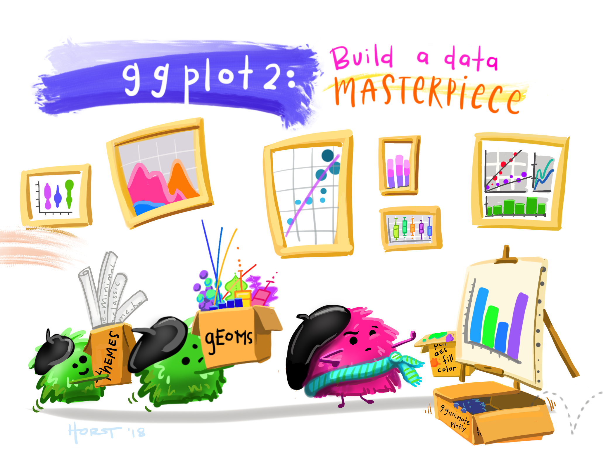
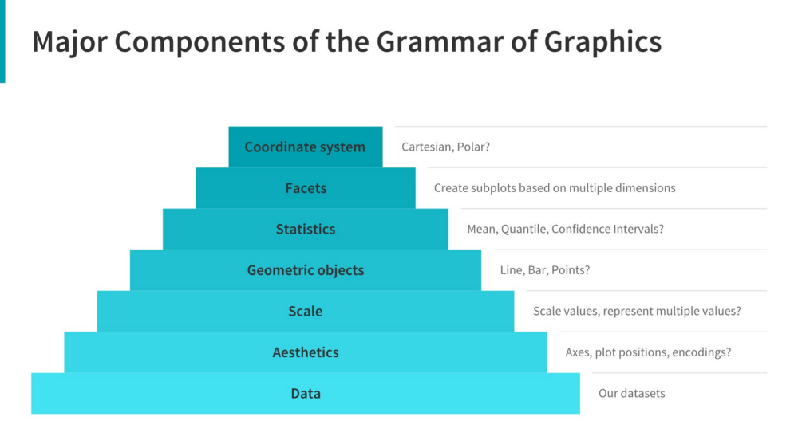
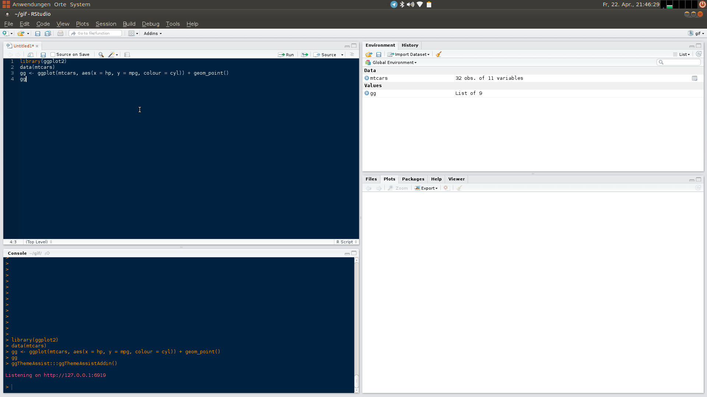

```{r setup, echo=FALSE, message=FALSE, warning=FALSE}
rm(list=objects()) # start with a clean workspace
source("knitr_setup.R")
library(ggplot2)
```

> ### Learning Objectives
>
> * Create simple scatterplots and histograms with Base R graphics.
> * Learn the basic plotting features of the ggplot2 package.
> * Customize the aesthetics of an existing ggplot figure.
> * Create plots from data in a data frame.
> * Export plots from RStudio to standard graphical file formats.
>
> ### Suggested Readings
>
> * The "Introduction" chapter of Rick Scavetta's ["Data Visualization with ggplot2 (Part 1)"](https://www.datacamp.com/courses/data-visualization-with-ggplot2-1) lesson on DataCamp (it's free!).
> * [Chapter 3](https://r4ds.had.co.nz/data-visualisation.html) of "R for Data Science", by Garrett Grolemund and Hadley Wickham
> * [Data Visualization: A practical introduction](http://socviz.co/), by Kieran Healy
> * [The parks where you're most likely to be killed by a bear](https://www.vox.com/2016/10/6/13170344/bear-attacks-national-state-parks) (we'll be using a dataset on bear attacks in N. America for this lesson).

---

> "The purpose of computing is insight, not numbers"
>
> \- [Richard Hamming](https://en.wikipedia.org/wiki/Richard_Hamming)

...and one of the best ways to develop insights from data is to _visualize_ the data. The best starting point I recommend is to go through the "Introduction" chapter of Rick Scavetta's ["Data Visualization with ggplot2 (Part 1)"](https://www.datacamp.com/courses/data-visualization-with-ggplot2-1) lesson on DataCamp. The introduction section is free and contains three 5-minute summary videos along with some practice exercises.

Data visualization will be the primary focus of a follow-on course to this one called "Exploratory Data Analysis". For now, we will explore a few features of R's plotting packages.

# R Setup

Before we get started, let's set up our analysis environment like before:

1) Open up your "data-analysis-tutorial" R Project that you created in the first data analysis lesson - if you didn't do this, [go back and do it now](L10-data-analysis-1-data-frames.html#41_r_setup).
2) Create a new `.R` file (File > New File > R Script), and save it as "`data_viz.R`" inside your "data-analysis-tutorial" R Project folder.
3) This time, instead of downloading the data file and saving it in our `data` folder, let's just read it in directly from the web!

```{r, message=FALSE}
library(readr)
library(dplyr)
df <- read_csv("https://github.com/emse6574-gwu/2019-Fall/raw/gh-pages/data/north_america_bear_killings.csv")
```

For this lesson, we are going to use the [North American Bear Killings](https://data.world/ajsanne/north-america-bear-killings) dataset, which was compiled by [Ali Sanne](https://data.world/ajsanne) from the [Wikipedia page](https://en.wikipedia.org/wiki/List_of_fatal_bear_attacks_in_North_America) on fatal bear attacks in North America. The dataset contains recorded killings by black, brown, or polar bears from 1900 to 2019 in North America. Each row in the dataset holds information for a single incident with the following columns:

Variable      |Class      |Description
--------------|-----------|----------------------------------------
name          | character | Name of victim.
age           | double    | Age of victim.
gender        | character | Gender of victim.
date          | character | Date of incident.
month         | double    | Month of incident.
year          | double    | Year of incident.
wildOrCaptive | character | "Wild" or "Captive" bear.
location      | character | Location of incident.
description   | character | Short description of incident.
bearType      | character | "Black", "Brown", or "Polar"
hunter        | double    | 1 if victim was a hunter, 0 otherwise.
grizzly       | double    | 1 if bear is a Grizzly, 0 otherwise.
hiker         | double    | 1 if victim was a hiker, 0 otherwise.
onlyOneKilled | double    | 1 if only one victim was killed, 0 otherwise.

**Side node**: One thing I learned looking at this data is (kind of like squares and rectangles), all grizzly bears are brown bears, but [not all brown bears are grizzly bears](https://www.nps.gov/katm/learn/photosmultimedia/brown-bear-frequently-asked-questions.htm#2).

To confirm that we've correctly loaded the data frame, let's preview the data:

```{r, message=FALSE}
glimpse(df)
```

Look's good - let's start making some plots!

# Basic plots in R

R has a number of built-in tools for basic graph types. We will only cover two here because they are so common and convenient: scatterplots and histograms.

## Scatterplots with `plot()`

A scatter plot provides a graphical view of the relationship between two variables. Typically these are used for "continuous" variables, like _time_, _age_, _money_, etc...things that are not categorical in nature (as opposed to "discrete" variables, like _nationality_). Here's a scatterplot of the age of the bear killing victims over time:

```{r fig.height=5, fig.width=6, message=FALSE, warning=FALSE}
plot(x = df$year, y = df$age)
```

The basic inputs to the `plot()` function are `x` and `y`, which must be vectors of the same length. You can customize many features (fonts, colors, axes, shape, titles, etc.) through [graphic options](http://www.statmethods.net/advgraphs/parameters.html). Here's the same plot with a few customizations:

```{r fig.height=5, fig.width=6, message=FALSE, warning=FALSE}
plot(x    = df$year,
     y    = df$age,
     col  = 'darkblue', # "col" changes the point color
     pch  = 19, # "pch" changes the point shape
     main = "Age of bear killing victims over time",
     xlab = "Year",
     ylab = "Age")
```

Looks like bear killings are becoming more frequent over time (hmm, why might that be?), though pretty evenly-distributed across age.

## Histograms with `hist()`

The [histogram](https://en.wikipedia.org/wiki/Histogram) is one of the most common ways to visualize the _distribution_ of a variable. The `hist()` function takes just one variable: `x`. Here's a histogram of the `month` variable:

```{r fig.height=5, fig.width=6, message=FALSE, warning=FALSE}
hist(x = df$month)
```

As you might expect, most bear attacks occur during the summer months, when parks get more visitors. As with the `plot()` function, you can customize a lot of the histogram features. One common customization is to modify the number of "bins" in the histogram by changing the `breaks` argument. Here we'll fix the number of bins to `12` - one for each month:

```{r fig.height=5, fig.width=6, message=FALSE, warning=FALSE}
hist(x      = df$month,
     breaks = 12,
     col    = 'darkred',
     main   = "Distribution of bear killings by month",
     xlab   = "Month",
     ylab   = "Count")
```

# Advanced figures with `ggplot2`

{ width=500 }
[[Art by Allison Horst]](https://github.com/allisonhorst)

While Base R plot functions are useful for making simple, quick plots, many R users have adopted the [`ggplot2`](http://docs.ggplot2.org/) package as their primary tool for visualizing data.

## The Grammar of Graphics

The `ggplot2` library is built on the ["Grammar of Graphics"](https://www.springer.com/in/book/9780387245447) concept developed by Leland Wilkinson. A "grammar of graphics" (that's what the "gg" in "ggplot2" stands for) is a framework that uses _layers_ to describe and construct visualizations or graphics in a structured manner. Here's a visual summary of the concept:

<center>
{ width=700 }
</center>

We will start using `ggplot2` by re-creating some of the above plots, but using ggplot functions to get a feel for the syntax. But first, install and load the library:

```{r, eval=FALSE}
install.packages("ggplot2")
library(ggplot2)
```

## A blank slate

The `ggplot()` function is used to initialize the basic graph structure, and then we add layers to it. The basic idea is that you specify different parts of the plot, and add them together using the `+` operator. We will start with a blank plot and will add layers as we go along:

```{r fig.height=4, fig.width=6, message=FALSE, warning=FALSE}
ggplot(data = df)
```

## Geoms and aesthetics

Geometric objects (called "geoms") are the actual marks we put on a plot. You can have an unlimited number of layers, but at a minimum a plot **must have at least one geom**. Examples include:

- `geom_point()` makes a scatter plot by adding a layer of points.
- `geom_line()` adds a layer of lines connecting data points.
- `geom_bar()` adds bars for bar charts and histograms.
- `geom_boxplot()` adds boxes for boxplots.

Each type of geom usually has a **required set of aesthetics** to be set, and usually accepts only a subset of all aesthetics. Aesthetic mappings are set with the `aes()` function. Examples include:

- position (i.e., on the x and y axes)
- color ("outside" color)
- fill ("inside" color)
- shape (of points)
- linetype (solid, dashed, dotted etc.)
- size (of geoms)

## Scatterplots with `geom_point()`

Now that we know what geoms and aesthetics are, let's put them to practice by making a scatterplot. To start, we will add the `geom_point()` geom and we'll set the position for the x- and y-axis inside the `aes()` function:

```{r fig.height=4, fig.width=6, message=FALSE, warning=FALSE}
ggplot(data = df) +
    geom_point(aes(x = year, y = age))
```

Notice how we've "added" the `geom_point()` layer to the previous blank slate. Also note that the names we used to define the `x` and `y` axes are column names in the data frame, `df`. These must be placed _inside_ the `aes()` function, which tells ggplot to look in `df` for those columns.

Let's further customize the plot with a few more layers:

```{r fig.height=4, fig.width=6, message=FALSE, warning=FALSE}
ggplot(data = df) +
    geom_point(aes(x = year, y = age)) +
    # Adjust the plot labels and add a title
    labs(x = "Year",
         y = "Age",
         title = "Age of bear killing victims over time") +
    # Change some of the overall plot looks
    theme_minimal()
```

In the above plot, the `labs()` layer enables you to modify the plot labels and title. The `theme_minimal()` layer changes some global aspects of the plot, such as the background color, grid lines, legend appearance, etc. There are [many themes to choose from](https://ggplot2.tidyverse.org/reference/ggtheme.html), but keeping things simple with `theme_minimal()` often improves the plot from the default theme settings.

## Histograms with `geom_bar()`

Bar charts are great for comparing different values of a numerical variable. By default, the `geom_bar()` layer works just like a histogram in that it plots a count of the variable provided. For example, here is the same histogram as before - the count of the bear attacks for each month in the dataset:

```{r fig.height=5, fig.width=5, message=FALSE, warning=FALSE}
ggplot(data = df) +
    geom_bar(aes(x = month))
```

One useful feature of bar plots is to "fill" the color of the bars by another variable in the data. To do this, add the `fill=` argument in the `aes()` call. For example, here's the same histogram with the bar colors representing the type of bear. I'll also adjust the x-axis so that it labels the 12 months, and I'll adjust the theme and labels:

```{r fig.height=5, fig.width=6, message=FALSE, warning=FALSE}
ggplot(data = df) +
    geom_bar(aes(x = month, fill = bearType)) +
    # Customize the x-axis scale
    scale_x_continuous(breaks=seq(12)) +
    # Adjust the plot labels and add a title
    labs(x = "Month",
         y = "Count",
         fill = 'Bear Type',
         title = "Distribution of bear killings by month") +
    # Change some of the overall plot looks
    theme_minimal()
```

Hmm, looks like brown bears are the most frequent killers, though black bears are a close second.

## Bar charts with `geom_bar()`

You can also use `geom_bar()` to create a bar chart (as opposed to a histogram). Whereas histograms report the _count_ of one variable (`x`), bar charts also have a `y` variable that determine the height of bars. To make a bar chart, you have to tell `geom_bar()` to use the actual `y` values in the `aes()` call by adding the `stat="identity"` argument in `geom_bar()`, otherwise it will use the default statistic (which is `stat="count"` to make a histogram).

For example, here is a bar chart of the number of bear killings in each year - notice how we first create a new summary data framed called `annualKillings` from the original `df`:

```{r fig.height=4, fig.width=7, message=FALSE, warning=FALSE}
annualKillings <- df %>% count(year)
ggplot(data = annualKillings) +
    # Notice the addition of the "stat = 'identity'" argument in geom_bar()
    geom_bar(aes(x = year, y = n), stat = 'identity') +
    labs(x     = "Year",
         y     = 'Number of killings',
         title = "Annual number of deadly bear attacks over time") +
    theme_minimal()
```

Just like with histograms, you can "fill" the color of the bars with another variable. Let's see how the number of incidents vary by the gender of the victim. Notice again how we first use the `count()` function to compute the number of killings by gender:

```{r fig.height=4, fig.width=8, message=FALSE, warning=FALSE}
annualKillingsByGender <- df %>%
    filter(! is.na(gender)) %>%
    count(year, gender)
ggplot(data = annualKillingsByGender) +
    # Notice the addition of the "fill = gender" argument in aes()
    geom_bar(aes(x = year, y = n, fill = gender), stat = 'identity') +
    labs(x     = "Year",
         y     = 'Number of killings',
         fill = "Victim gender",
         title = "Annual deadly bear attacks over time and victim gender") +
    theme_minimal()
```

# Customizing your ggplot

While the `ggplot2` library offers a wide variety of options for customizing your plots, remembering exactly how to do specific tasks (like changing the color of a line, or changing the position of a legend) can be difficult. Fortunately, there are wonderful resources for looking up all the tricks to make the perfect ggplot. Here are a few:

- [RStudio `ggplot2` Cheatsheet](https://www.rstudio.com/wp-content/uploads/2015/03/ggplot2-cheatsheet.pdf)
- [Tidyverse `ggplot2` reference guide](https://ggplot2.tidyverse.org/reference/)
- [R Cookbook for `ggplot2`](http://www.cookbook-r.com/Graphs/)
- [Top 50 `ggplot2` visualizations](http://r-statistics.co/Top50-Ggplot2-Visualizations-MasterList-R-Code.html)

One particularly useful tool is the [**ggThemeAssist**](https://github.com/calligross/ggthemeassist) package, which is an RStudio plug in that creates a graphic interface for editing ggplots. You can install it from CRAN:

```{r, eval=FALSE}
install.packages("ggThemeAssist")
```

After installing, the tool is available in the "Addins" menu within RStudio. To edit your ggplot, just highlight a ggplot object in your current script and run the "Addin" from the Addins menu. Use the input widgets to get your ideas into shape. After terminating **ggThemeAssist**, a character string containing your desired changes in standard `ggplot2` notation is inserted in your script. Re-running your script now produces the plot you just configured using **ggThemeAssist**!

[Click to enlarge](images/ggThemeAssist2.gif){ target="_blank"}



# Saving figures

The first (and easiest) is to export directly from the RStudio 'Plots' panel, by clicking on `Export` when the image is plotted. This will give you the option of `.png` or `.pdf` and selecting the directory to which you wish to save it to. I strongly recommend you save images as `.pdf` types as these won't pixelate when you change the image size.

Another easy way to save a ggplot figure is to use the `ggsave()` function. First, create your plot and save it as an object:

```{r, eval=FALSE}
scatterPlot <- ggplot(data = df) +
    geom_point(aes(x = year, y = age))
```

Then save the plot using `ggsave()` (make sure you create a folder called "plots" in which to save your plot):

```{r, eval=FALSE}
ggsave(filename = file.path('data', 'scatterPlot.pdf'),
       plot   = scatterPlot,
       width  = 6,
       height = 4)
```

---

**Page sources**:

Some content on this page has been modified from other courses, including:

- [Data Analysis and Visualization in R _alpha_](https://datacarpentry.org/R-genomics/index.html), by Data Carpentry contributors.


