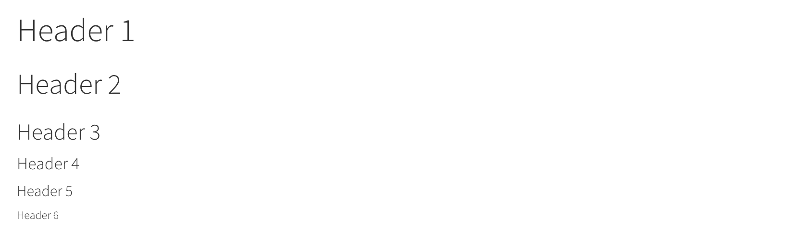

```{r setup, echo=FALSE, message=FALSE, warning=FALSE}
rm(list=objects()) # start with a clean workspace
source("knitr_setup.R")
```

> ### Learning Objectives
>
> * Be able to manage computational projects for reproducibility, reuse, and collaboration.
> * Use R tools and conventions to document code and analyses and produce reproducible reports.
> * Be able to publish, share materials, and collaborate through the web.
> * Understand why this all matters!
>
> ### Suggested Readings
>
> * [R Markdown: The Definitive Guide](https://bookdown.org/yihui/rmarkdown/), by Yihui Xie, J. J. Allaire, and Garrett Grolemund
> * [RMarkdown Cheatsheet](https://www.rstudio.com/wp-content/uploads/2015/02/rmarkdown-cheatsheet.pdf)

---

# Literate programming

Literate programming is a paradigm first introduced by [Donald E. Knuth](https://en.wikipedia.org/wiki/Donald_Knuth). The idea is simple:

> Treat programs as a literature understandable to **human beings**

The goal is to integrate data analysis (executable code) with textual documentation, linking data, code, and text together in one document. Literate programming can be directly linked to the concept of [**reproducibility**](https://en.wikipedia.org/wiki/Reproducibility). Basically, for someone to make a legitimate scientific claim, they should at minimum be able to fully reproduce their results from their raw data (and preferrably others should be able to reproduce them as well).

This leads to the idea of having a **reproducible workflow** - from raw data to published results.

> Enter RMarkdown

[RMarkdown](https://rmarkdown.rstudio.com/) integrates a **documentantion** language ([markdown](https://en.wikipedia.org/wiki/Markdown)) with a **programming** language (`R`). This enables authors to craft interactive documents of data, analysis, and results that are easily shareable, particularly through the web.

---

# Rmarkdown overview

Watch this 1-min video to get a quick sense of what RMarkdown is:

<iframe src="https://player.vimeo.com/video/178485416?color=428bca&title=0&byline=0&portrait=0" width="640" height="400" frameborder="0" webkitallowfullscreen mozallowfullscreen allowfullscreen></iframe>
<p><a href="https://vimeo.com/178485416">What is R Markdown?</a> from <a href="https://vimeo.com/rstudioinc">RStudio, Inc.</a> on <a href="https://vimeo.com">Vimeo</a>.</p>

...and watch this 1.5 min video to witness the horrors of not using a reproducible workflow:

<iframe width="640" height="400" src="https://www.youtube.com/embed/s3JldKoA0zw" frameborder="0" allowfullscreen></iframe>

---

# Elements of RMarkdown

{ width=500 }
[[Art by Allison Horst]](https://github.com/allisonhorst)

## Markdown

Markdown is a simple, plain text language for converting raw text to HTML for the web (and other outputs, like pdfs). Some of its attributes include:

- It has a very small syntax (html links, tables, images, headers, italic / bold font, and a few other things).
- It is both easy-to-read and easy-to-write.
- It is clean and legible across multiple platforms (including mobile phones).
- All formatting is handled automatically through a browser.
- Supports raw html as well.

## Code

Code "chunks" are defined through special notation and are executed in sequence throughout the document (just like an `.R` script). You can mix code directly in with markdown (e.g. "Here's some simple math in R: `2 + 2` produces `r 2 + 2`") or in separate chunks before or after markdown text. This enables you to write English language text in markdown to explain something, and then immediately follow it up with code to illustrate or demonstrate it.

RMarkdown currently supports a number of different [Language Engines](https://rmarkdown.rstudio.com/authoring_knitr_engines.html) through the `knitr` package, including:

- **R** (default)
- Python
- SQL
- Bash
- Rcpp
- Stan
- JavaScript
- CSS

## Outputs

The `knitr` package enables you to "knit" together the markdown text and R code into a variety of output formats. The default format is an html document for reading through an internet browser and sharing results across the web. Check out the [RMarkdown Gallery](https://rmarkdown.rstudio.com/gallery.html) for some examples. Other formats include:

{ width=400 }

## Publish to the web

Once you've written up your RMarkdown document, you can publish it to the web for free using RPubs: http://rpubs.com/

Watch this quick demo of how to publish your markdown file to the web using RPubs:

<iframe width="560" height="315" src="https://www.youtube.com/embed/GJ36zamYVLg" frameborder="0" allow="accelerometer; autoplay; encrypted-media; gyroscope; picture-in-picture" allowfullscreen></iframe>

---

# Elements of a `.Rmd` document

## The YAML header

The yaml header contains metadata about the document - most importantly the output. Different settings can be set within different outputs. Here we'll be focusing on on the [`html_document` output](https://bookdown.org/yihui/rmarkdown/html-document.html#table-of-contents).

It is contained between these separators at the top of the file.

```{r, eval=FALSE}
---

---
```

Markdown was originally designed for HTML output, so it may not be surprising that the HTML format has the richest features among all output formats. To create an HTML document from R Markdown, you specify the `html_document` output format in the YAML metadata of your document:

{ width=600 }

At a bare minimum, your yaml should include a title and output format. Here I've also included my name as the author, and the date:

```{r, eval=FALSE}
---
title: "This is a demo"
author: "John Helveston"
date: "11/18/2019"
output: html_document
---
```

This will produce an html page that looks like this:

{ width=650 }

## Markdown basics

The text in an R Markdown document is written with the [Markdown syntax](https://bookdown.org/yihui/rmarkdown/markdown-syntax.html).

> Check out this [**60-second** markdown reference guide](https://commonmark.org/help/) to get the basics

If you're not sure how to make something in markdown, you can try it out first with this handy [**markdown demo site**](https://markdown-it.github.io/).

Here's some of the most-used markdown syntax:

<div class="tableMedium">
Type this...             | ...to get this
-------------------------|------------------------------------
`normal text`            | normal text
`*italic text*`          | *italic text*
`**bold text**`          |**bold text**
`***bold italic text***` | ***bold italic text***
`superscript^2^`         | superscript^2^
`~~strikethrough~~`      | ~~strikethrough~~
`` `code text` ``        | `code text`
</div>

For **headers**, use the `#` symbol:

```{r, eval=FALSE}
# Header 1
## Header 2
### Header 3
#### Header 4
##### Header 5
###### Header 6
```

{ width=700 }

To make a **bullet list**, use the `-` symbol:

```{r, eval=FALSE}
- first item
- second item
- third item
```

- first item
- second item
- third item

To make a **numbered list**, use numbers with a period:

```{r, eval=FALSE}
1. first item
2. second item
3. third item
```

1. first item
2. second item
3. third item

To make a **url link** to another site, use brackets with parentheses:

```{r, eval=FALSE}
[Download R](http://www.r-project.org/)
```
[Download R](http://www.r-project.org/)

To make a **basic table**, use the `|` symbol to break up columns, and make a header row by adding `--------` underneath the header row:

```{r, eval=FALSE}
Table Header  | Second Header
------------- | -------------
Cell 1, 1     | Cell 2, 1
Cell 1, 2     | Cell 2, 2
```

Table Header  | Second Header
------------- | -------------
Cell 1, 1     | Cell 2, 1
Cell 1, 2     | Cell 2, 2

Check out this handy [**online table converter**](http://www.tablesgenerator.com/markdown_tables)

## Inline R code

You can embed R code directly in a markdown sentence. For example, if you had already created an object `x`...

```{r}
x <- 10
```
...you could use `x` in a sentence by typing a `` ` `` followed by `r` then any R code you want:

```{r, eval=FALSE}
The value of parameter `x` is `r x`, and `2*x` is `r 2*x`
```

The value of parameter `x` is `r x`, and `2*x` is `r 2*x`

Wow - that's pretty cool!

## R Code chunks

Code chunks are blocks of R code that are executed when you compile the `.Rmd` document. The output of the code is inserted into the RMarkdown document. Chunks can be used as a means to render R output into documents or to simply display code for illustration (e.g. with option `eval=FALSE`).

Here's an example of a `.Rmd` file with a code chunk on the left and the rendered output on the right:

{ width=700 }

You can quickly insert an [R code chunk](https://bookdown.org/yihui/rmarkdown/r-code.html) with:

- The keyboard shortcut **`Ctrl + Alt + I`** (**OS X: `Cmd + Option + I`**)
- The Add Chunk  command in the RStudio toolbar
- By typing the chunk delimiters ` ```{r} ` and ` ``` `.

### Chunk notation

In between the chunk delimiters ` ```{r} ` and ` ``` `, you can write R code:

    `r ''````{r chunk-name}
    cat('hello world!')
    ```
The above R chunk renders as:

```{r, echo=FALSE}
cat('hello world!')
```

You don't have to name the chunks, but it's a good practice (like commenting your code). In the above chunk, the name of the chunk is "chunk-name".

### Chunk options

There are lots of options for customizing how markdown chunks appear. By default, code chunks print **code** + **output**:

```{r}
cat('hello world!')
```

But you can change this by inserting options immediately after the `r` in the header ` ```{r} ` and separate them with commas. For example, if you just want to display the code but don't want it to actually run, you can add `eval=FALSE`:

    `r ''````{r, eval=FALSE}
    cat('hello world!')
    ```

If you only want to print the **output** (i.e. run the code, but don't show the code itself), use `echo=FALSE`:

    `r ''````{r, echo=FALSE}
    cat('hello world!')
    ```

Finally, if you want to run the code in the background but you don't want anything to print, use `include=FALSE`:

    `r ''````{r, include=FALSE}
    cat('hello world!')
    ```

There are loads of other options for controlling how R chunks behave - here is a list of some (for more details see <http://yihui.name/knitr/>):

{ width=600 }

## Plots

By default, figures produced by R code will be placed immediately after the code chunk they were generated from. Here's an example using `ggplot2` to plot the relationship between a couple of variables:

    `r ''````{r, message=FALSE, fig.height=4, fig.width=6}
    library(ggplot2)
    library(gapminder)
    ggplot(gapminder) +
        geom_point(aes(x = gdpPercap, y = lifeExp, color = continent), size=0.8) +
        theme_minimal()
    ```

```{r, message=FALSE, fig.height=4, fig.width=6}
library(ggplot2)
library(gapminder)
ggplot(gapminder) +
    geom_point(aes(x = gdpPercap, y = lifeExp, color = continent), size=0.8) +
    theme_minimal()
```

You can adjust the dimensions of plots using `fig.height` & `fig.width` inside the chunk settings. For example, in the above plot the setting are `{r, fig.height=4, fig.width=6}`.

---

# Tips

## Knitting to other output formats

As previously mentioned, the default output format for RMarkdown documents is html, but you can change this by adjusting the YAML `output`. For example, if I wanted to create a pdf document instead, I could use `pdf_document` in the YAML:

```{r, eval=FALSE}
---
title: "This is a demo"
author: "John Helveston"
date: "11/18/2019"
output: pdf_document
---
```

## Convert a data frame to a table

If you have a table already organized as a data frame in R, rather than painstakingly type the content into a typical markdown table, you can just use the `kable()` function to directly convert it. Here's an example using the `beatles` data frame from the earlier lesson on [data frames](L10-da1-data-frames.html):

```{r}
beatles <- data.frame(
    firstName   = c("John", "Paul", "Ringo", "George"),
    lastName    = c("Lennon", "McCartney", "Starr", "Harrison"),
    instrument  = c("guitar", "bass", "drums", "guitar"),
    yearOfBirth = c(1940, 1942, 1940, 1943),
    deceased    = c(TRUE, FALSE, FALSE, TRUE)
)
kable(beatles)
```

## Inserting a Python code chunk

One of the most impressive things about RMarkdown code chunks is that the code itself doesn't have to be R code. For example, if you want to use Python code instead, just change `{r}` to `{python}` in the code chunk:

```{python}
'In Python, you can concatenate strings' + ' like this!'
```

---

# Additional Resources

- [R Markdown: The Definitive guide](https://bookdown.org/yihui/rmarkdown/)

- [Rmarkdown documentation](http://rmarkdown.rstudio.com/)

- [Rmarkdown `html_document` format documentation](https://rmarkdown.rstudio.com/html_document_format.html)

- [Rstudio Rmarkdown cheatsheet](https://www.rstudio.com/wp-content/uploads/2015/02/rmarkdown-cheatsheet.pdf)

- [Reproducible Research](https://www.coursera.org/learn/reproducible-research) coursera MOOC

- [Producing html documents from `.R` scripts using `knitr::spin`](http://deanattali.com/2015/03/24/knitrs-best-hidden-gem-spin/)

---

**Page sources**:

Some content on this page has been modified from other courses, including:

- [R for Reproducible Research](https://annakrystalli.me/rrresearch/), by [Anna Krystalli](https://annakrystalli.me)
