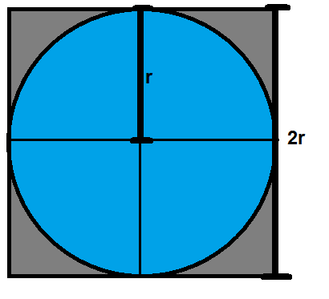

```{r setup, echo=FALSE, message=FALSE, warning=FALSE}
rm(list=objects()) # start with a clean workspace
source("knitr_setup.R")
set.seed(42)
```

When you hear the words "Monte Carlo", most people envision this:

{ width=200 }

...or this:

{ width=300 }

But when I hear Monte Carlo, I envision this:

{ width=300 }

No, that's not some grainy image coming into focus - that's a [Monte Carlo simulation](https://en.wikipedia.org/wiki/Monte_Carlo_method) approximating the value of $\pi$ (`r pi`...).

---

# What is Monte Carlo simulation?

## Basic idea

Monte Carlo simulation uses (pseudo)random numbers to solve (not-so-random) problems. The general approach goes like this:

- Run a series of trials.
- In each trial, simulate an event (e.g. a coin toss, a dice roll, etc.).
- Count the number of successful trials.
- Guess that the Expected Odds $\simeq$ Observed Odds = $\frac{\text{# Successful Trials}}{\text{# Total Trials}}$

For many applications, Monte Carlo simulations result in a sufficiently accurate result with a reasonable amount of trials (~ 100,000). You can always improve your accuracy with more trials, but that comes at the expense of increased run time. To summarize:

1. As # of trials increases, observed odds --> expected odds.
2. More trials --> more accurate (+ more time).

## Why the name "Monte Carlo"?

The name "Monte Carlo" comes from the (pseudo)random nature of the simulation process. Running a series of trials is similar to how many gambling games work in casinos, and [Monte Carlo](https://en.wikipedia.org/wiki/Monte_Carlo) is famous for gambling. Of course, in the casinos the odds are always slightly in the favor of the house, so after millions of trials the odds are that the house will win more money than the gamblers.

## Why even do this?

Many problems have "closed-form" solutions, meaning they can be solved with math alone. But there are also many problems for which no known closed-form solution exists. Integration is a classic example - there are many integrals for which a purely mathematical solution cannot be determined. However, solutions can be _approximated_ using simulation.

R comes with many tools for running (pseudo)random simulations, which is one reason R is such a popular programming language for people who build and work with statistical models that involve simulations.

---

# Monte Carlo integration

Integration is ultimately about computing the area below the curve of a function. Let's take a simple example - suppose we want to find the integral from 3 to 7 of the following function:

$$f(x) = x^2$$

That is, we want to compute the area under the curve of $x^2$ between $3 < x < 7$. Here's what that looks like:

<!-- ```{r} -->
<!-- x1 <- seq(1, 10, by = 0.1) -->
<!-- y1 <- x1^2 -->
<!-- plot(x1, y1, type = "l", col='#B34D33FF') -->
<!-- x2 <- x1[which(3 < x1 & x1 < 7)] -->
<!-- y2 <- x2^2 -->
<!-- polygon(c(x2, rev(x2)), c(0*y2, rev(y2)), col='#E64D334D', border=NA) -->
<!-- ``` -->

```{r, echo=FALSE, message=FALSE, fig.width=6, fig.height=4}
library(dplyr)
library(ggplot2)
x  <- seq(0, 10, by = 0.01)
df <- data.frame(x = x, y = x^2)
p <- ggplot(data = df) +
    geom_line(aes(x = x, y = y)) +
    geom_area(data = df %>% filter(x > 3 & x < 7),
              aes(x = x, y = y), alpha = 0.2, fill = 'red') +
    scale_x_continuous(breaks = seq(0, 10, 2), limits = c(0, 10))
p
```

One way to estimate the shaded area is to draw a bunch of random points inside a rectangle in the x-y plane that contains the shaded area and then count how many fall below the function line. So we're going to randomly draw points inside this box:

```{r, echo=FALSE, message=FALSE, fig.width=6, fig.height=4}
pBox <- p +
    geom_area(data = data.frame(x = c(3, 3, 7, 7), y = c(0, 7^2, 7^2, 0)),
              aes(x = x, y = y), alpha = 0, color = 'black', linetype = 2)
pBox
```

Let's simulate some random points inside the box:

```{r}
numTrials <- 100000
# The function runif() samples from a "uniform" distribution
x <- runif(numTrials, min = 3, max = 7) # Values of x between 3 and 7
y <- runif(numTrials, min = 0, max = 7^2) # Values of y between 0 and 7^2
```

Now that we have our points, we can use them to estimate the area under the curve. The logic here is that the ratio of points below the curve to the total number of points will be equal to the ratio of the area under $f(x)$ to the total area of the rectangle. That is:

$$\frac{\text{# Points Under Curve}}{\text{# Total Points}} = \frac{\text{Area Under Curve}}{\text{Area of Rectangle}}$$

So, to get the area under the curve, we need to compute the area of the rectangle and multiply it by $(\text{# Points Under Curve}) / (\text{# Total Points})$. We know the total area of the rectangle is its length ($(7 - 3) = 4$) times its height ($7^2$), which is $4 * 49 = 196$. So the area under the curve should be 196 times the ratio of points under the curve to the total number of points. Let's write the code!

```{r}
# Determine which y points are less than or equal to x^2:
belowCurve <- y <= x^2 # This will create a vector of TRUE and FALSE values
# Compute the ratio of points below the curve:
ratio <- sum(belowCurve) / numTrials
totalArea <- (7 - 3) * 7^2 # Rectangle length x height = 196
areaUnderCurve <- ratio * totalArea
areaUnderCurve
```

So, using Monte Carlo simulation with 100,000 points, we estimate that the area under the curve is `r areaUnderCurve`. How'd we do? Well, if you're familiar with calculus, the integral of $f(x) = x^2$ has a closed-form solution ($\frac{x^3}{3} + C$), so we can check our estimate against the pure-math solution:

$$\int_{3}^{7} x^2 \mathrm{dx} = \left ( \frac{x^3}{3} \right ) \Big|_3^7 = \frac{7^3}{3} - \frac{3^3}{3} = 105.33\bar{3}$$

```{r, echo=FALSE}
error <- (7^3 / 3) - (3^3 / 3) - areaUnderCurve
errorPer <- round(100*abs(error / areaUnderCurve), 2)
```
So our estimate error is: `105.333 - ` ``r areaUnderCurve`` `=` ``r error``.

That's an error of just `r errorPer` % - not bad!

---

# Monte Carlo $\pi$

Now let's look at something a bit trickier - approximating $\pi$!

Watch this quick video to see a summary of how this works (...I hope you like lounge music)

<iframe width="640" height="400" src="https://www.youtube.com/embed/ELetCV_wX_c" frameborder="0" allow="accelerometer; autoplay; encrypted-media; gyroscope; picture-in-picture" allowfullscreen></iframe>

Now let's approximate $\pi$ ourselves! Let's start with some basic geometry.

The area of a circle is:

> $A_{circle} = \pi r^2$

If we draw a square containing that circle, its area will be:

> $A_{square} = 4r^2$

This is because each side of the square is simply $2r$, as can be seen in this image:



Knowing these two equations for the areas of a circle and square, we can compute $\pi$ by taking the ratio, $R$, of the area of a circle to that of a square containing that circle:

$R = \dfrac{\pi r^2}{4r^2} = \dfrac{\pi}{4}$

So to compute $\pi$, all we need to do is multiply 4 times the ratio of the area of the circle to that of the square. Just like with integration, we can approximate that ratio by simulating lots of points in the square and then simply counting the number that fall inside the circle.

**Let's write the code!**

First, generate lots of random points in a square. For this example, we'll use a square with side length of 1 centered at `(x, y) = (0, 0)`, so we need to draw random points between `x = (-0.5, 0.5)` and `y = (-0.5, 0.5)`:

```{r}
numTrials <- 1000
points <- data.frame(
    x = runif(numTrials, -0.5, 0.5),
    y = runif(numTrials, -0.5, 0.5))
head(points)
```

For this example, we're putting the points in a data frame to make it easier to work with. Now that we have random x and y points, let's compute the radius to each point (the distance from `(x, y) = (0, 0)`) so we can determine which points fall inside the circle (which has a radius of 0.5):

```{r, message=FALSE}
library(dplyr)
points <- points %>%
    mutate(
        radius = sqrt(x^2 + y^2),
        pointInCircle = ifelse(radius <= 0.5, TRUE, FALSE))
```

Just to make sure we correctly labeled the points, let's plot them, coloring them based on the `pointInCircle` variable we just created:

```{r, fig.width = 6, fig.height = 4.5}
library(ggplot2)
ggplot(points) +
    geom_point(aes(x = x, y = y, color = pointInCircle), size = 0.7) +
    theme_minimal()
```

Looks like we correctly labeled the points! Now we have everything we need to estimate $\pi$!

```{r}
ratio <- sum(points$pointInCircle) / nrow(points)
piApprox <- 4 * ratio
piApprox
```

```{r, echo=FALSE}
error <- piApprox - pi
errorPer <- round(100*abs(error / pi), 2)
```

So our estimate error is: `3.1415 - ` ``r piApprox`` `=` ``r error``.

That's an error of just `r errorPer` % - not bad for only 1,000 points!

To get an even better estimate of $\pi$, we can increase N. Let's see what we get with 100,000 trials:

```{r}
numTrials <- 100000
points <- data.frame(
    x = runif(numTrials, -0.5, 0.5),
    y = runif(numTrials, -0.5, 0.5)) %>%
    mutate(
        radius = sqrt(x^2 + y^2),
        pointInCircle = ifelse(radius <= 0.5, TRUE, FALSE))
ratio <- sum(points$pointInCircle) / nrow(points)
piApprox <- 4 * ratio
piApprox
# Compute error:
error <- piApprox - pi
percentError <- round(100*abs(error / pi), 2)
percentError
```

By increasing the number of trials from 1,000 to 100,000, we improved our estimate error from `r errorPer` % to `r percentError` %!

---

**Page sources**:

Some content on this page has been modified from other courses, including:

- CMU [15-112: Fundamentals of Programming](http://www.kosbie.net/cmu/spring-17/15-112/), by [David Kosbie](http://www.kosbie.net/cmu/) & [Kelly Rivers](https://hcii.cmu.edu/people/kelly-rivers)
