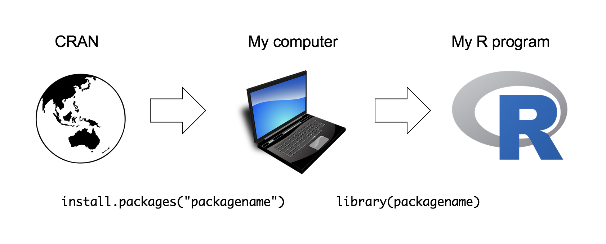

```{r setup, echo=FALSE, message=FALSE, warning=FALSE}
rm(list=objects()) # start with a clean workspace
source("knitr_setup.R")
```

---

# Functions

You can do a lot with the basic operators like `+`, `-`, and `*`, but to do more advanced calculations you're going to need to start using functions.^[Technically speaking, operators are functions in R: the addition operator `+` is a convenient way of calling the addition function `'+'()`. Thus `10+20` is equivalent to the function call `'+'(20, 30)`. Not surprisingly, no-one ever uses this version.]

> [Watch this 1-minute video for a quick summary of **functions**](https://vimeo.com/220490105)


R has a lot of very useful built-in functions. Suppose I wanted to take the square root of 225. The usual notation for this is $\sqrt{25}=5$, though sometimes you'll also see it written like this $25^{0.5} = 5$. This second way of writing it is kind of useful to "remind" you of the mathematical fact that "square root of $x$" is actually the same as "raising $x$ to the power of 0.5". And since we already know how to raise things to powers in R, we could do this:

```{r}
225 ^ 0.5
```

However, we could also compute this using R's built-in square root function `sqrt()`:

```{r}
sqrt(225)
```

Not sure what a particular function does? You can ask R for help by typing `?` and then the function name, and R will return documentation on the function. For example, `?sqrt()` will return information about the `sqrt()` function.

## Some common functions

Function   | Description       | Example
---------- | ------------------|------------------------------
`exp()`    | Exponential  | `exp(0)` returns ``r exp(0)``
`sqrt()`   | Square root  | `sqrt(64)` returns ``r sqrt(64)``
`log(x)`   | Natural log of `x` | `log(1)` returns ``r log(1)``
`factorial()` | Factorial | `factorial(5)` returns ``r factorial(5)``
`round(x, digits=0)` | Round `x` to the `digits` decimal place | `round(3.1415, digits=2)` returns ``r round(3.1415, digits=2)``
`abs(x)`  | Absolute value of `x` | `abs(-42)` returns ``r abs(-42)``

## Combining functions

In the same way that R allows us to put multiple operations together into a longer command (like `1 + 2 * 4` for instance), it also lets us put functions together and even combine functions with operators if we so desire. For example, the following is a perfectly legitimate command:

```{r}
sqrt(1 + abs(-8))
```

When R executes this command, starts out by calculating the value of `abs(-8)`, which produces an intermediate value of `8`. The command then simplifies to `sqrt(1 + 8)`. To solve the square root^[R does support complex numbers, but unless you explicitly specify that you want them it assumes all calculations must be real valued. By default, the square root of a negative number is treated as undefined: `sqrt(-9)` will produce `NaN` (not a number) as its output. To get complex numbers, you would type `sqrt(-9+0i)` and R would now return `0+3i`.] it first needs to add `1 + 8` to get `9`, at which point it evaluates `sqrt(9)`, and so it finally outputs a value of `3`.

---

# Arguments

When we use a function to do something, we generally refer to this as **calling** the function. The values that we type into the function are referred to as the **arguments** of that function. Some functions can have more than one argument.

> [Watch this 1-minute video for a quick summary of **arguments**](https://vimeo.com/220490157)


## Multiple arguments

Some functions have more than one argument. For example, the `round()` function can be used to round some value to the nearest whole number. For example, I could type this:

```{r}
round(3.1415)
```

Pretty straightforward. However, suppose I only wanted to round it to two decimal places: that is, I want to get `3.14` as the output. To do this, you can input a second argument that specifies the number of decimal places that you want to round the number to. To get `3.14`, I would type this:

```{r}
round(3.14165, 2)
```

## Argument names

In this simple example, it's not too hard to remember which argument comes first and which one comes second, but it starts to get very difficult once you start using complicated functions that have lots of arguments. Fortunately, most R functions use **argument names** to make your life a little easier. For the `round()` function, for example, the number that needs to be rounded is specified using the `x` argument, and the number of decimal points that you want it rounded to is specified using the `digits` argument:

```{r}
round(x = 3.1415, digits = 2)
```

## Default values

Notice that the first time I called the `round()` function I didn't actually specify the `digits` argument at all, and yet R somehow knew that this meant it should round to the nearest whole number. How did that happen? The answer is that the `digits` argument has a **default value** of `0`, meaning that if you decide not to specify a value for `digits` then R will act as if you had typed `digits = 0`. This is quite handy: most of the time when you want to round a number you want to round it to the nearest *whole* number, and it would be pretty annoying to have to specify the `digits` argument every single time. On the other hand, sometimes you actually do want to round to something other than the nearest whole number, and it would be even more annoying if R didn't allow this! Thus, by having `digits = 0` as the default value, we get the best of both worlds.

Finally, not all functions have (or require) arguments:

```{r}
date()
```

---

# Objects

In R, all "assignments" have this form:

```{r eval = FALSE}
objectName <- value
```

where the arrow, `<-`, means "assign `value` to `objectName`".

> [Watch this 1-minute video for a quick summary of **objects**](https://vimeo.com/220493412)

The operator `<-` is a pain to type, so RStudio has a keyboard shortcut: Alt + - (the minus sign). RStudio offers many other handy [keyboard shortcuts](https://support.rstudio.com/hc/en-us/articles/200711853-Keyboard-Shortcuts). Also, Alt+Shift+K brings up a keyboard shortcut reference card.

To practice, try assigning `2` to `x`:

```{r}
x <- 2
```

Now type `x` again - notice that it returns the value assigned to it!

```{r}
x
```

If you overwrite an object with a different value, R will "forget" the previous assigned value and only keep the new assignment:

```{r}
x
x <- 42
x
```

**A note on formatting**: Always surround `<-` with spaces! Otherwise your code can be confusing. For example, if you typed `x<-2` (no spaces), it's not clear if you meant `x <- 2` or `x < -2`. The first one assigns `2` to `x`, but the second one compares whether `x` is less than `-2`.

## Object names

You can choose almost any name you like for an object, as long as the name does not begin with a *number* or a special character like `+`, `-`, `*`, `/`, `^`, `!`, `@`, or `&`. You will be wise to adopt a [convention for demarcating words](https://en.wikipedia.org/wiki/Camel_case) in names. Here are a few:

- `snake_case_is_one_choice`
- `other.people.use.periods`
- `camelCaseIsAlsoGood`

Make another assignment:

```{r}
this_is_a_really_long_name <- 2.5
```

To inspect this, try out RStudio's completion facility: type the first few characters, press TAB - voila! RStudio auto-completes the long name for you :)

**R is case sensitive**. To understand what this means, try this:

```{r}
cases_matter <- 2^2
Cases_matter <- 2^3
```

Let's try to inspect:

```{r}
cases_matter
Cases_matter
```

Although the two objects look similar, one has a capital "C", and R stores that as a different object.

In general, type carefully. Typos matter. Case matters. **Get better at typing**.

## The workspace

Look at your workspace in the upper right pane. The workspace is where user-defined objects accumulate. You can also get a listing of these objects with commands:

```{r}
objects()
ls()
```

If you want to remove the object named `x`, you can do this

```{r}
rm(x)
```

To remove everything, use this:

```{r}
rm(list = ls())
```

or click the broom in RStudio's Environment pane.

---

# Data types

Every programming language has the ability to store data of different types. R recognizes several important basic data types (there are 6 total, but these 4 are all we'll ever use):

Type      | Description                 | Example
----------|-----------------------------|----------
numeric   | Numbers                     | `3.14`, `42`, `1.61803398875`
integer   | A number with no decimal    | `1L`, `7L`
character | Text data, a.k.a. "strings" | `"this is a string"`, `"3.14"`
logical   | Used for comparing objects  | `TRUE`, `FALSE`

To assess the type of any variable, R has two different functions:

- `class()` tells us the high level object type
- `typeof()` tells us the low level object type

We'll use these to explore each data type.

## Numeric types

Numbers in R are of the `numeric` data type, and it is the default computational type. There are two types of numeric data types: **integers** and **floats**. The difference is floats have decimals and integers don't. At the lower level, floats have the type "`double`" while integers have the type "`integer`".

By default, R assumes all numbers are **floats**, even if it _looks_ like an integer:

```{r}
class(3.14)
class(3)
typeof(3.14)
typeof(3)
```

The fact that `3` is not an integer can be confirmed with the `is.integer()`function:

```{r}
is.integer(3)
```

To make a number an integer, you have to either add an `L` to the end, or use the `as.integer()` function to coerce it into an integer type:

```{r}
typeof(3L)
typeof(as.integer(3))
```

Note that you can have a decimal of `0` but the data types can be different:

```{r}
typeof(7)
typeof(7.0)
typeof(7L)
```

## Character types

A character object is used to represent string values in R. Anything put between single quotes (`''`) or double quotes (`""`) will be stored as a character. For example:

```{r}
s <- '3.14'
class(s)
```

Notice that even though the value assigned to `s` is a number, it is stored as a character because the number is surrounded by quotes. If you mistakenly thought it was stored as a number, R will gladly return an error when you try to do a numerical operation with it:

```{r error=TRUE}
s + 7
```

We can also convert objects into character values with the `as.character()` function:

```{r}
a_number <- 3.14
class(a_number)
a_string <- as.character(a_number)
class(a_string)
```

We will go into much more detail about character data later on in [Week 6](L6.1-strings.html)

## Logical types

A logical value is usually created when comparing variables. For example, let's compare whether one value is greater than another:

```{r}
x <- 1
y <- 2
z <- x > y # Is x greater than y?
z
```

The object `z` now stores the value (`FALSE`) that resulted from comparing `x` and `y`.

To compare whether two values are equal, you have to type the `=` sign twice:

```{r}
x == y
```

Here I am asking, "is `x` equal to `y`"? In this case, the answer is `FALSE`.

We will go into more detail about comparing values in R later on in [Week 4](L4.1-conditionals.html)

## Special values

In addition to the four main data types mentioned, there are a few additional "special" types: `Inf`, `NaN`, `NA` and `NULL`.

**Infinity**: `Inf` corresponds to a value that is infinitely large. You can also have `-Inf`. The easiest way to get `Inf` is to divide a positive number by 0:

```{r}
1/0
```

**Not a Number**: `NaN` is short for "not a number", and it's basically a reserved keyword that means "there isn't a mathematically defined number for this." For example:

```{r}
0/0
```

**Not available**: `NA` indicates that the value that is "supposed" to be stored here is missing. We'll see these much more when we start getting into data structures like vector, matrices, and data frames.

**No value**: `NULL` asserts that the variable genuinely has no value whatsoever, or does not even exist.

## Coercing data types

In general, you can force an object into a different type using `as.something()`, replacing "`something`" with a data type:

```{r}
as.numeric(3.1415)
as.integer(3.1415)
as.character(3.1415)
as.logical(3.1415)
```

Note that `as.logical()` returns `TRUE` for any numeric value other than `0`, for which it returns `FALSE`.

If you try to coerce a string into a number, R will return `NA`:

```{r}
as.numeric('foo')
```

If you want to force a float number (i.e. one with decimals) into an integer value, but you don't want to change the actual _type_ to an integer type, use `round()`, `ceiling()`, or `floor()`. This will turn the number into an integer in _value_, but will still technically be float types. Note that these functions produce different outcomes.

```{r}
round(3.1415)   # Typical rounding
ceiling(3.1415) # Rounds *up* to nearest integer
floor(3.1415)   # Rounds *down* to nearest integer
```

---

# Packages

When you start R, it only loads the "Base R" functions. But there are thousands and thousands of additional functions stored in **packages**.

> [Watch this 1-minute video for a quick summary of **packages**](https://vimeo.com/220490447)

There is a critical distinction that you need to understand, which is the difference between having a package **installed** on your computer, and having a package **loaded** in an R session. You only need to _install_ a package to your computer once, but you will need to _load_ it whenever you want to use it in any one R session. This relationship is illustrated in the image below:

{ width=800 }

When installing a package, you must put the package name in quotes:

```{r eval=FALSE}
install.packages("packagename") # This works
install.packages(packagename)   # This doesn't work
```

When loading a package in an R session, you don't have to use quotes (but you can if you want):

```{r eval=FALSE}
library("packagename") # This works
library(packagename)   # This also works
```

As an example, try installing the [Wikifacts](https://github.com/keithmcnulty/wikifacts) package, by Keith McNulty:

```{r eval=FALSE}
install.packages("wikifacts") # Remember - you only have to do this once!
```

Now that you have the package installed on your computer, try loading it using `library(wikifacts)`, then trying using some of it's functions:

```{r}
library(wikifacts) # Load the library
```
```{r}
wiki_randomfact()
wiki_didyouknow()
```

In case you're wondering, the only thing this package does is generate messages containing random facts from [Wikipedia](https://www.wikipedia.org/).

---

# Tips

## Check if a number is an integer

If you use the `is.integer()` function to check if a number that **looks** like an integer, you might get a surprising result:

```{r}
is.integer(7)
```

This is because the default numeric type is a _float_. The safer way to check if a number is an integer in value is to compare it against itself as an integer:

```{r}
7 == as.integer(7)
```

**In your assignments, use this method to check if something is an integer!**

---

**Page sources**:

Some content on this page has been modified from other courses, including:

- Danielle Navarro's website ["R for Psychological Science"](https://psyr.org/index.html)
- Jenny Bryan's [STAT 545 Course](http://stat545.com/)
- [RStudio primers](https://rstudio.cloud/learn/primers/1.2)
- Xiao Ping Song's [Intro2R crash course](https://github.com/xp-song/Intro2R)

---

**Footnotes**


