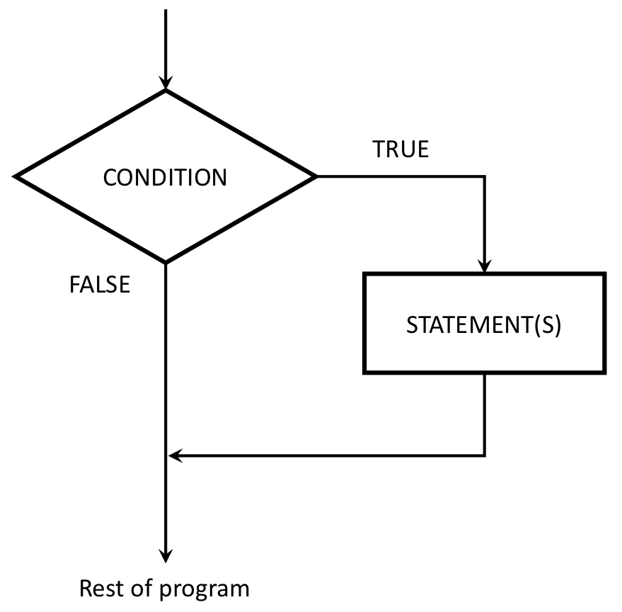

```{r setup, echo=FALSE, message=FALSE, warning=FALSE}
rm(list=objects()) # start with a clean workspace
source("knitr_setup.R")
```

> ### Learning Objectives
>
> * Understand how to use `if` and `else` statements to handle conditional programming.
>
> ### Suggested Readings
>
> * [Chapters 9.2 - 9.3](https://rstudio-education.github.io/hopr/programs.html#if-statements) of "Hands-On Programming with R", by Garrett Grolemund


---

Like most programming languages, R can evaluate **conditional statements**. A conditional statement is a switch - it tells the code which command to execute depending on a _condition_ that is specified by the programmer.

The most prominent examples of a conditional statement is the `if` statement, and the accompanying `else` statement.

---

# if

The basic format of an `if` statement in R is as follows:

```
if ( CONDITION ) {
    STATEMENT1
    STATEMENT2
    ETC
}
```

If the condition is `TRUE`, then R will execute the statements contained in the curly braces, otherwise it will skip it. This schematic illustrates the idea:

<center>
{ width=400 }
</center>

## Example 1

```{r}
f <- function(x) {
    cat("A")
    if (x == 0) {
        cat("B")
        cat("C")
    }
    cat("D")
}
```
```{r}
f(0)
f(1)
```

## Example 2

Consider a simple absolute value function. Since `abs()` is a built-in function, we'll call ours `absValue()`:

```{r}
absValue <- function(x) {
    if (x < 0) {
        x = -1*x
    }
    return(x)
}
```
```{r}
absValue(7)  # Returns 7
absValue(-7) # Also returns 7
```

# if else

You can extend the `if` statement to include an `else` statement as well, leading to the following syntax:

```
if ( CONDITION ) {
  STATEMENT1
  STATEMENT2
  ETC
} else {
  STATEMENT3
  STATEMENT4
  ETC
}
```

The interpretation of this version is similar. If the condition is `TRUE`, then the contents of the first block of code are executed; but if it is `FALSE`, then the contents of the second block of code are executed instead. The schematic illustration of an if-else construction looks like this:

<center>
{ width=500 }
</center>

## Example

```{r}
f <- function(x) {
    cat("A")
    if (x == 0) {
        cat("B")
        cat("C")
    }
    else {
        cat("D")
        if (x == 1) {
            cat("E")
        } else {
            cat("F")
        }
    }
    cat("G")
}
```
```{r}
f(0)
f(1)
f(2)
```

# else if

You can also chain multiple `else if` statements together for a more complex conditional statement. For example, if you're trying to assign letter grades to a numeric test score, you can use a series of `else if` statements to search for the bracket the score lies in:

```{r}
getLetterGrade <- function(score) {
    if (score >= 90) {
        grade = "A"
    } else if (score >= 80) {
        grade = "B"
    } else if (score >= 70) {
        grade = "C"
    } else if (score >= 60) {
        grade = "D"
    } else {
        grade = "F"
    }
    return(grade)
}
```
```{r}
cat("103 -->", getLetterGrade(103))
cat(" 88 -->", getLetterGrade(88))
cat(" 70 -->", getLetterGrade(70))
cat(" 61 -->", getLetterGrade(61))
cat(" 22 -->", getLetterGrade(22))
```

---

**Page sources**:

Some content on this page has been modified from other courses, including:

- CMU [15-112: Fundamentals of Programming](http://www.kosbie.net/cmu/spring-17/15-112/notes/notes-conditionals.html), by [David Kosbie](http://www.kosbie.net/cmu/) & [Kelly Rivers](https://hcii.cmu.edu/people/kelly-rivers)
- Danielle Navarro's website ["R for Psychological Science"](https://psyr.org/index.html)

