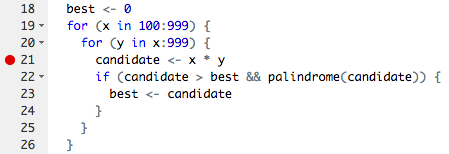
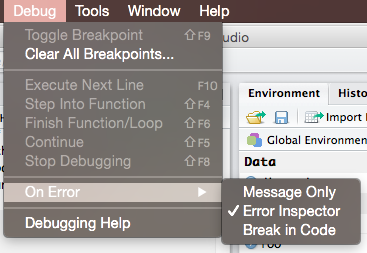
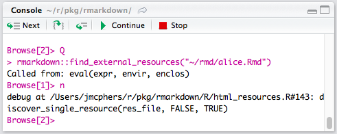

```{r setup, echo=FALSE, message=FALSE, warning=FALSE}
rm(list=objects()) # start with a clean workspace
source("knitr_setup.R")
```

> ### Learning Objectives
>
> * Understand how to write a basic test function.
> * Understand how to write custom error messages in a function.
> * Understand multiple ways to debug your code.
>
> ### Suggested Readings
>
> * [Chapter 11](https://whattheyforgot.org/debugging-r-code.html) in Jenny Bryan and Jim Hester's fantastic book, ["What They Forgot to Teach You About R"](https://whattheyforgot.org/).

Here are some other great resources:
> * [Debugging techniques in RStudio](https://resources.rstudio.com/wistia-rstudio-conf-2018-2/debugging-techniques-in-rstudio-amanda-gadrow-4) - Amanda Gadrow's talk at rstudio::conf 2018.
> * [Debugging in RStudio article](https://support.rstudio.com/hc/en-us/articles/200713843)

---

# Writing test cases

<center>
{ width=300 }
</center>

Writing test cases is part of the process of understanding a problem; if you don't know what the result of an example input should be, you can't know how to solve the problem.

Test cases are also used to verify that a solution to a problem is correct -- that it works as expected. Without a good set of test cases, we have no idea whether our code actually works!

## Test case types

Test cases vary based on the problem, but you generally want to ensure that you have at least one or two of each of the following test case types:

- **Normal Cases**: Typical input that should follow the main path through the code.
- **Large Cases**: Typical input, but of a larger size than usual. This ensures that bugs don't appear after multiple iterations.
- **Edge Cases**: Pairs of inputs that test different choice points in the code. For example, if a condition in the problem checks whether `n < 2`, two important edge cases are when `n = 2` and `n = 3`, which trigger different behaviors. Other edge cases include the first / last characters in a string or items in a list.
- **Special Cases**: Some inputs need to be special-cased for many problems. This includes negative numbers, `0` and `1` for integers, the empty string (`""`), and input values of different types than are expected.
- **Varying Results**: Finally, test cases should cover multiple possible results. This is especially important for logical functions; make sure that you have both `TRUE` and `FALSE` cases among your tests!

## Testing with `stopifnot()`

The `stopifnot()` function does what you might expect - it stops the function if whatever is inside the `()` is not `TRUE`. Let's look at an example.

Consider the function `isEvenNumber()`, which takes a numeric value and returns `TRUE` if it is an even number and `FALSE` otherwise:

```{r}
isEvenNumber <- function(n) {
    # A number is "even" if it is divisible by 2 with no remainder
    remainder <- n %% 2
    return(remainder == 0)
}
```

Here is a simple test function for `isEvenNumber()` that uses the `stopifnot()` function to examine the following two test cases:

- We expect the output of `isEvenNumber(42)` to be `TRUE`
- We expect the output of `isEvenNumber(43)` to be `FALSE`

```{r}
testIsEvenNumber <- function() {
    cat("Testing isEvenNumber()... ")
    stopifnot(isEvenNumber(42) == TRUE)
    stopifnot(isEvenNumber(43) == FALSE)
    cat("Passed!\n")
}
```

In this test function, we called the `stopifnot()` function and used the `==` operator to assess whether the output of `isEvenNumber()` is equal to the value we expected. We can run these cases by simply calling our test function:

```{r}
testIsEvenNumber()
```

## Testing function inputs

The two test cases we used for `isEvenNumber()` are "normal" cases because they use typical inputs and test for expected outputs. A better test function would also include a few other statements to test other points of failure.

One particular common error is when a user inputs the wrong data type to a function:

```{r error=TRUE}
isEvenNumber('42')
```

Here we've input a string instead of a number, and R sent us an error message. To account for this possibility, we can modify our function and test function:

```{r}
isEvenNumber <- function(n) {
    # First make sure the input is a numeric type
    if (! is.numeric(n)) {
        return(FALSE)
    }
    remainder <- n %% 2
    return(remainder == 0)
}

testIsEvenNumber <- function() {
    cat("Testing isEvenNumber()... ")
    stopifnot(isEvenNumber(42) == TRUE)
    stopifnot(isEvenNumber(43) == FALSE)
    stopifnot(isEvenNumber('not_a_number') == FALSE)
    cat("Passed!\n")
}

testIsEvenNumber()
```

## Better error messaging with `stop()`

Another approach to checking input types is to explicitly provide a better error message so the user can know what went wrong. For example, rather than return `FALSE` when we input a string to `isEvenNumber()`, we can use `stop()` to halt the function and send an error message:

```{r error=TRUE}
isEvenNumber <- function(n) {
    if (! is.numeric(n)) {
        stop('Oops! This function requires numeric inputs!')
    }
    remainder <- n %% 2
    return(remainder == 0)
}
isEvenNumber('42')
```

---

# Debugging

Bugs are a natural part of the programming process. However, you can reduce the number of bugs you encounter by following a few tips:

- Write code with good style.
- Write tests **before** writing functions, and test as you go.
- Make sure each function only has **one** task.
- Avoid copying and pasting code at all costs (this leads to bug propagation).

## Debugging your own code

The most common case you will run into a bug is when writing new code yourself.
Often the mistake is obvious and easily fixed, but sometimes it only appears
after multiple levels of calls and is harder to diagnose. There are a few
common strategies to use when debugging your own code.

- Use `traceback()` to determine where a given error is occurring.
- Output diagnostic information in code with `print()`, `cat()` or `message()` statements.
- Use `browser()` to open an interactive debugger before the error
- Use `debug()` to automatically open a debugger at the start of a function call.
- Use `trace()` to start a debugger at a location inside a function.

### traceback()

The `traceback()` function can be used to print a summary of how your program
arrived at the error. This is also called a call stack, stack trace or
backtrace.

In R this gives you each call that lead up to the error, which can be very
useful for determining what lead to the error.

You can use `traceback()` in two different ways, either by calling it
immediately after the error has occurred.

<!-- knitr messes with the tracebacks, so we just do this manually :| -->

```{r, eval = FALSE}
f <- function(x) {
    return(x + 1)
}
g <- function(x) {
    return(f(x) - 1)
}
g("a")
```
```
#> Error in x + 1 : non-numeric argument to binary operator
```
```r
traceback()
```
```
#> 2: f(x) at #1
#> 1: g("a")
```

Or by using `traceback()` as an error handler, which will call it immediately
on any error. (You could even put this in your [`.Rprofile`](https://stackoverflow.com/questions/46819684/how-to-access-and-edit-rprofile))

```{r, eval = FALSE}
options(error = traceback)
g("a")
```

```
#> Error in x + 1 : non-numeric argument to binary operator
#> 2: f(x) at #1
#> 1: g("a")
```

### `print()`

Once you know where an error occurs it is then helpful to know why. Often
errors occur because functions are given inputs their authors did not expect,
so it is useful to print the value of objects during execution.

The most basic way to do this is to sprinkle messages throughout your code, with `print()` or `str()`. `str()` is often more useful because it gives more detail into the exact structure of an object, which may not be the structure you expect it to be.

The main downsides to the print approach is you often have to add them in
multiple places to narrow down the error, and you cannot further investigate
the object.

### `browser()`

A more sophisticated debugging method is to put a call to `browser()` in your
code. This will stop execution at that point and open R's interactive debugger.
In the debugger you can run any R command to look at objects in the current
environment, modify them and continue executing.

Some useful things to do are

1. Use `ls()` to determine what objects are available in the current
   environment. This allows you to see exactly what things you can examine.
2. Use `str()`, `print()` etc. to examine the objects
3. Use `n` to evaluate the next statement. Use `s` to evaluate the next
   statement, but step into function calls.
4. Use `where` to print a [stack trace](#traceback)
5. Use `c` to leave the debugger and continue execution
6. Use `Q` to exit the debugger and return to the R prompt.

## Debugging in RStudio

### Editor breakpoints

RStudio provides some additional tooling for debugging over using R on the
command line. First you can set an editor breakpoint by clicking to the left of
the line number in the source file, or by pressing `Shift+F9` with your cursor
on the line. A breakpoint is equivalent to a `browser()` call, but you avoid
needing to change your code like `browser()`.



### Stopping on error

If you are trying to hunt down a particular error it is often useful to have
RStudio enter the debugger when it occurs. You can control the error behavior with (`Debug -> On Error -> Error Inspector`).



### Debugging console



The RStudio debugging console has a few buttons to make debugging a little
nicer, From left to right they are, next (equivalent to `n`), step info (`s`),
continue (`c`) and Stop (`Q`).

---

**Page sources**:

Some content on this page has been modified from other courses, including:

- CMU [15-112: Fundamentals of Programming](http://www.kosbie.net/cmu/spring-17/15-112/), by [David Kosbie](http://www.kosbie.net/cmu/) & [Kelly Rivers](https://hcii.cmu.edu/people/kelly-rivers)
- Jennifer Bryan & Jim Hester's ["What They Forgot to Teach You About R"](https://whattheyforgot.org/debugging-r-code.html)
