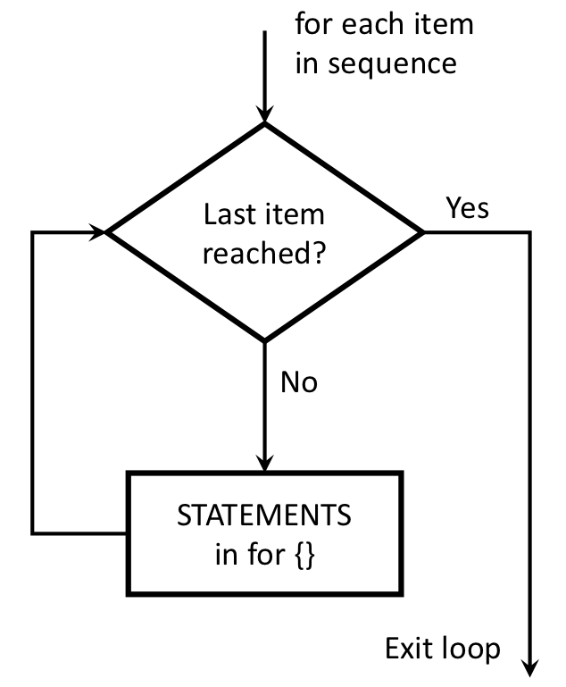

```{r setup, echo=FALSE, message=FALSE, warning=FALSE}
rm(list=objects()) # start with a clean workspace
source("knitr_setup.R")
```

Similar to conditionals (remember those [if / else statements](L4.1-conditionals.html)?), loops are another kind of "flow control" - that is, code that alters the otherwise linear flow of operations from the top of a script straight through to the end. The idea is simple: a loop is a block of code (i.e., a sequence of commands) that R will execute over and over again until some *termination criterion* is met.

The main two types of loops are `for` and `while` loops.

---

# The `for` loop

The basic format of a `for` loop goes like this:

```
for (VALUE in SEQUENCE) {
  STATEMENT1
  STATEMENT2
  ETC
}
```

In a `for` loop, R runs a fixed number of iterations determined by the `SEQUENCE` statement, which is a sequence of values. In each iteration, the variable `VALUE` will take the next value in `SEQUENCE`. Once we’ve exhausted all of the values in `SEQUENCE`, the loop terminates and the flow of the program continues down the script. This schematic illustrates the idea:

{ width=350 }

## Looping over numbers

It is common to use a sequence of integers for the values in `SEQUENCE`. The simplest way to do this is to use the `:` operator. For example, the code `1:10` creates the integers 1 through 10. The following `for` loop uses this sequence to print out each integer in the sequence:

```{r}
# Print the numbers from 1 to 10
for (i in 1:10) {
    print(i)
}
```

You can also use the `seq()` function to generate a specific sequence of numbers over which to iterate. This can be useful if you want to control the step size (in the example below, it's 2):

```{r}
# Print the numbers from 1 to 10 with a step size of 2
for (i in seq(1, 10, by=2)) {
    print(i)
}
```

## Looping over other things

R will loop over any vector you create. For example, you can loop over a sequence of characters:

```{r}
# The c() function creates a vector...we'll get to those later
x <- c('If', 'you', 'want', 'to', 'view', 'paradise,', 'simply', 'look',
       'around', 'and', 'view', 'it.')
for (i in x) {
    print(i)
}
```

You can also loop over logical values. The following loop will print out the value when it is `TRUE`:

```{r}
x <- c(TRUE, FALSE, FALSE, TRUE, FALSE, FALSE, FALSE, TRUE, FALSE)
for (i in x) {
    if (i == TRUE) {
      print(i)
    }
}
```

## Nested `for` loops

You can have loops inside loops!

```{r}
for (row in seq(10)) {
    for (col in seq(row + 1)) {
        cat("*")
    }
    cat('\n') # Print a new line
}
```

This will come in handy when working with 2-dimensional objects, like [matrices](L10.1-matrices.html) and [data frames](L11.1-data-frames.html).

---

# The `while` loop

The basic format of the loop looks like this:

```
while (CONDITION) {
  STATEMENT1
  STATEMENT2
  ETC
}
```

The code corresponding to `CONDITION` needs to produce a logical value, either `TRUE` or `FALSE`. Whenever R encounters a while statement, it checks to see if the condition is `TRUE`. If it is, R goes on to execute all of the commands inside the curly brackets. R will then continue to repeat this process until the condition is `FALSE`. Once that happens, R jumps to the bottom of the loop (i.e., to the `}` character), and then continues on with whatever commands appear next in the script. This schematic illustrates the idea:

{ width=350 }

**Example**:

The following function prints each power of 2 up to an upper limit:

```{r}
powersOfTwo <- function(upperLimit) {
    n = 1
    while (n < upperLimit) {
        print(n)
        n = 2*n
    }
}
```
```{r}
powersOfTwo(5)
powersOfTwo(100)
```

---

# The break and next statements

## break

You can force a loop to stop by inserting the `break` statement in the loop. In a nested loop, the `break` statement exits from the innermost loop that is being evaluated. Here's an example:

```{r}
for (val in 1:5) {
    if (val == 3) {
        break
    }
    print(val)
}
```

In this example, we iterate over the consecutive numbers from 1 to 5. Inside the for loop we have used a if condition to break if the current value is equal to 3. As we can see from the output, the loop terminates when it encounters the break statement.

## next

A `next` statement is useful when we want to skip the current iteration of a loop without terminating it. On encountering `next`, R will jump to the end of the loop and start the next iteration. Here's an example:

```{r}
for (val in 1:5) {
    if (val == 3) {
        next
    }
    print(val)
}
```

In the above example, we use the `next` statement inside an `if` statement to check if the value is equal to 3. If the value is equal to 3, the current evaluation stops (i.e. the value is not printed) and the loop continues with the next iteration.

---

# For the love of turtles

Turtle graphics is a classic teaching tool in computer science, originally invented in the 1960s and reimplemented over and over again in different programming languages. Let's load that package.

```{r, message=FALSE}
library(TurtleGraphics)
```

Here's the idea. You have a turtle, and she lives in a nice warm terrarium:

```{r}
turtle_init()
```

Your job is to *program* her to undertake certain actions. So for example, you can use the `turtle_forward()` command to get her to walk forwards, the `turtle_left()` command to get her to rotate to the left, and so on. For example, if I used this command my turtle would walk forward 10 steps and leave a trail behind her showing the path she took.

```{r eval=FALSE}
turtle_forward(distance = 10)
```

That seems simple enough, but what if I want my turtle to draw a more complicated shape? Let's say I want her to draw a hexagon. There are six sides to the hexagon, so the most natural way to write code for this is to write a `for` loop that loops over the sides! At each iteration within the loop, I'll have the turtle walk forwards, and then turn 60 degrees to the left. Here's what happens:

```{r, fig.show='animate', interval=0.1, cache=TRUE, message=FALSE}
turtle_init()
for (side in 1:6) {
    turtle_forward(distance = 10)
    turtle_left(angle = 60)
}
```

---

**Page sources**:

Some content on this page has been modified from other courses, including:

- CMU [15-112: Fundamentals of Programming](http://www.kosbie.net/cmu/spring-17/15-112/), by [David Kosbie](http://www.kosbie.net/cmu/) & [Kelly Rivers](https://hcii.cmu.edu/people/kelly-rivers)
- Danielle Navarro's website ["R for Psychological Science"](https://psyr.org/index.html)
