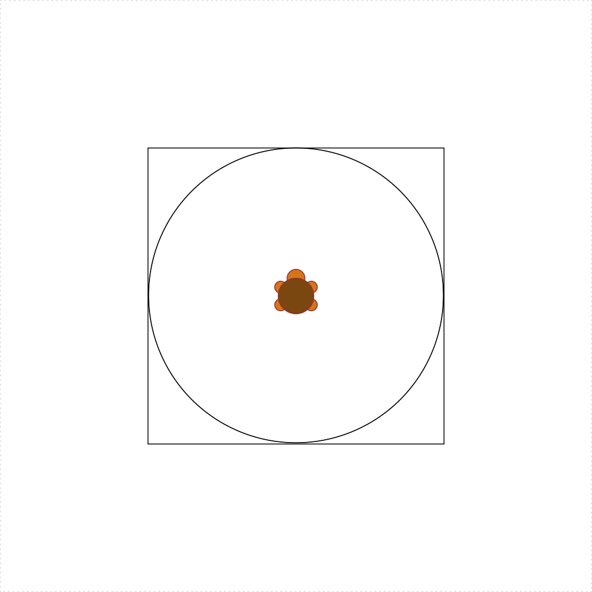
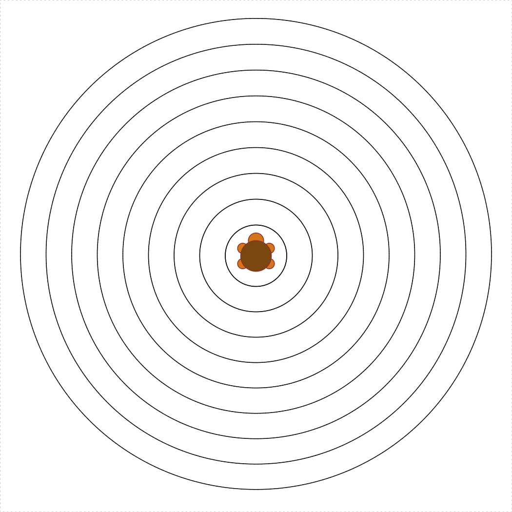
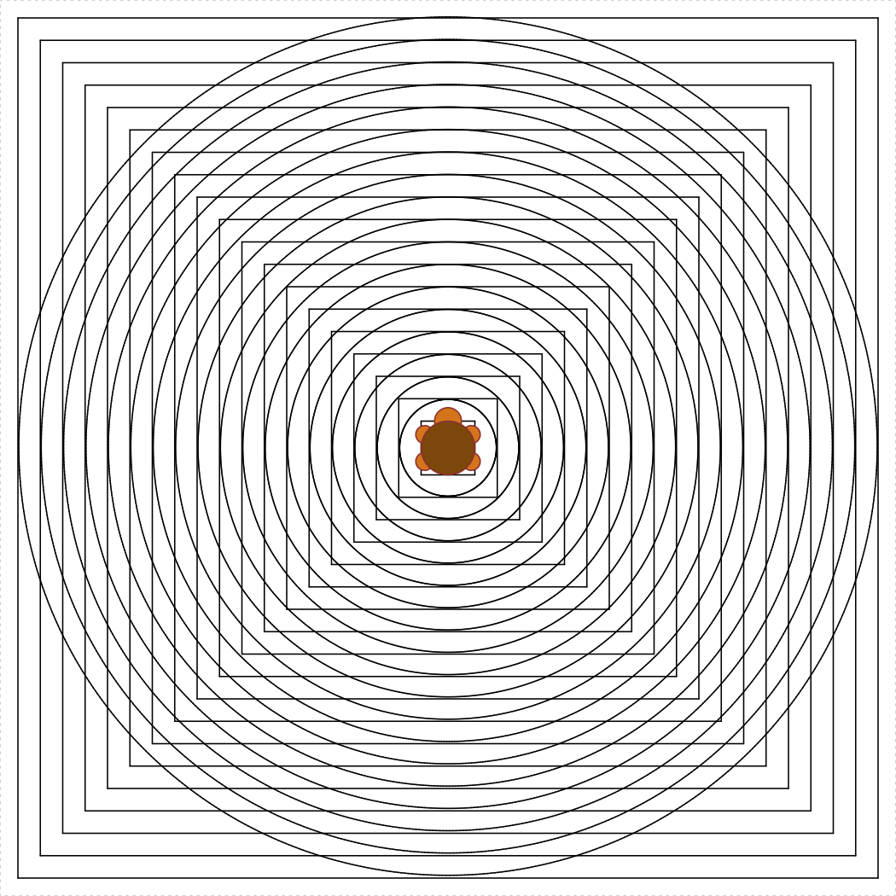

```{r setup, echo=FALSE, message=FALSE, warning=FALSE}
rm(list=objects()) # start with a clean workspace
source("knitr_setup.R")
```

**Hint**: Read the [Vectors Tips](L6-vectors.html#4_tips) page - these could come in handy!

# Write functions

Here are a bunch of functions you should be able to write. Any of these may appear (directly or modified) on a quiz or exam! Your function should be able to pass the test functions provided.

# `for` loops

## Sum from `m` to `n`

There are many ways to sum the integers between two bounds, `m` and `n`.

### a) `loopSumFromMToN(m, n)`

Use a `for` loop to sum the total of the integers between `m` and `n`.

```{r, eval=FALSE}
testLoopSumFromMToN <- function() {
    cat("Testing loopSumFromMToN()...")
    stopifnot(loopSumFromMToN(5, 10) == (5+6+7+8+9+10))
    stopifnot(loopSumFromMToN(1, 1) == 1)
    stopifnot(loopSumFromMToN(0, 0) == 0)
    stopifnot(loopSumFromMToN(0, 7) == (1+2+3+4+5+6+7))
    cat("Passed!\n")
}
```

### b) `vectorSumFromMToN(m, n)`

Use a vector (no loops!) to sum the total of the integers between `m` and `n`.

```{r, eval=FALSE}
testVectorSumFromMToN <- function() {
    cat("Testing vectorSumFromMToN()...")
    stopifnot(vectorSumFromMToN(5, 10) == (5+6+7+8+9+10))
    stopifnot(vectorSumFromMToN(1, 1) == 1)
    stopifnot(vectorSumFromMToN(0, 0) == 0)
    stopifnot(vectorSumFromMToN(0, 7) == (1+2+3+4+5+6+7))
    cat("Passed!\n")
}
```

### c) `formulaSumFromMtoN(m, n)`

Use a closed formula (no vectors or loops!) to sum the total of the integers between `m` and `n`. Hint: [Wikipedia](https://en.wikipedia.org/wiki/1_%2B_2_%2B_3_%2B_4_%2B_%E2%8B%AF) is helpful :)

```{r, eval=FALSE}
testFormulaSumFromMtoN <- function() {
    cat("Testing formulaSumFromMtoN()...")
    stopifnot(formulaSumFromMtoN(5, 10) == (5+6+7+8+9+10))
    stopifnot(formulaSumFromMtoN(1, 1) == 1)
    stopifnot(formulaSumFromMtoN(0, 0) == 0)
    stopifnot(formulaSumFromMtoN(0, 7) == (1+2+3+4+5+6+7))
    cat("Passed!\n")
}
```

### d) `sumEveryKthFromMToN(m, n, k)`

Use a `for` loop to sum every kth integer between `m` and `n`.

```{r, eval=FALSE}
testSumEveryKthFromMToN <- function() {
    cat("Testing sumEveryKthFromMToN()...")
    stopifnot(sumEveryKthFromMToN(5, 20, 7) == (5 + 12 + 19))
    stopifnot(sumEveryKthFromMToN(1, 10, 2) == (1 + 3 + 5 + 7 + 9))
    stopifnot(sumEveryKthFromMToN(0, 0, 1) == 0)
    cat("Passed!\n")
}
```

### e) `sumOfOddsFromMToN(m, n)`

Use a `for` loop to sum every odd integer between `m` and `n`.

```{r, eval=FALSE}
testSumOfOddsFromMToN1 <- function() {
    cat("Testing sumOfOddsFromMToN1()...")
    stopifnot(sumOfOddsFromMToN1(4, 10) == (5 + 7 + 9))
    stopifnot(sumOfOddsFromMToN1(5, 9) == (5 + 7 + 9))
    cat("Passed!\n")
}
```

### `fizzBuzz()`

The "Fizz-Buzz test" is a classic interview question for programming job candidates. Write a function that prints the numbers from 1 to 100 (with each number on a new line), but for multiples of `3` print "Fizz" instead of the number, and for multiples of `5` print "Buzz". For numbers which are multiples of both `3` and `5` print "FizzBuzz". The first 16 lines of `fizzBuzz()` should read:

```{r, eval=FALSE}
1
2
"Fizz"
4
"Buzz"
"Fizz"
7
8
"Fizz"
"Buzz"
11
"Fizz"
13
14
"FizzBuzz"
16
```

# `while` loops

### `nthMultipleOf4Or7(n)`

Find the nth positive integer that is a multiple of either 4 or 7. Hint: you should write a helper function called `isMultipleOf4Or7(n)` that returns `TRUE` if `n` is a multiple of 4 or 7 and `FALSE` otherwise.

```{r, eval=FALSE}
testNthMultipleOf4Or7 <- function() {
    cat("Testing nthMultipleOf4Or7()...")
    stopifnot(nthMultipleOf4Or7(1) == 4)
    stopifnot(nthMultipleOf4Or7(2) == 7)
    stopifnot(nthMultipleOf4Or7(3) == 8)
    stopifnot(nthMultipleOf4Or7(4) == 12)
    stopifnot(nthMultipleOf4Or7(5) == 14)
    stopifnot(nthMultipleOf4Or7(6) == 16)
    stopifnot(nthMultipleOf4Or7(10) == 28)
    cat("Passed!\n")
}
```

## Prime Numbers

**Background**: Read up on the Wikipedia page on [prime numbers](https://en.wikipedia.org/wiki/Prime_number). We want to write the function `nthPrime(n)`. However, to write that function, we'll first need to write `isPrime(n)`, which determines whether a number is prime or not.

### a) `isPrime(n)`

Write the function `isPrime(n)` which takes a non-negative integer, `n`, and returns `TRUE` if it is a prime number and `FALSE` otherwise.

```{r, eval=FALSE}
testIsPrime <- function() {
    cat("Testing isPrime()...")
    stopifnot(isPrime(1) == FALSE)
    stopifnot(isPrime(2) == TRUE)
    stopifnot(isPrime(7) == TRUE)
    stopifnot(isPrime(13) == TRUE)
    stopifnot(isPrime(14) == FALSE)
    cat("Passed!\n")
}
```

### b) `nthPrime(n)`

Write the function `nthPrime(n)` which takes a non-negative integer, `n`, and returns the nth prime number, where `nthPrime(1)` returns the first prime number (2).

```{r, eval=FALSE}
testNthPrime <- function() {
    cat("Testing nthPrime()...")
    stopifnot(nthPrime(1) == 2)
    stopifnot(nthPrime(2) == 3)
    stopifnot(nthPrime(3) == 5)
    stopifnot(nthPrime(4) == 7)
    stopifnot(nthPrime(7) == 17)
    cat("Passed!\n")
}
```

## Turtle loops!

### `turtleCircleInSquare(s)`

Write the function `turtleCircleInSquare(s)` that uses the `TurtleGraphics` library to draw a circle inscribed inside a square with side `s < 100`. The square and circle should be centered in the turtle's terrarium. Hint: You may want to use `turtleSquare(s)` and `turtleCircle(r)` as helper functions! The following code should produce a circle inscribed inside a square with a side length of 50:

```{r, eval=FALSE}
library(TurtleGraphics)
turtle_init()
turtle_do({
    turtleCircleInSquare(50)
})
```
{ width=456 }

### `concentricTurtleCircles(spacing = 5)`

Write the function `concentricTurtleCircles(spacing)` that uses the `TurtleGraphics` library to draw concentric circles from the center of the terrarium and outward. The `spacing` argument determines the spacing between each circle, and the default value should be `spacing = 5`. Also, `spacing >= 1`, and your function must not allow the turtle to escape the terrarium. Hint: you may want to use `turtleCircle(r)` as a helper function. The following code should produce concentric circles with a spacing of 5:

```{r, eval=FALSE}
library(TurtleGraphics)
turtle_init()
turtle_do({
    concentricTurtleCircles()
})
```
{ width=456 }

### `concentricTurtleCircleInSquares(spacing = 5)`

Write the function `concentricTurtleCircleInSquares(spacing)` that uses the `TurtleGraphics` library to draw concentric circles inscribed in squares from the center of the terrarium and outward. The `spacing` argument determines the spacing between each circle, and the default value should be `spacing = 5`. Also, `spacing >= 1`, and your function must not allow the turtle to escape the terrarium. Hint: you may want to use `turtleCircleInSquare(s)` as a helper function. The following code should produce concentric circles inscribed in squares with a spacing of 5:

```{r, eval=FALSE}
library(TurtleGraphics)
turtle_init()
turtle_do({
    concentricTurtleCircleInSquares()
})
```
{ width=456 }

---

**Page sources**:

Some content on this page has been modified from other courses, including:

- CMU [15-112: Fundamentals of Programming](http://www.kosbie.net/cmu/spring-17/15-112/), by [David Kosbie](http://www.kosbie.net/cmu/) & [Kelly Rivers](https://hcii.cmu.edu/people/kelly-rivers)
- Danielle Navarro's website ["R for Psychological Science"](https://psyr.org/index.html)
