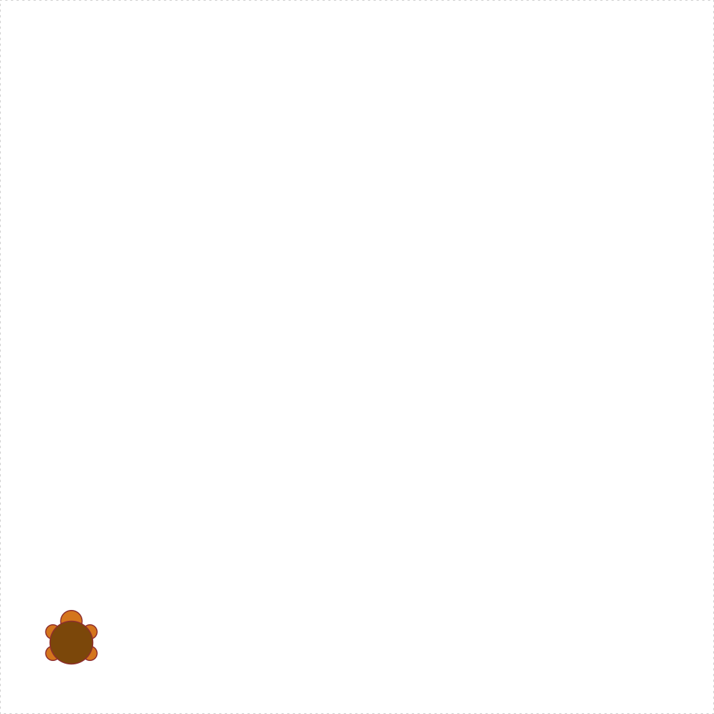

[Turtle graphics](https://en.wikipedia.org/wiki/Turtle_graphics){target="_blank"} is a classic teaching tool in computer science, originally invented in the 1960s and reimplemented over and over again in different programming languages. In R, there is a similar package called `TurtleGraphics`:

```{r, eval=FALSE}
install.packages('TurtleGraphics')
library(TurtleGraphics)
```

Here's the idea. You have a turtle, and she lives in a nice warm terrarium. The terrarium is 100 x 100 units in size, where the lower-left corner is at the `(x, y)` position of `(0, 0)`. When you call `turtle_init()`, the turtle is initially positioned in the center of the terrarium at `(50, 50)`:

```{r, eval=FALSE}
turtle_init()
```
{ width=456 }

You can move the turtle using a variety of movement functions (see `?turtle_move()`), and she will leave a trail where ever she goes. For example, you can move her 10 units forward from her starting position:

```{r eval=FALSE}
turtle_init()
turtle_forward(distance = 10)
```
{ width=456 }

You can also make the turtle jump to a new position (without drawing a line) by using the `turtle_setpos(x, y)`, where `(x, y)` is a coordinate within the 100 x 100 terrarium:

```{r eval=FALSE}
turtle_init()
turtle_setpos(x=10, y=10)
```
{ width=456 }

Simple enough, right? But what if I want my turtle to draw a more complicated shape? Let's say I want her to draw a hexagon. There are six sides to the hexagon, so the most natural way to write code for this is to write a `for` loop that loops over the sides! At each iteration within the loop, I'll have the turtle walk forwards, and then turn 60 degrees to the left. Here's what happens:

<!-- ```{r, fig.show='animate', interval=0.05, cache=TRUE, message=FALSE} -->
<!-- Having trouble with Travis CI and ffmpeg, so manually sticking video in -->
```{r eval=FALSE}
turtle_init()
for (side in 1:6) {
    turtle_forward(distance = 10)
    turtle_left(angle = 60)
}
```
<video width="456" controls="" loop="">
<source src="images/turtle_hexagon.webm">
</video>

Cool! As you draw more complex shapes, you can speed up the process by wrapping your turtle commands inside the `turtle_do({})` function. This will skip the animations of the turtle moving and will jump straight to the final position. For example, here's the hexagon again without animations:

```{r eval=FALSE}
turtle_init()
turtle_do({
    for (side in 1:6) {
        turtle_forward(distance = 10)
        turtle_left(angle = 60)
    }
})
```
{ width=456 }

---

**Page sources**:

Some content on this page has been modified from other courses, including:

- Danielle Navarro's website ["R for Psychological Science"](https://psyr.org/index.html)


