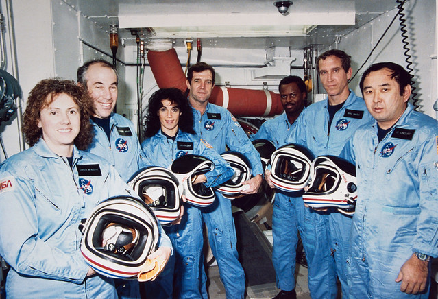

This short case study is an example of what it means to turn "data" into "information". In this example, we'll be examining data about the relationship between the temperature of different NASA rocket launches and damage to the rock O-rings - the root cause of the [1986 Space Shuttle Challenger explosion](https://en.wikipedia.org/wiki/Space_Shuttle_Challenger_disaster).

Don't worry yet if you don't understand the specific code here - just try to follow along to see how we can pull out _information_ from raw data.

# The Challenger disaster

On January 28, 1986 the space shuttle Challenger exploded. In his book titled ["Visual Explanations"](https://www.edwardtufte.com/tufte/books_visex), Edward Tufte (1997) provides a detailed account of the background to the incident. In short, the temperature on the day of the launch was too low and resulted in failure of the O-rings in the rocket, which led to an explosion that destroyed the rocket and killed the 7-person crew, pictured below.


[[Image source](https://www.flickr.com/photos/gsfc/12191288154)]

# The data

The R package `DAAG` has a dataset called `orings` which contains data on temperatures and O-ring damage during launches prior to the Challenger incident. Let's load the `DAAG` library and preview the data:

```{r, messages=FALSE}
library(DAAG)
head(orings)
```

We can see that the dataset contains observations about the temperatures of launches and O-ring damage, but we don't yet have _information_. One step forward towards _information_ is to simply plot the data to _see_ if there might be a relationship between temperature and O-ring damage:

```{r, messages=FALSE}
library(ggplot2)
plot <- ggplot(orings, aes(x=Temperature, y=Total)) +
    geom_point() +
    labs(x = 'Temperature (F)', y = 'Total O-Ring Damage')
plot
```

The graph above shows O-ring damage on the y-axis and temperature on the x-axis. We can easily see that no prior launches below 66 degrees F were damage-free, and it appears that at lower temperatures (such as 55 degrees) the damage was even more severe.

Now, what temperature was forecasted for the day of the Challenger launch? **26 to 29 degrees**. Let's add that context to our plot:

```{r, messages=FALSE}
plot +
    # Modify the x and y limits
    xlim(25, 85) +
    ylim(0, 6) +
    # Add a red rectangle for the forecasted temperature on launch day
    annotate("rect", xmin = 26, xmax = 29,  ymin=0, ymax=6,
             alpha = 0.3, fill = "red") +
    # Add text
    annotate("text", x = 30, y = 3,
             label = "Forecast \n temperature \n 26 to 29")
```

Now we have some _information_. The transformation of the raw data into a visualization makes it obvious that the temperature forecasted for the day of the Challenger launch should raise red flags. It falls far below the temperature range of prior launches, and those prior launches suggest that O-ring damage may be correlated with decreasing temperature.

To their credit, the engineers working on the Challenger were worried about the potential for O-ring failure. But the critical step in making the link to temperature was not thoroughly communicated. Instead, the _raw data_ was presented in tabular form along with diagrams like the one below, which show how erosion in the primary O-ring interacted with the secondary O-ring:

{ width=600 }
[[Image source](https://www.edwardtufte.com/tufte/books_visex)]

While the above diagram contains a lot of _data_, the critical **information** about the relationship between launch temperature and O-ring damage is not obvious. In contrast, the scatterplot achieves this without putting much cognitive load on the viewer. Just about anyone can look at that plot and understand that the forecasted temperature on January 28, 1986 might be a risk for O-ring failure.

---

**References**:

- The [Space shuttle Challenger explosion](https://vizdatar.wordpress.com/2015/05/06/space-shuttle-challenger-explosion-2/) blog post, by Vikram Dayal
- Robison et al. (2002) [Representation and Misrepresentation: Tufte and the Morton Thiokol Engineers on the Challenger](https://people.rit.edu/wlrgsh/FINRobison.pdf), _Science and Engineering Ethics_, 8, 59-81.
- Tufte, Edward R. (1997) ["Visual Explanations: Images and Quantities, Evidence and Narrative"](https://www.edwardtufte.com/tufte/books_visex), Graphics Press, Cheshire, Connecticut.

