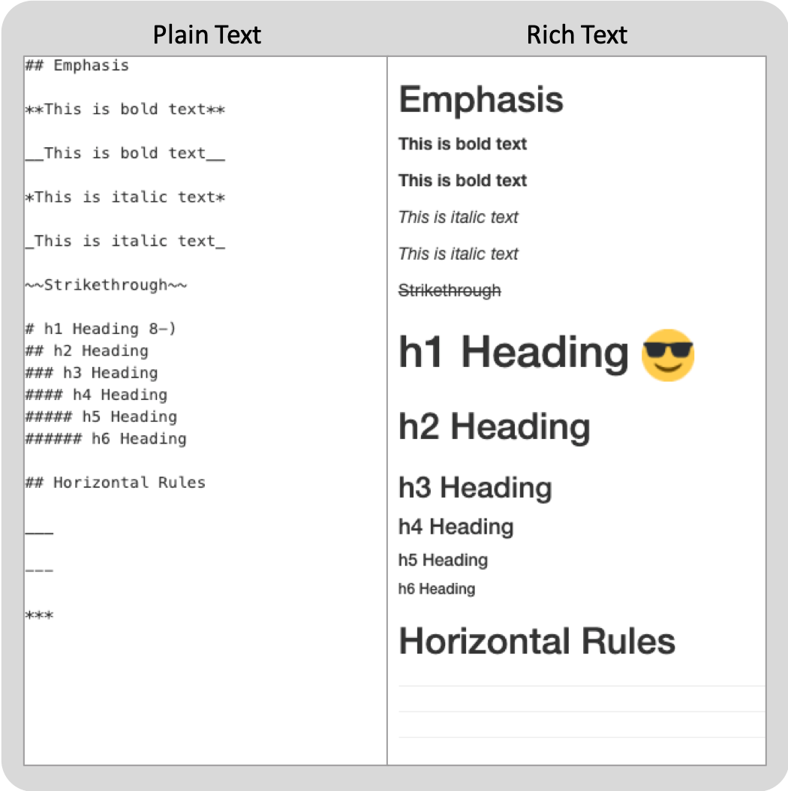

# Meet your instructor!

### Dr. John Helveston

Assistant Professor in Engineering Management & Systems Engineering


### Background:

- 2016 PhD in Engineering & Public Policy at Carnegie Mellon University
- 2015 MS in Engineering & Public Policy at Carnegie Mellon University
- 2010 BS in Engineering Science & Mechanics at Virginia Tech

---
# Meet your tutors!

.pull-left[
### Yanjie He

Masters student in Data Analytics


]

.pull-right[

### Lingmei Zhao

Masters student in Statistics


]

---
# Meet your classmates!

Get to know your neighbor! Turn to a neighbor and in [2 minutes](https://www.youtube.com/watch?v=48z7nQaehWI), share:

- Your name
- Your program
- Something notable you did over the summer

Afterwards: let's here from a few of you - tell us something you learned!

---
# Course orientation

- ### Everything you'll need will be on the course website:

  https://emse6574-gwu.github.io/2019-Fall/

--
- ### Course is broken into two main chunks:

    - 1) _Programming_...for
    - 2) _Data Analytics_

--
- ### Go to the "Resources" page for help:

    - Use Slack to ask questions.
    - Go to Office hours / tutor sessions

---
# Assignments & Grades

###  Standard Grading

|Course Component  | Weight | Notes
|:-----------------|--------|-----------------------------------
|Homeworks (6)     | 30%    | Lowest is dropped
|Quizzes (5)       | 15%    | Lowest is dropped
|Midterm Exams (2) | 30%    | Lowest is half-weighted
|Final Exam        | 20%    |
|Attendance & Participation | 5% |

--
###  AMD Grading

- Intended for students who struggle early on, but work hard to succeed in 2nd half.
- Highest grade with AMD is a C.

    - Homeworks: From 30% -> 20%
    - Midterms: From 30% -> 20%
    - Final: From 20% -> 40%

---
# Course policies

### Basic policies 

- **BE NICE. BE HONEST. DON'T CHEAT.** 

--
- Write your own code (even in "collaborative" assignments)

--

### Late submissions

- **5** late days - use them however you want.
- You can't use more than **2** late days on any one assignment.

---
# How to succeed in this class

* ### Take care of your brain

    - Sleep!
    - Exercise!
    - Eat good food!


--
* ### Don't cheat!

--
* ### Start HW early! Come to office hours / tutor sessions!

---
# Course Mantras

.pull-left[
### Embrace plain text

]

--
.pull-right[
### Everything you do should be _reproducible_.

**Example**: RMarkdown -> HTML.
This presentation was generated from R code!
]

---
# Install R & Rstudio

Go to ["Getting Started" lesson](https://emse6574-gwu.github.io/2019-Fall/L1.2-getting-started.html)

--
<br>

After installed:
<br>

**Open this**:


**Not this**:

 

--

|R: Engine            |  RStudio: Dashboard|
|---------------------|--------------------|
|  | |

---
# R as a calculator

###Basic operators:

- Addition: `+`
- Subtraction: `-`
- Multiplication: `*`
- Division: `/`

--
<br>

### Other important operators:

--
- `^`

--
- `%/%`

--
- `%%`

---
# Relational operators

### Compare if condition is `TRUE` or `FALSE` using:

- Less than: `<`
- Less than or equal to : `<=`
- Greater than or equal to: `>=`
- Greater than: `>`
- Equal: `==`
- Not equal: `!=`

---
# Logical operators

### Assess logical statements using:

- And: `&`
- Or: `|`
- Not: `!`

---
# Other important points 

- ### Order of operations - when in doubt, add `()`

--
- ### R ignores excess spacing

--
- ### Use `#` for comments

---
# Use RProjects to stay organized

`File > New Project...`

<br>

--
### Get path to current "working directory":

`getwd()`

<br>

--
### Save your code in .R Files:
<br>

`File > New File > R Script`
 
---
# Break time

[3 minute break](https://www.youtube.com/watch?v=iHdviZkM7S4)

---
# Functions 

### Funtions take this form: 

`name(argument)`

### Examples:

|Function   | Description       | Example |
|:----------|:------------------|:---------------------------|
|`exp()`    | Exponential  | `exp(0)` returns ``r exp(0)``|
|`sqrt()`   | Square root  | `sqrt(64)` returns ``r sqrt(64)``|
|`log(x)`   | Natural log of `x` | `log(1)` returns ``r log(1)``|
|`factorial()` | Factorial | `factorial(5)` returns ``r factorial(5)``|
|`round(x, digits=0)` | Round `x` to the `digits` decimal place | `round(3.1415, 2)` returns ``r round(3.1415, 2)``|
|`abs(x)`  | Absolute value of `x` | `abs(-42)` returns ``r abs(-42)``|

--
### What would this produce?

`sqrt(1 + abs(-8))`

---
# Objects

### Object assignments take this form:

`objectName <- value`

--
### Name objects with descriptive _words_; case matters:

- `snake_case_is_one_choice`
- `other.people.use.periods`
- `camelCaseIsAlsoGood`

--

### To see all objects, use:

`ls()`

---
# Data Types 

|Type      | Description                 | Example
|:---------|:----------------------------|:------------
|numeric   | Numbers                     | `3.14`, `42`, `1.61803398875`
|integer   | A number with no decimal    | `1L`, `7L`
|character | Text data, a.k.a. "strings" | `"this is a string"`, `"3.14"`
|logical   | Used for comparing objects  | `TRUE`, `FALSE`

To assess the type of any variable:

- `class()` tells us the high level object type
- `typeof()` tells us the low level object type

---
# Checking data types

Check the data type using `is.something()`

```{r}
is.numeric(3.1415)
is.integer(3.1415)
is.character(3.1415)
is.logical(3.1415)
```

---
# Coercing data types

Force an object into a different type using `as.something()`

```{r}
as.numeric(3.1415)
as.integer(3.1415)
as.character(3.1415)
as.logical(3.1415)
```

---
# Installing packages 

Add additional functions by installing packages:

```{r, eval=FALSE}
install.packages("packagename") # This works
install.packages(packagename)   # This doesn't work
```

--
In each session, load the package with the `library()` function:

```{r, eval=FALSE}
library("packagename") # This works
library(packagename)   # This also works
```

---
# Final points 

### Take the survey on Slack about office hours 

--
### Interested in Python?

You can take a free 3-day boot camp held on Fridays (9/6, 13, & 20). [link will be posted on Slack]