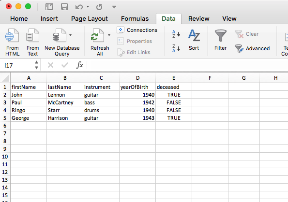

```{r, echo=FALSE, message=FALSE}
library(tidyverse)
```

# Quiz 4 - Strings!

### [20 minutes](https://www.youtube.com/watch?v=kxGWsHYITAw)

- ### No calculators
- ### No notes
- ### No books
- ### No computers
- ### No phones

---
# Announcements

--
1) Download the `week10notes.zip` file for class today (link in `slack/classroom`).
<br>
<br>

--
2) Make sure you have these packages installed:
```{r, eval=FALSE}
install.packages("stringr")
install.packages("dplyr")
install.packages("ggplot2")
install.packages("readr")
```

---

### "The purpose of computing is insight, not numbers"
### - Richard Hamming

---
# The data frame...in Excel



---
# The data frame...in R

**R**:
```{r, echo=FALSE}
beatles <- tibble(
    firstName   = c("John", "Paul", "Ringo", "George"),
    lastName    = c("Lennon", "McCartney", "Starr", "Harrison"),
    instrument  = c("guitar", "bass", "drums", "guitar"),
    yearOfBirth = c(1940, 1942, 1940, 1943),
    deceased    = c(TRUE, FALSE, FALSE, TRUE)
)
beatles
```

---
# Data frame columns are **vectors**

The **data frame** is a collection of **vectors** of the same length
```{r}
beatles
```
<br>

--
You can access each vector (column) using the `$` symbol:
--
```{r}
beatles$firstName
```
--
```{r}
beatles$lastName
```

---
# Making a data frame with `tibble()`

```{r, eval=FALSE}
library(dplyr)
```
```{r}
beatles <- tibble(
    firstName   = c("John", "Paul", "Ringo", "George"),
    lastName    = c("Lennon", "McCartney", "Starr", "Harrison"),
    instrument  = c("guitar", "bass", "drums", "guitar"),
    yearOfBirth = c(1940, 1942, 1940, 1943),
    deceased    = c(TRUE, FALSE, FALSE, TRUE)
)
```
<br>
--
```{r}
beatles
```

---
# Each vector must have the same length

```{r, eval=FALSE}
beatles <- tibble(
    firstName   = c("John", "Paul", "Ringo", "George", "BOB"),
    lastName    = c("Lennon", "McCartney", "Starr", "Harrison"),
    instrument  = c("guitar", "bass", "drums", "guitar"),
    yearOfBirth = c(1940, 1942, 1940, 1943),
    deceased    = c(TRUE, FALSE, FALSE, TRUE)
)
```
--
```{r, error=TRUE, echo=FALSE}
beatles <- tibble(
    firstName   = c("John", "Paul", "Ringo", "George", "BOB"),
    lastName    = c("Lennon", "McCartney", "Starr", "Harrison"),
    instrument  = c("guitar", "bass", "drums", "guitar"),
    yearOfBirth = c(1940, 1942, 1940, 1943),
    deceased    = c(TRUE, FALSE, FALSE, TRUE)
)
```

---
# Data frame rows are **observations**

```{r}
beatles
```

---
# Data frame rows are **observations**

```{r}
beatles
```
<br>

Example: Information about John Lennon is the first **row**

```{r}
beatles[1,]
```

---
# Dimensions

```{r, echo=FALSE}
beatles
```

```{r}
nrow(beatles) # Number of rows
ncol(beatles) # Number of columns
dim(beatles)  # Number of rows and columns
```

---
# Row and column names

Get the names of columns:
```{r}
names(beatles)
colnames(beatles)
```
<br>

--
Get the names of rows:
```{r}
rownames(beatles)
```

---
# Changing the column names

```{r, echo=FALSE}
beatles
```
<br>

--
Change the column names:
```{r, eval=FALSE}
colnames(beatles) <- c('one', 'two', 'three', 'four', 'five')
beatles
```
```{r, echo=FALSE}
df <- beatles
colnames(df) <- c('one', 'two', 'three', 'four', 'five')
df
```

---
# Changing the column names

```{r, echo=FALSE}
beatles
```
<br>

--
Change the column names:
```{r, eval=FALSE}
library(stringr)
colnames(beatles) <- str_to_upper(colnames(beatles))
beatles
```
```{r, echo=FALSE}
colnames(df) <- str_to_upper(colnames(beatles))
df
```

---
# Combining data frames

Combine by columns using `bind_cols()`:

```{r}
names <- tibble(
    firstName = c("John", "Paul", "Ringo", "George"),
    lastName  = c("Lennon", "McCartney", "Starr", "Harrison")
)
instruments <- tibble(
    instrument = c("guitar", "bass", "drums", "guitar")
)
```
--
```{r}
bind_cols(names, instruments)
```

---
# Combining data frames

Combine by rows using `bind_rows()`:

```{r}
members1 <- tibble(
    firstName = c("John", "Paul"),
    lastName  = c("Lennon", "McCartney")
)
members2 <- tibble(
    firstName = c("Ringo", "George"),
    lastName  = c("Starr", "Harrison")
)
```
--
```{r}
bind_rows(members1, members2)
```

---
# Combining data frames

Be careful - `bind_rows()` requires **exact same** columns names:

```{r}
colnames(members2) <- c("firstName", "LastName")
bind_rows(members1, members2)
```

---
# Practice - Think, Pair, Share

```{r, eval=FALSE}
animals_farm = tibble(
    name           = c("cow", "horse"),
    sound          = c("moo", "neigh"),
    aveWeightLbs   = c(2400, 1500),
    aveLifeSpanYrs = c(20, 25)
)
animals_pet = tibble(
    name           = c("dog", "cat"),
    sound          = c("woof", "meow"),
    aveWeightLbs   = c(40, 8),
    aveLifeSpanYrs = c(10, 12)
)
```

Use R code to find answers to these questions:

1. How many rows are in the `animals_farm` data frame?
2. How many columns are in the `animals_pet` data frame?
3. Create a new data frame, `animals`, by combining `animals_farm` and `animals_pet`.
4. Create a new column in `animals` called `type` and set the values to `"farm"` or `"pet"`.
5. Change the column names of `animals` to title case.

```{r, eval=FALSE}
nrow(animals_farm)
ncol(animals_pet)
animals <- bind_rows(animals_farm, animals_pet)
animals$type <- c('farm', 'farm', 'pet', 'pet')
library(stringr)
colnames(animals) <- str_to_title(colnames(animals))
```

---
# Accessing elements

General form for indexing elements:

```{r, eval=FALSE}
DF[ROWS, COLUMNS]
```

--
Select the element in row 1, column 2:
```{r}
beatles[1, 2]
```

--
Select the elements in rows 1 & 2 and columns 2 & 3:
```{r}
beatles[c(1, 2), c(2, 3)]
```

---
# Accessing elements

Leaving row or column index blank means "selects all":

--
```{r}
beatles[c(1, 2),]
```
--
```{r}
beatles[,c(1, 2)]
```

---
# Negative indices exclude row / column

--
Select all rows except the first:
```{r}
beatles[-1, ]
```
<br>

--
Select all columns except the first:
```{r}
beatles[,-1]
```

---
# Using character indices

--
You can use a vector of column names to select columns:
```{r}
beatles[,c('firstName', 'lastName')]
```
<br>

--
Same thing, but just the first two rows:
```{r}
beatles[1:2, c('firstName', 'lastName')]
```

---
# Use logical indices to filter rows

Example: What if want to filter rows to find which Beatles members were still alive?
<br>
<br>

--
First, create a logical vector using the `deceased` column:
```{r}
beatles$deceased == FALSE
```
<br>

--
Next, insert this logical vector in the row position of `[,]`:
```{r}
beatles[beatles$deceased == FALSE,]
```

---
# Creating new variables

Use the `$` symbol to create a new column
<br>
<br>

--
Add the hometown of the bandmembers:
```{r}
beatles$hometown <- 'Liverpool'
beatles
```

---
# Creating new variables

Use the `$` symbol to create a new column
<br>
<br>

--
Compute and add the age of the bandmembers:
```{r}
beatles$age <- 2019 - beatles$yearOfBirth
beatles
```

---
# Practice - Think, Pair, Share

```{r}
beatles <- tibble(
    firstName   = c("John", "Paul", "Ringo", "George"),
    lastName    = c("Lennon", "McCartney", "Starr", "Harrison"),
    instrument  = c("guitar", "bass", "drums", "guitar"),
    yearOfBirth = c(1940, 1942, 1940, 1943),
    deceased    = c(TRUE, FALSE, FALSE, TRUE)
)
```

Use R code to find answers to these questions:

1. Create a new column, `playsGuitar`, which is `TRUE` if the band member plays the guitar and `FALSE` otherwise.
2. Select the rows for the band members who have four-letter first names.
3. Create a new column, `fullName`, which contains the band member's first and last name separated by a space (e.g. `"John Lennon"`)

```{r, eval=FALSE, echo=FALSE}
# Solutions
beatles$playsGuitar <- beatles$instrument == 'guitar'
library(stringr)
beatles[str_length(beatles$firstName) == 4,]
beatles$fullName <- str_c(beatles$firstName, beatles$lastName, sep = ' ')
```

---
# 5 minute break - stand up, move around, stretch!

### [5 minutes](https://www.youtube.com/watch?v=_W0bSen8Qjg)

---
# Getting the data from an R package

```{r, eval=FALSE, message=FALSE}
install.packages("ggplot2")
library(ggplot2)
```
--
```{r}
data(package = "ggplot2")
```

Dataset   | Description
----|----------------------------------------------------------------------
diamonds       | Prices of 50,000 round cut diamonds
economics      | US economic time series
economics_long | US economic time series
faithfuld      | 2d density estimate of Old Faithful data
luv_colours    | 'colors()' in Luv space
midwest        | Midwest demographics
mpg            | Fuel economy data from 1999 and 2008 for 38
               | popular models of car
msleep         | An updated and expanded version of the mammals
               | sleep dataset
presidential   | Terms of 11 presidents from Eisenhower to Obama
seals          | Vector field of seal movements
txhousing      | Housing sales in TX

---
# Working with external datasets

Today's example: `msleep`

V. M. Savage and G. B. West. "A quantitative, theoretical framework for understanding mammalian sleep." _Proceedings of the National Academy of Sciences_, 104 (3):1051-1056, 2007.

 Column Name      | Description
------------------|------------------------------------
name              | Common name
genus             | The taxonomic genus of animal
vore              | Carnivore, omnivore or herbivore?
order             | The taxonomic order of animal
conservation      | The conservation status of the animal
sleep_total       | Total amount of sleep, in hours
sleep_rem         | REM sleep, in hours
sleep_cycle       | Length of sleep cycle, in hours
awake             | Amount of time spent awake, in hours
brainwt           | Brain weight in kilograms
bodywt            | Body weight in kilograms

---
# Importing data from a file

Note the `msleep.csv` file in your `data` folder.

- **DO NOT** double-click it!
- **DO NOT** open it in Excel!
<br>

PSA: Excel **breaks** data
<br>
<br>

--
Import the .csv file:
```{r, eval=FALSE}
library(readr)
pathToData <- file.path('data', 'msleep.csv')
msleep <- read_csv(pathToData)
```

---
# A note about file paths

--
When you open a `.Rproj` file, R sets your _working directory_ to the location of that file.
<br>
<br>

--
To view your current _working directory_, use:
```{r}
getwd()
```
<br>

--
The `file.path()` function creates a **local** path **from your working directory**
```{r}
pathToData <- file.path('data', 'msleep.csv')
pathToData
```
<br>

--
Avoid using **hard-coded** file paths, like this:
```{r, eval=FALSE}
pathToData <- 'data/msleep.csv'
```

---
# Previewing data frames: Dimensions

```{r}
nrow(msleep) # Number of rows
ncol(msleep) # Number of columns
dim(msleep)  # Number of rows and columns
```

---
# Previewing data frames: Content

--
Look at the data in a "spreadsheet"-like way:
```{r, eval = FALSE}
View(msleep)
```
<br>

--
View the **first** 6 rows with `head()`, or **last** 6 rows with `tail()`:
```{r}
head(msleep)
```

---
# Quick data summaries

Preview each variable with `str()` or `glimpse()`:

```{r}
glimpse(msleep)
```

---
# Group Practice

1) Use `read_csv()` and `file.path()` to load the `wildlife_impacts.csv` file that is in the `data` folder. Name the data frame object `df`.
<br>
<br>

2) Use the `df` object to answer the following questions:

- How many rows and columns are in the data frame?
- What type of data is each column?
- Preview the different columns - what do you think this data is about? What might one row represent?
- How many unique airports are in the data frame?
- What is the earliest and latest observation in the data frame?
- What is the lowest and highest cost of any one repair in the data frame?

---
# Next week: better data wrangling with **dplyr**

<center>

</center>

---
# Next next week: plotting with **ggplot2**

Translating _data_ into _insight_:

```{r fig.height=4, fig.width=6, message=FALSE, warning=FALSE}
library(ggplot2)
ggplot(msleep, aes(x=brainwt, y=bodywt)) +
    geom_point(alpha=0.6) +
    stat_smooth(method='lm', col='red', se=F, size=0.7) +
    scale_x_log10() +
    scale_y_log10() +
    labs(x='log(brain weight) in g', y='log(body weight) in kg') +
    theme_minimal()
```

---
# A note about HW5

- You have what you need to start now.
- It will be _much_ easier if you use the **dplyr** functions (i.e. read ahead).
