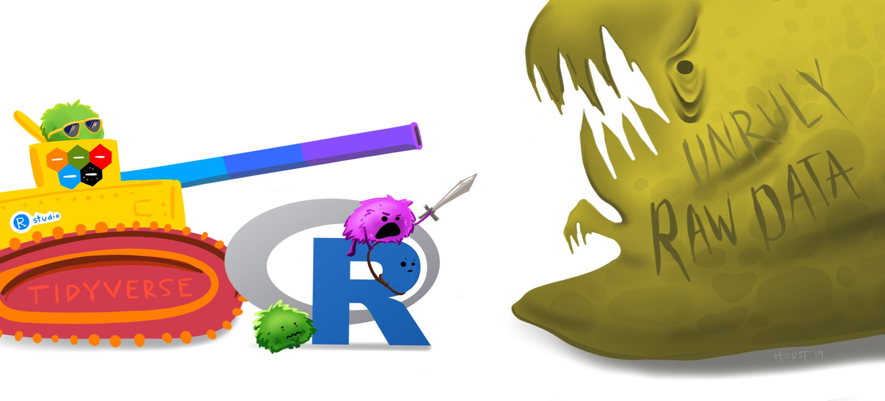
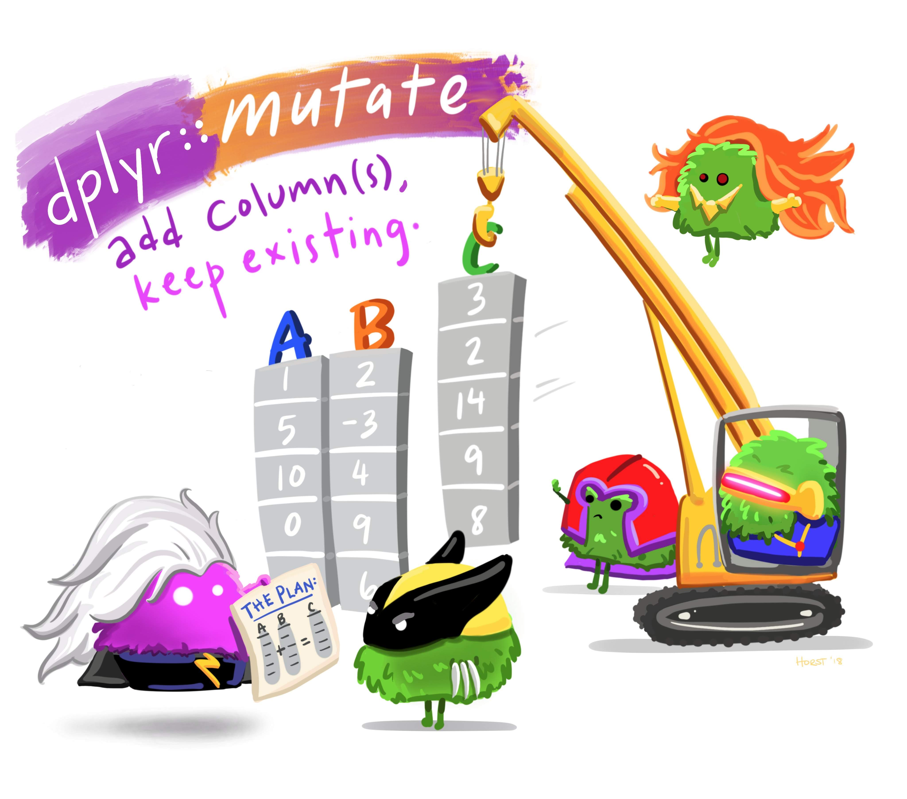

```{r, echo=FALSE, message=FALSE}
library(tidyverse)
```

# Announcements

--
1) Download the `week11notes.zip` file for class today (link in `slack/classroom`).
<br>
<br>

--
2) Make sure you have the "tidyverse" installed:
```{r, eval=FALSE}
install.packages('tidyverse')
library(tidyverse)
```

---
# The tidyverse

<br>
`stringr` + `dplyr` + `readr` +  `ggplot2` + more = `tidyverse`

<br>
<center>

</center>

---
# Today: better data wrangling with **dplyr**

<center>

</center>

---
# 80% of the job is data wrangling

<br>
<br>

<center>

</center>

---
# The main `dplyr` verbs

- `select()`: subset columns
- `filter()`: subset rows on conditions
- `arrange()`: sort results
- `mutate()`: create new columns by using information from other columns
- `group_by()`: group data to perform grouped operations
- `summarize()`: create summary statistics (usually on grouped data)
- `count()`: count discrete rows

---
# This week's British Band: The Spice Girls

```{r}
spicegirls <- tibble(
    firstName   = c("Melanie", "Melanie", "Emma", "Geri", "Victoria"),
    lastName    = c("Brown", "Chisholm", "Bunton", "Halliwell", "Beckham"),
    spice       = c("Scary", "Sporty", "Baby", "Ginger", "Posh"),
    yearOfBirth = c(1975, 1974, 1976, 1972, 1974),
    deceased    = c(FALSE, FALSE, FALSE, FALSE, FALSE)
)
spicegirls
```

---
# Select columns with `select()`

<br>
<br>
<center>

</center>

---
# Select columns with `select()`

Example: Select the columns `firstName` & `lastName`
<br>

---
# Select columns with `select()`

Example: Select the columns `firstName` & `lastName`
<br>

Base R:
```{r}
spicegirls[c('firstName', 'lastName')]
```

---
# Select columns with `select()`

Example: Select the columns `firstName` & `lastName`
<br>

Base R:
```{r, eval=FALSE}
spicegirls[c('firstName', 'lastName')]
```
<br>

dplyr:
```{r}
select(spicegirls, firstName, lastName)
```

---
# Select columns with `select()`

Select all columns *except* certain ones with a `-` sign:
```{r}
select(spicegirls, -firstName, -lastName)
```

---
# Select columns with `select()`

Select columns based on name criteria:

- `ends_with()` = Select columns that end with a character string
- `contains()` = Select columns that contain a character string
- `matches()` = Select columns that match a regular expression
- `one_of()` = Select column names that are from a group of names
<br>
<br>

--
```{r}
# Select only the "name" columns
select(spicegirls, ends_with('name'))
```

---
# Select rows with `filter()`

<br>
<br>
<center>

</center>

---
# Select rows with `filter()`

Example: Filter the band members born after 1974
<br>
```{r, echo=FALSE}
spicegirls[spicegirls$yearOfBirth > 1974,]
```

---
# Select rows with `filter()`

Example: Filter the band members born after 1974
<br>
```{r, echo=FALSE}
spicegirls[spicegirls$yearOfBirth > 1974,]
```
<br>

Base R:
```{r, eval=FALSE}
spicegirls[spicegirls$yearOfBirth > 1974,]
```

---
# Select rows with `filter()`

Example: Filter the band members born after 1974
<br>
```{r, echo=FALSE}
spicegirls[spicegirls$yearOfBirth > 1974,]
```
<br>

Base R:
```{r, eval=FALSE}
spicegirls[spicegirls$yearOfBirth > 1974,]
```
<br>

dplyr:
```{r, eval=FALSE}
filter(spicegirls, yearOfBirth > 1974)
```

---
# Select rows with `filter()`

Example: Filter the band members born after 1974
```{r}
filter(spicegirls, yearOfBirth > 1974)
```

---
# Select rows with `filter()`

Example: Filter the band members born after 1974
```{r}
filter(spicegirls, yearOfBirth > 1974)
```
<br>

Example: Filter the band members named "Melanie"
--
```{r}
filter(spicegirls, firstName == "Melanie")
```

---
# Practice: `select` columns, `filter` rows

Data: Wildlife impacts data (we saw this last week)
<br>
<br>

1) Create the data frame object `df` by using `file.path()` and `read_csv()` to load the `wildlife_impacts.csv` file that is in the `data` folder.
<br>
<br>

2) Use the `df` object and the `select()` and `filter()` functions to answer the following questions:

- Create a new data frame, `df_birds`, that contains only the variables (columns) about the species of bird.
- Create a new data frame, `dc`, that contains only the observations (rows) from DC airports.
- Create a new data frame, `dc_birds_known`, that contains only the observations (rows) from DC airports and those where the species of bird is known.
- How many _known_ unique species of birds have been involved in accidents at DC airports?

---
# Sequence operations with pipes: `%>%`

<br>
<br>
--
.pull-left[
<br>
<center>

</center>
]

--
<center>
.pull-right[

</center>
]

---
# Think of the words "...and then..."

<br>

--
**Without Pipes**:
```{r, eval=FALSE}
leave_house(get_dressed(get_out_of_bed(wake_up(me))))
```
<br>

--
**With Pipes**:
```{r, eval=FALSE}
me %>%
    wake_up %>%
    get_out_of_bed %>%
    get_dressed %>%
    leave_house
```

---
# Sequence operations with pipes: `%>%`

What if I want to filter rows, and then select columns?

---
# Sequence operations with pipes: `%>%`

What if I want to filter rows, and then select columns?
<br>
<br>

Example:

Step 1: Filter the band members born after 1974

Step 2: Select only the columns `firstName` & `lastName`
<br>
<br>

--
**Without Pipes**:
```{r}
select(filter(spicegirls, yearOfBirth > 1974), firstName, lastName)
```

---
# Sequence operations with pipes: `%>%`

What if I want to filter rows, and then select columns?
<br>
<br>

Example:

Step 1: Filter the band members born after 1974

Step 2: Select only the columns `firstName` & `lastName`
<br>
<br>

--
**With Pipes**:
```{r}
spicegirls %>%
    filter(yearOfBirth > 1974) %>%
    select(firstName, lastName)
```

---
# Think of the words "...and then..."

**Without Pipes**:
```{r}
select(filter(spicegirls, yearOfBirth > 1974), firstName, lastName)
```

**With Pipes**:
```{r}
spicegirls %>%
    filter(yearOfBirth > 1974) %>%
    select(firstName, lastName)
```

---
# Practice: `select`, `filter`, and `%>%`

Data: Wildlife impacts data
<br>
<br>

1) Create the data frame object `df` by using `file.path()` and `read_csv()` to load the `wildlife_impacts.csv` file that is in the `data` folder.
<br>
<br>

2) Use the `df` object and the `select()` and `filter()` functions to answer the following questions:

- Create a new data frame, `dc_dawn`, that contains only the observations (rows) from DC airports that occurred at dawn.
- Create a new data frame, `dc_dawn_birds`, that contains only the observations (rows) from DC airports that occurred at dawn and only the variables (columns) about the species of bird.
- Create a new data frame, `dc_dawn_birds_known`, that contains only the observations (rows) from DC airports that occurred at dawn and only the variables (columns) about the KNOWN species of bird.
- How many _known_ unique species of birds have been involved in accidents at DC airports at dawn?

---
# Sort rows with `arrange()`

--
Sort the data frame by year of birth:
```{r}
spicegirls %>%
    arrange(yearOfBirth)
```

---
# Sort rows with `arrange()`

Use the `desc()` function to sort in descending order:
```{r}
spicegirls %>%
    arrange(desc(yearOfBirth))
```

---
# Sort rows with `arrange()`

Example of filtering, arranging, and selecting:

```{r}
spicegirls %>%
    filter(yearOfBirth < 1975) %>%
    arrange(desc(yearOfBirth)) %>%
    select(ends_with('name'))
```

---
# 5 minute break - stand up, move around, stretch!

### [5 minutes](https://www.youtube.com/watch?v=_W0bSen8Qjg)

---
# Create new variables with `mutate()`

<center>

</center>

---
# Create new variables with `mutate()`

<br>
<br>
<center>

</center>

---
# Create new variables with `mutate()`

Example: Compute the age of each band member from `yearOfBirth`
<br>

---
# Create new variables with `mutate()`

Example: Compute the age of each band member from `yearOfBirth`
<br>

Base R:
```{r, eval=FALSE}
spicegirls$age <- 2019 - spicegirls$yearOfBirth
```

---
# Create new variables with `mutate()`

Example: Compute the age of each band member from `yearOfBirth`
<br>

Base R:
```{r, eval=FALSE}
spicegirls$age <- 2019 - spicegirls$yearOfBirth
```
<br>

dplyr:
```{r}
spicegirls %>%
    mutate(age = 2019 - yearOfBirth)
```

---
# You can immediately use new variables

```{r}
spicegirls %>%
    select(firstName, lastName, yearOfBirth) %>%
    mutate(
        age      = 2019 - yearOfBirth,
        meanAge  = mean(age),
        youngest = (age == min(age)),
        oldest   = (age == max(age)))
```

---
# if/else statements with `ifelse()`

To create a new variable based on a condition, use `ifelse()`
<br>
`ifelse(<condition>, <if TRUE>, <else>)`
<br>
--
```{r}
spicegirls %>%
    mutate(
        bornEvenOrOdd = ifelse(yearOfBirth %% 2 == 0, 'even', 'odd'))
```

---
# Practice: `mutate`

Data: Wildlife impacts data
<br>
<br>

1) Create the data frame object `df` by using `file.path()` and `read_csv()` to load the `wildlife_impacts.csv` file that is in the `data` folder.
<br>
<br>

2) Use the `df` object and the `mutate()` functions to add the following new variables:

- `height_miles`: The `height` variable converted to miles (Hint: there are 5,280 feet in a mile).
- `cost_mil`: `TRUE` if the repair costs was greater or equal to $1 million, `FALSE` otherwise.

BONUS: Use the `incident_month` variable to create a new variable `season`, which takes one of four values based on the incident month:

- `spring`: March, April, May
- `summer`: June, July, August
- `fall`: September, October, November
- `winter`: December, January, February

---
# Split-apply-combine with `group_by`
<br>

### 1. **Split** the data into groups
<br>

### 2. **Apply** some analysis to each group
<br>

### 3. **Combine** the results

---
# Split-apply-combine with `group_by`

<br>
<br>
<center>

</center>

---
# Split-apply-combine with `group_by`
<br>

```{r, echo=FALSE}
spicegirls <- spicegirls %>%
    select(-spice) %>%
    mutate(band = 'spicegirls')
beatles <- tibble(
    firstName   = c("John", "Paul", "Ringo", "George"),
    lastName    = c("Lennon", "McCartney", "Starr", "Harrison"),
    yearOfBirth = c(1940, 1942, 1940, 1943),
    deceased    = c(TRUE, FALSE, FALSE, TRUE),
    band        = 'beatles'
)
bands <- bind_rows(spicegirls, beatles)
```
```{r}
bands
```

---
# Split-apply-combine with `group_by`

Compute the mean band member age for each band
```{r}
bands %>%
    mutate(
        age = 2019 - yearOfBirth)
```

---
# Split-apply-combine with `group_by`

Compute the mean band member age for each band
```{r}
bands %>%
    mutate(
        age = 2019 - yearOfBirth,
        mean_age = mean(age))
```

---
# Split-apply-combine with `group_by`

Compute the mean band member age for each band
```{r}
bands %>%
    mutate(age = 2019 - yearOfBirth) %>%
    group_by(band) %>%
    mutate(mean_age = mean(age))
```

---
# Summarize data frames with `summarise()`

<br>
<br>
<center>

</center>

---
# Summarize data frames with `summarise()`

Compute the mean band member age for each band
```{r}
bands %>%
    mutate(age = 2019 - yearOfBirth) %>%
    group_by(band) %>%
    summarise(mean_age = mean(age))
```

---
# Summarize data frames with `summarise()`

Compute the mean band member age for each band
```{r}
bands %>%
    mutate(age = 2019 - yearOfBirth) %>%
    group_by(band) %>%
    summarise(
        mean_age = mean(age),
        min_age = min(age),
        max_age = max(age))
```

---
# Practice: `group_by` + `summarise`

Data: Wildlife impacts data
<br>
<br>

1) Create the data frame object `df` by using `file.path()` and `read_csv()` to load the `wildlife_impacts.csv` file that is in the `data` folder.
<br>
<br>

2) Use the `df` object and the `group_by()` and `summarise` functions to answer the following questions:

- Create a summary data frame that contains the mean `height` for each different time of day.
- Create a summary data frame that contains the maximum `cost_repairs_infl_adj` for each year.

---
# Count observations with `count()`

Example: How many members are in each band?
<br>
--
```{r}
bands %>%
    group_by(band) %>%
    summarise(count = n())
```

---
# Count observations with `count()`

Same thing, but faster:
<br>
```{r}
bands %>%
    count(band)
```

---
# Count observations with `count()`

Counting *combinations of variables*:
<br>
```{r}
bands %>%
    mutate(startsWithG = str_detect(firstName, '^G')) %>%
    count(band, startsWithG)
```

---
# Practice: `count`

Data: Wildlife impacts data
<br>
<br>

1) Create the data frame object `df` by using `file.path()` and `read_csv()` to load the `wildlife_impacts.csv` file that is in the `data` folder.
<br>
<br>

2) Use the `df` object and the `count()` function to answer the following questions:

- Which month has had the greatest number of reported incidents?
- Which year has had the greatest number of reported incidents?

---
# Exporting data

Use `filePath()` + `write_csv()`
<br>

```{r}
ageSummary <- bands %>%
    mutate(age = 2019 - yearOfBirth) %>%
    group_by(band) %>%
    summarise(
        mean_age = mean(age),
        min_age = min(age),
        max_age = max(age))
ageSummary
```

---
# Exporting data

<br>
Save the `ageSummary` data frame in your "data" folder:
<br>
```{r, eval=FALSE}
savePath <- file.path('data', 'ageSummary.csv')
write_csv(ageSummary, savePath)
```

---
# HW 5

<br>
--
Make sure you install the package `nycflights13`

```{r, eval=FALSE}
install.packages('nycflights13')
```

<br>
--
This package includes **5 data frames**:

```{r, eval=FALSE}
airlines
airports
flights
planes
weather
```
