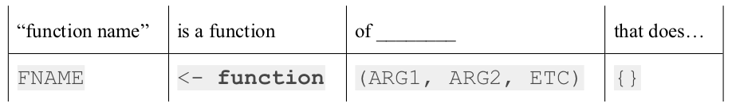
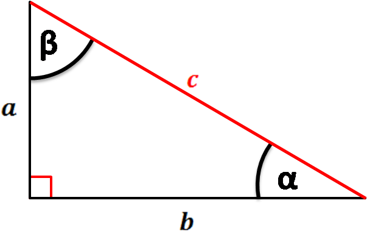

# Quiz 1

### [20 minutes](https://www.youtube.com/watch?v=kxGWsHYITAw)

- ### No calculators
- ### No notes
- ### No books
- ### No computers
- ### No phones
- ### No strings or loops

---
# Announcements

### 1. If you haven't already, download the slack app 

--
### 2. HW1 solutions will be posted Tues. @ 8:01pm.

---
# Announcements

### 3. Thanks for the animals Kaitlin, Jenny, Gabriel, William, Emily, Bruna, Alp, Alexa R., & Olivia!

| | | |
|-|-|-|
| |  |   |
| | | |
| |  | |

---
# Make a class notes project

### File > New Project...

--
### Save your project, e.g. `"week_3.RProj"`

--
### File > New File > R Script

--
### Save your script, e.g. `"class_notes.R"`

---
# Basic function syntax

```{r eval=FALSE}
FNAME <- function(ARG1, ARG2, ETC) {
  STATEMENT1
  STATEMENT2
  return(VALUE)
}
```

--
How I remember this:


<br>
<br>

--
**Example**: Write a function that returns the square root of `x`. Don't just call `sqrt()`.
<br>

---
# `return()` and `cat()` statements

--
.pull-left[
<br>

```{r}
isPositive <- function(n) {
    return(n > 0)
}
```
]
--
.pull-right[

<br>

```{r}
isPositive <- function(n) {
    cat(n > 0)
}
```
]

---
# `return()` and `cat()` statements

.pull-left[
<br>

```{r}
isPositive <- function(n) {
    return(n > 0)
}
```
<br>

- `return()` _returns_ back a value

]
.pull-right[

<br>

```{r}
isPositive <- function(n) {
    cat(n > 0)
}
```
<br>

- `cat()` _prints_ a value as a string
]

---
# Why use `cat()`?

### Short for "concatenating"

### `cat()` prints arguments to the console:
<br>

--
```{r}
printX <- function(x) {
  cat("The value of x is", x)
}
```
--
```{r}
printX(7)
```
--
```{r}
printXSquared <- function(x) {
  y <- x^2
  cat("The value of x^2 is", y)
}
```
--
```{r}
printXSquared(7)
```

---
# Practice: What will these functions do? 

### [2 minutes](https://www.youtube.com/watch?v=48z7nQaehWI) - no typing!
<br>

.pull-left[
```{r}
f1 <- function(x) {
    return(x^3)
}
f2 <- function(x) {
    cat(x^3)
}
f3 <- function(x) {
    cat(x^3)
    return(x^4)
}
f4 <- function(x) {
    return(x^3)
    cat(x^4)
}
```
]
.pull-right[
```{r, eval=FALSE}
f1(2)
f2(2)
f3(2)
f4(2)
```
]

---
# Practice: What will these functions do? 

```{r, eval=FALSE}
f1 <- function(x) {
    return(x^3)
}
f1(2)
```

--
```{r, echo=FALSE}
f1(2)
```

--
```{r, eval=FALSE}
f2 <- function(x) {
    cat(x^3)
}
f2(2)
```

--
```{r, echo=FALSE}
f2(2)
```

--
```{r, eval=FALSE}
f3 <- function(x) {
    cat(x^3)
    return(x^4)
}
f3(2)
```

--
```{r, echo=FALSE}
f3(2)
```

---
# Practice: What will these functions do? 

```{r, eval=FALSE}
f4 <- function(x) {
    return(x^3)
    cat(x^4)
}
f4(2)
```

--
```{r, echo=FALSE}
f4(2)
```

---
# Helper functions

### Helper functions break complicated problems into smaller chunks.

### **Example**: Write a function to compute the hypotenuse of a triangle:



--

### The formula to compute the hypotenuse is:

--
### $c = \sqrt{a^2 + b^2}$

--
### Helper function - compute the part under square root:

--
### $a^2 + b^2$

---
# "Top Down" design


### Hypotenuse: $c = \sqrt{a^2 + b^2}$
<br>

--
### Step 1: Define the function `hypotenuse(a, b)`
<br>

--
### Step 2: Define the function `sumOfSquares(a, b)`

---
# Local objects

### All objects inside function are **local**.

### If you call a local object in the global environment, you'll get an error.

--
### Example:

```{r}
squareOfX <- function(x) {
  y <- x^2
  return(y)
}
```

--
```{r}
squareOfX(3)
```

--
```{r, error=TRUE}
y
```

---
# Global objects

### **Global** objects are those in the global environment (see "Environment" pane in RStudio).

### **NEVER, NEVER, NEVER** call global objects inside functions.

--
### Here's an example:

```{r include=FALSE}
n <- NULL
```
```{r error=TRUE}
printN <- function() {
    cat(n)  # n is not local -- so it is global (bad idea!!!)
}
```
--
```{r}
printN() # Nothing happens because n isn't defined
```
--
```{r}
n = 5 # Define n in the *global* environment
printN()
```

---
# Global objects

### It is okay to call other functions inside functions 

--
### Example:

```{r}
sumOfSquares <- function(a, b) {
    return(a^2 + b^2)
}

hypotenuse <- function(a, b) {
   return(sqrt(sumOfSquares(a, b)))
}
```

--

```{r}
hypotenuse(3, 4)
```

---
# Group Practice - Write some functions!

### [20 minutes](https://www.youtube.com/watch?v=kxGWsHYITAw) - In groups of 4, write the following functions:
<br>

1) `onesDigit(x)`: Write a function that takes an integer and returns its ones digit.
<br>
<br>

--
2) `tensDigit(x)`: Write a function that takes an integer and returns its tens digit. 
<br>
<br>

--
.pull-left[
`onesDigit(x)` tests:

- onesDigit(123) == 3
- onesDigit(7890) == 0
- onesDigit(6) == 6
- onesDigit(-54) == 4
]

--
.pull-right[
`tensDigit(x)` tests:

- tensDigit(456) == 5
- tensDigit(23) == 2
- tensDigit(1) == 0
- tensDigit(-7890) == 9
]

---
# Hints

### Hint #1:

For `tensDigit(x)`, you may want to use `onesDigit(x)` as a helper function!

### Hint #2:

.pull-left[

The mod operator (`%%`) "chops" a number and returns everything to the _right_

```{r}
123456 %% 1
123456 %% 10
123456 %% 100
```

]

.pull-right[

The integer divide operator (`%/%`) "chops" a number and returns everything to the _left_

```{r}
123456 %/% 1
123456 %/% 10
123456 %/% 100
```

]

---
# Group Practice - Write more functions!

[20 minutes](https://www.youtube.com/watch?v=kxGWsHYITAw) - In groups of 4, write the following functions:

.pull-left[

1) `eggCartons(eggs)`: Write a program that reads in a non-negative number of eggs and prints the number of egg cartons required to hold that many eggs (given that each egg carton holds one dozen eggs, and you cannot buy fractional egg cartons). Be sure your program works for multiples of 12, including 0.

- eggCartons(0) == 0
- eggCartons(1) == 1
- eggCartons(12) == 1
- eggCartons(13) == 2
- eggCartons(24) == 2
- eggCartons(25) == 3

]

.pull-right[

2) `militaryTimeToStandardTime(n)`: Write a program that takes an integer between 0 and 23 (representing the hour in military time), and returns the same hour in standard time. For example, 17 in military time is 5 o'clock in standard time.

- militaryTimeToStandardTime(0) == 12
- militaryTimeToStandardTime(1) == 1
- militaryTimeToStandardTime(11) == 11
- militaryTimeToStandardTime(12) == 12
- militaryTimeToStandardTime(13) == 1
- militaryTimeToStandardTime(23) == 11

]
