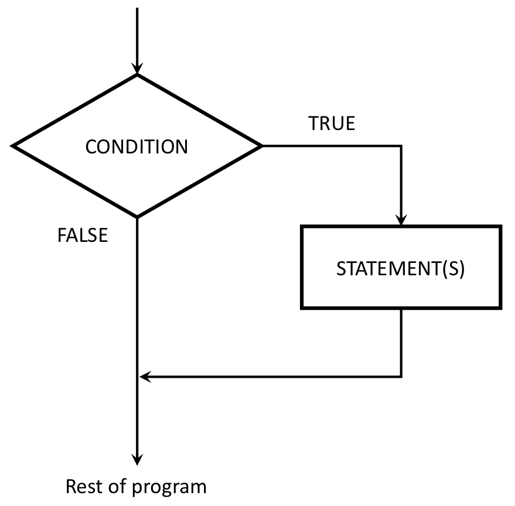
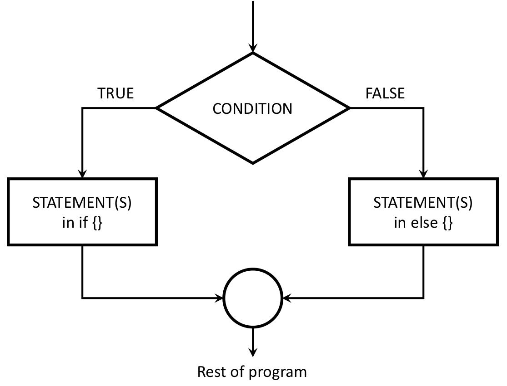
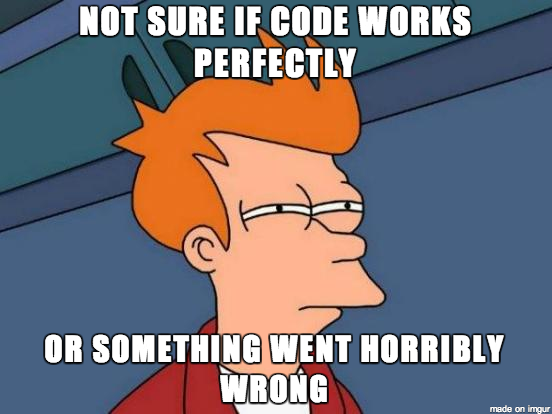

# Updates

---
# "Flow Control"

### Flow control is code that alters the otherwise linear flow of operations in a program.
 
--
### This week:

- `if` statements 
- `else` statements 
<br>

--

### Next week:

- `for` loops
- `while` loops
- `break` statements 
- `next` statements 

---
# The `if` statement

--
### Basic format:
<br>
.pull-left[
```{r, eval=FALSE}
if ( CONDITION ) {
    STATEMENT1
    STATEMENT2
    ETC
}
```
]
--
.pull-right[
Here's the general idea:


]
---
# Practice: What will this return?

```{r, eval=FALSE}
f <- function(x) {
    cat("A")
    if (x == 0) {
        cat("B")
        cat("C")
    }
    cat("D")
}
f(1)
f(0)
```

--
```{r, echo=FALSE}
f <- function(x) {
    cat("A")
    if (x == 0) {
        cat("B")
        cat("C")
    }
    cat("D")
}
```
```{r}
f(1)
f(0)
```

---
# Example: Absolute value

### Write the function `absValue()` that returns the absolute value of a number.
<br>

--
```{r}
absValue <- function(x) {
    if (x < 0) {x = -1*x}
    return(x)
}
```
```{r}
absValue(7)  # Returns 7
absValue(-7) # Also returns 7
```

---
# Adding an `else` to an `if`

--
### Basic format:
<br>
.pull-left[

```{r, eval=FALSE}
if ( CONDITION ) {
  STATEMENT1
  STATEMENT2
  ETC
} else {
  STATEMENT3
  STATEMENT4
  ETC
}
```
]

--
.pull-right[
Here's the general idea:


]

---
# Example: What will this return?

[2 minutes](https://www.youtube.com/watch?v=48z7nQaehWI) - no typing!

--
.pull-left[
```{r, eval=FALSE}
f <- function(x) {
    cat("A")
    if (x == 0) {
        cat("B")
        cat("C")
    } else {
        cat("D")
        if (x == 1) {
            cat("E")
        } else {
            cat("F")
        }
    }
    cat("G")
}
f(0)
f(1)
f(2)
```
]

--
.pull-right[
```{r, echo=FALSE}
f <- function(x) {
    cat("A")
    if (x == 0) {
        cat("B")
        cat("C")
    } else {
        cat("D")
        if (x == 1) {
            cat("E")
        } else {
            cat("F")
        }
    }
    cat("G")
}
```
```{r}
f(0)
f(1)
f(2)
```
]
---
# `else if` chains

Often times you'll need to check for more than one condition. 

"Bracketing" problems (like setting grades) are a good example. 

--
.pull-left[
```{r}
getLetterGrade <- function(score) {
    if (score >= 90) {
        grade = "A"
    } else if (score >= 80) {
        grade = "B"
    } else if (score >= 70) {
        grade = "C"
    } else if (score >= 60) {
        grade = "D"
    } else {
        grade = "F"
    }
    return(grade)
}
```
]

--
.pull-right[
```{r}
cat(" 99 -->", getLetterGrade(99))
cat(" 88 -->", getLetterGrade(88))
cat(" 70 -->", getLetterGrade(70))
cat(" 61 -->", getLetterGrade(61))
cat(" 22 -->", getLetterGrade(22))
```
]

---
# Practice - No typing! [10 minutes]() 

.pull-left[
```{r, eval = FALSE}
f1 <- function(x) {
    x = x + 1
    if ((x %% 2) == 0) {
        x = x - 1
    }
    y = 2*x
    cat(y, '\n')
}
f2 <- function(x) {
    if ((x %% 3) == 0) {
        cat('woo!\n')
        cat(x %/% 3)
    }
    cat(x %% 2, '\n')
}
```
]
.pull-right[

```{r, eval = FALSE}
f <- function(x) {
    if (x > 0) {
        cat('cat')
        x = 2*x
    } else if (x <= 0) {
        x = abs(x)
        cat('tac')
    }
    cat(x , '\n')
}
```

Write the output of this code by hand:

```{r, eval = FALSE}
cat(f1(7))
cat(f1(12))
cat(f2(9))
cat(f2(11))
cat(f3(-9))
cat(f3(15))
```
]

---
# Why write test functions?

<br>
<center>

</center>

--
- ### They help you understand the problem
- ### They verify that a function is working as expected

---
# Test function "syntax"

--
### Basic format:

```{r, eval=FALSE}
functionName <- function(ARG1, ARG2,...) {
    STATEMENTS 
    return(VALUE)
}

testFunctionName <- function() {
    cat("Testing functionName()...")
    <insert test cases>
    cat("Passed!\n")
}
```

---
# Test case types

--
- **Normal Cases**: Typical inputs.

--
- **Large Cases**: Typical input, larger than usual. 

--
- **Edge Cases**: Pairs of inputs that bound important points, e.g., if checking whether `n < 2`, two edge cases are when `n = 1.99`, `n = 2`.

--
- **Special Cases**: Negative numbers, `0` and `1` for integers, the empty string (`""`), and different type inputs, e.g. `"2"` instead of `2`.

--
- **Varying Results**: Cover multiple possible results, e.g. both `TRUE` and `FALSE` outcomes. 

---
# Testing with `stopifnot()`

`stopifnot()` stops the function if whatever is inside the `()` is not `TRUE`.

--
Example:
```{r}
isEvenNumber <- function(n) {
    return((n %% 2) == 0)
}
```

--
Test cases:
- `isEvenNumber(42)` should be `TRUE`
- `isEvenNumber(43)` should be `FALSE`
<br>

--

```{r}
testIsEvenNumber <- function() {
    cat("Testing isEvenNumber()... ")
    stopifnot(isEvenNumber(42) == TRUE)
    stopifnot(isEvenNumber(43) == FALSE)
    cat("Passed!\n")
}
```

--
```{r}
testIsEvenNumber()
```

---
# Testing function inputs

--
What if we gave `isEvenNumber()` the wrong input type?
```{r error=TRUE}
isEvenNumber('42')
```

--
An improved function that checks inputs:

```{r}
isEvenNumber <- function(n) {
    if (! is.numeric(n)) { return(FALSE) }
    return((n %% 2) == 0)
}
```

--
Now add more test cases:

```{r}
testIsEvenNumber <- function() {
    cat("Testing isEvenNumber()... ")
    stopifnot(isEvenNumber(42) == TRUE)
    stopifnot(isEvenNumber(43) == FALSE)
    stopifnot(isEvenNumber('not_a_number') == FALSE)
    cat("Passed!\n")
}
```


--- 
# Group Practice

## `isPositiveMultipleOf4Or7(n)`

### a)

Write the function `isPositiveMultipleOf4Or7(n)` that returns `TRUE` if `n` is a positive multiple of 4 or 7 and `FALSE` otherwise. Note than `n` could be any data type.

### b)

Write the test function `testIsPositiveMultipleOf4Or7()` that tests the function `isPositiveMultipleOf4Or7(n)` for a variety of values of `n`. Consider cases that you might not expect, such as cases where `n` is not a number.
