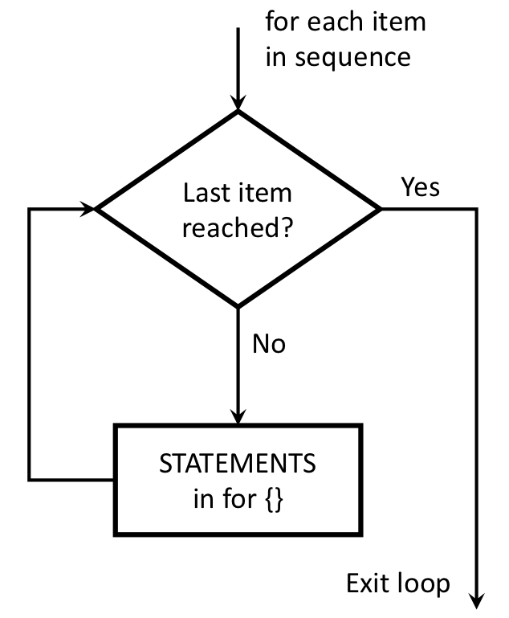
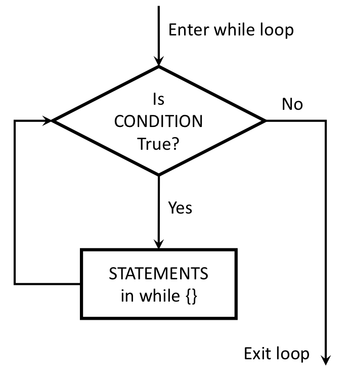

# Announcements

--
###What's with this `+` sign in the console?

---
# "Flow Control"

### Flow control is code that alters the otherwise linear flow of operations in a program.
 
--
### Last week:

- `if` statements 
- `else` statements 
<br>

--

### This week:

- `for` loops
- `while` loops
- `break` statements 
- `next` statements 

---
# The `for` loop

--
<br>
.pull-left[
### Basic format:
```{r, eval=FALSE}
for (VALUE in SEQUENCE) {
  STATEMENT1
  STATEMENT2
  ETC
}
```
]
--
.pull-right[
Here's the general idea:


]

---
# Making a sequence

--
### (Side note: these are vectors...that's next week - read ahead!)

--
### Two ways to make a sequence:

--
### 1. Use the `seq()` function
### 2. Use the `:` operator 

<br>

--
```{r}
seq(1, 10)
```

--
```{r}
seq(1, 10, 2)
```

--
```{r}
1:10
```
---
# Sequences don't have to be integers 

--
```{r, eval=FALSE}
1.5:5.5
```
```{r, echo=FALSE}
1.5:5.5
```

--
```{r, eval=FALSE}
seq(1.2, 6, 0.4)
```
```{r, echo=FALSE}
seq(1.2, 6, 0.4)
```

--
You can also loop over a vector of strings (more on vectors next week!)
```{r}
x <- rep('oh hai!', 3)
x
```
--
```{r, eval=FALSE}
for (i in x) {
    cat(i, '\n')
}
```
```
oh hai! 
oh hai! 
oh hai! 
```

---
# Practice: What will this return?

[60 seconds](https://www.youtube.com/watch?v=CH50zuS8DD0) - no typing!

```{r, eval=FALSE}
for (i in 1:5) {
    if ((i %% 2) == 0) {
        cat('--')
    } else if ((i %% 3) == 0) {
        cat('----')
    }
    cat(i, '\n')
}
```
<br>

--
```
1 
--2 
----3 
--4 
5 
```

---
# Practice: What will this return?

[60 seconds](https://www.youtube.com/watch?v=CH50zuS8DD0) - no typing!

```{r, eval=FALSE}
n <- 6
for (i in seq(n)) {
    cat('|')
    for (j in seq(1, n, 2)) {
        cat('*')
    }
    cat('|', '\n')
}
```

<br>

--
```
--***-- 
--***-- 
--***-- 
--***-- 
--***-- 
--***-- 
```

---
# Group practice: sum from `m` to `n`

[20 minutes](https://www.youtube.com/watch?v=kxGWsHYITAw) - In groups of 4, write the following functions:

1) `sumFromMToN(m, n)`: Write a function that sums the total of the integers between `m` and `n`. **Bonus**: Try solving this without a loop (it's possible - Google it!).

- `sumFromMToN(5, 10) == (5+6+7+8+9+10)`
- `sumFromMToN(1, 1) == 1`

2) `sumOfOddsFromMToN(m, n)`: Write a function that sums every _odd_ integer between `m` and `n`.

- `sumOfOddsFromMToN(4, 10) == (5 + 7 + 9)`
- `sumOfOddsFromMToN(5, 9) == (5 + 7 + 9)`
    
3) `sumEveryKthFromMToN(m, n, k)`: Write a function to sum every kth integer between `m` and `n`.

- `sumEveryKthFromMToN(5, 20, 7) == (5 + 12 + 19)`
- `sumEveryKthFromMToN(1, 10, 2) == (1 + 3 + 5 + 7 + 9)`
- `sumEveryKthFromMToN(0, 0, 1) == 0`


---
# `break` and `next`


---
# The `while` loop

A friend calls her programmer roommate and says, "while you're out, buy some milk"...

...her roommate never returned home.


---
# The `while` loop

<br>
.pull-left[
### Basic format:
```{r, eval=FALSE}
while (CONDITION) {
  STATEMENT1
  STATEMENT2
  ETC
}
```
]
--
.pull-right[
Here's the general idea:


]

---
# `for` vs. `while`

.pull-left[
### Use `for` loops when there is a _known_ number of iterations. 
]
.pull-right[
### Use `while` loops when there is an _unknown_ number of iterations.
]

---
# Practice: What will this return?

[60 seconds](https://www.youtube.com/watch?v=CH50zuS8DD0) - no typing!

.pull-left[
```{r}
f <- function(x) {
    n = 1
    while (n < x) {
        cat(n, '\n')
        n = 2*n
    }
}
```
```{r, eval=FALSE}
f(5)
f(10)
f(50)
```
]

--
.pull-right[
```{r}
f(5)
f(10)
f(50)
```
]

---
# Group practice

[20 minutes](https://www.youtube.com/watch?v=kxGWsHYITAw) - In groups of 4, write the following functions:

.pull-left[
1) `isMultipleOf4Or7(n)`

Write a function that returns `TRUE` if `n` is a multiple of 4 or 7 and `FALSE` otherwise. Here's some test cases:

- `isMultipleOf4Or7(0) == FALSE`
- `isMultipleOf4Or7(1) == FALSE`
- `isMultipleOf4Or7(-7) == FALSE`
- `isMultipleOf4Or7(4) == TRUE`
- `isMultipleOf4Or7(7) == TRUE`
- `isMultipleOf4Or7(28) == TRUE`
- `isMultipleOf4Or7('notANumer') == FALSE`

]

.pull-right[

2) `nthMultipleOf4Or7(n)`

Write a function that returns the nth positive integer that is a multiple of either 4 or 7. Here's some test cases:

- `nthMultipleOf4Or7(1) == 4`
- `nthMultipleOf4Or7(2) == 7`
- `nthMultipleOf4Or7(3) == 8`
- `nthMultipleOf4Or7(4) == 12`
- `nthMultipleOf4Or7(5) == 14`
- `nthMultipleOf4Or7(6) == 16`
- `nthMultipleOf4Or7(10) == 28`
]

---
# Group practice - Prime Numbers

[20 minutes](https://www.youtube.com/watch?v=kxGWsHYITAw) - In groups of 4, write the following functions:

.pull-left[
1) `isPrime(n)`

Write a function that takes a non-negative integer, `n`, and returns `TRUE` if it is a prime number and `FALSE` otherwise. Here's a test function:

```{r, eval=FALSE}
testIsPrime <- function() {
    cat("Testing isPrime()...")
    stopifnot(isPrime(1) == FALSE)
    stopifnot(isPrime(2) == TRUE)
    stopifnot(isPrime(7) == TRUE)
    stopifnot(isPrime(13) == TRUE)
    stopifnot(isPrime(14) == FALSE)
    cat("Passed!\n")
}
```
]

.pull-right[
2) `nthPrime(n)`

Write a function that takes a non-negative integer, `n`, and returns the nth prime number, where `nthPrime(1)` returns the first prime number (2). Here's a test function:

```{r, eval=FALSE}
testNthPrime <- function() {
    cat("Testing nthPrime()...")
    stopifnot(nthPrime(1) == 2)
    stopifnot(nthPrime(2) == 3)
    stopifnot(nthPrime(3) == 5)
    stopifnot(nthPrime(4) == 7)
    stopifnot(nthPrime(7) == 17)
    cat("Passed!\n")
}
```
]
