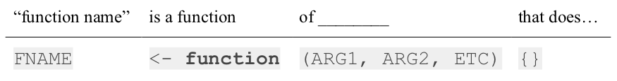

# Logical comparisons

Consider the following objects:

```{r}
w <- TRUE
x <- FALSE
y <- FALSE
z <- TRUE
```

Write code to answer the following questions:

a Write a logical statement that compares the objects `x`, `y`, and `z` and returns `TRUE`

b) Write a logical statement that compares the objects `x`, `y`, and `z` and returns `FALSE`

c) Fill in the correct relational operators to make this statement return `TRUE`:

`! (x __ y) & ! (z __ y)`

d) Fill in the correct relational operators to make this statement return `FALSE`:

`! (w __ y) | (z __ y)`

---
# Order of operations

What would this return?
```{r, eval=FALSE}
sqrt(1 + abs(-8))
```
--
```{r, echo=FALSE}
sqrt(1 + abs(-8))
```
<br>

--
What would this return?
```{r, eval=FALSE}
sqrt(2*64^0.5)
```
--
```{r, echo=FALSE}
sqrt(2*64^0.5)
```

---
# Numeric Data

Floats / Doubles:
```{r}
class(3.14)
typeof(3.14)
```
<br>
<br>

"Integers":
```{r}
class(3)
typeof(3)
```

---
# Actual Integers

```{r}
class(3L)
typeof(3L)
```
<br>

--
Check if a number is an "integer" in value:
```{r}
is.integer(3)
```

--
```{r}
3 == as.integer(3)
```

--
```{r}
3 == 3L
```

---
# Logical Data

`TRUE` or `FALSE`

--
```{r}
x <- 1
y <- 2
```

--
```{r}
x > y # Is x greater than y?
```

--
```{r}
x == y
```

---
# Character Data

Things in quotes (which we call, "strings")

```{r}
s <- '3.14'
class(s)
```
<br>
<br>

--
What happens if we do this?
```{r, eval=FALSE}
s + 7
```
--
```{r, error=TRUE, echo=FALSE}
s + 7
```

--
```{r}
a_number <- 3.14
as.character(a_number)
```

---
# Integer division

Integer division drops the remainder

```{r}
4 / 3 # Regular division
4 %/% 3 # Integer division
```
<br>

--
What will this return?
```{r, eval=FALSE}
4 %/% 5
```
--
```{r, echo=FALSE}
4 %/% 5
```
<br>

--
What will this return?
```{r, eval=FALSE}
4 %/% 4
```
--
```{r, echo=FALSE}
4 %/% 4
```

---
# Modulus operator

Modulus returns the remainder after doing integer division

```{r}
5 %% 3
3.1415 %% 3
```

<br>

--
What will this return?
```{r, eval=FALSE}
4 %% 5
```
--
```{r, echo=FALSE}
4 %% 5
```
<br>

--
What will this return?
```{r, eval=FALSE}
4 %% 4
```
--
```{r, echo=FALSE}
4 %% 4
```

---
# Number "chopping"

"Chopping" with orders of 10:

.pull-left[

The mod operator (`%%`) "chops" a number and returns everything to the _right_

```{r}
123456 %% 1
123456 %% 10
123456 %% 100
```

]

.pull-right[

The integer divide operator (`%/%`) "chops" a number and returns everything to the _left_

```{r}
123456 %/% 1
123456 %/% 10
123456 %/% 100
```

]

---
# Functions

```{r eval=FALSE}
FNAME <- function(ARG1, ARG2, ETC) {
    STATEMENT1
    STATEMENT2
    return(VALUE)
}
```
<br>

--
How I remember this:


<br>
<br>

---
# Test Functions

```{r eval=FALSE}
testFNAME <- function() {
    cat('Testing FNAME()...')
    # Insert tests here
    stopifnot(FNAME(ARG1, ARG2, ETC) == TRUE)
    cat('Passed!')
}
```

`stopifnot()` stops the function if its argument is not `TRUE`.

---
# The `if` statement

--
### Basic format:
<br>
.pull-left[
```{r, eval=FALSE}
if ( CONDITION ) {
    STATEMENT1
    STATEMENT2
    ETC
}
```
]
--
.pull-right[
Here's the general idea:


]

---
# Use `if` statements to filter function inputs

Write the function `isEvenNumber(n)` that returns `TRUE` if `n` is an even number and `FALSE` otherwise. If `n` is not a number, the function should return `FALSE` instead of causing an error.

Test cases:
- `isEvenNumber(42) == TRUE`
- `isEvenNumber(43) == FALSE`
- `isEvenNumber('not a number') == FALSE`

--
```{r, eval=FALSE}
isEvenNumber <- function(n) {
    return((n %% 2) == 0)
}
```

--
```{r, eval=FALSE}
isEvenNumber <- function(n) {
    if (! is.numeric(n)) { return(FALSE) }
    if (n != as.integer(n)) { return(FALSE) }
    return((n %% 2) == 0)
}
```

---
# The `almostEqual()` function

```{r}
almostEqual <- function(d1, d2) {
    epsilon = 0.00001
    return(abs(d1-d2) <= epsilon)
}
```

--
```{r}
0.1 + 0.2 == 0.3
```

--
```{r}
almostEqual(0.1 + 0.2, 0.3)
```

---
# Iteration review: loop over a sequence
```{r}
seq(5)
```

--
.pull-left[
### `for` loop
<br>

```{r}
for (i in seq(5)) {
    cat(i, '\n')
}
```
]
--
.pull-right[
### `while` loop
<br>

```{r}
i <- 1
while (i <= 5) {
    cat(i, '\n')
    i <- i + 1
}
```
]

---
# Search for something in a sequence

```{r}
seq(5)
```

### Count of **even** numbers in sequence:

--
.pull-left[
### `for` loop
<br>

```{r}
count <- 0
for (i in seq(5)) {
    if (i %% 2 == 0) {
        count <- count + 1
    }
}
count
```
]
--
.pull-right[
### `while` loop
<br>

```{r}
count <- 0
i <- 1
while (i <= 5) {
    if (i %% 2 == 0) {
        count <- count + 1
    }
    i <- i + 1
}
count
```
]

---
# Making a sequence

### 1. Use the `seq()` function
### 2. Use the `:` operator
<br>

--
```{r}
seq(1, 10)
```

--
```{r}
seq(1, 10, 2)
```

--
```{r}
1:10
```

---
# `break` and `next`

### `break`

**Note**: `break` doesn't require `()`
--
.pull-left[

Forces a loop to stop and "break" out of the loop.

```{r, eval=FALSE}
for (val in 1:5) {
    if (val == 3) {
        break
    }
    cat(val, '\n')
}
```

```
1
2
```
]

--
.pull-right[

In a nested loop:

```{r, eval=FALSE}
for (i in 1:3) {
  cat('*')
    for (j in 1:3) {
        if (j == 3) {
            break
        }
        cat(j, '\n')
    }
}
```

```
*1
2
*1
2
*1
2
```
]

---
# `break` and `next`

### `next`

--
.pull-left[

Skips to the _next_ iteration of a loop

```{r, eval=FALSE}
for (val in 1:5) {
    if (val == 3) {
        next
    }
    cat(val, '\n')
}
```

```
1
2
4
5
```

]

--
.pull-right[

In a nested loop:

```{r, eval=FALSE}
for (i in 1:3) {
  cat('*')
    for (j in 1:3) {
        if (j == 2) {
            next
        }
        cat(j, '\n')
    }
}
```

```
*1
3
*1
3
*1
3
```
]

---
# `for` vs. `while`

.pull-left[
### Use `for` loops when there is a _known_ number of iterations.
]
.pull-right[
### Use `while` loops when there is an _unknown_ number of iterations.
]

---
# Vectors

The universal vector generator: `c()`

--
```{r}
# Numeric vectors
x <- c(1, 2, 3)
x
```
--
```{r}
# Character vectors
y <- c('one', 'two', 'three')
y
```
--
```{r}
# Logical vectors
y <- c(TRUE, FALSE, TRUE)
y
```

---
# Elements in vectors must be the same type

--
If a vector has a _single_ character element, R makes everything a **character**:
--
```{r}
c(1, 2, "3")
```
--
```{r}
c(TRUE, FALSE, "TRUE")
```
<br>

--
If a vector has numeric and logical elements, R makes everything a **number**:
--
```{r}
c(1, 2, TRUE, FALSE)
```
<br>

--
If a vector has integers and floats, R makes everything a **float**:
```{r}
c(1L, 2, pi)
```

---
# Using vectors instead of a loop: Summation

```{r}
x <- 1:10
x
```

--
**Using a loop**:
```{r}
total <- 0
for (item in x) {
    total <- total + item
}
total
```
<br>

--
**Using the `sum()` function**:
```{r}
sum(x)
```

---
# Vector slicing wit brackets `[]`

```{r}
x <- seq(1, 10)
x
```
--
```{r}
x[1] # Returns the first element
```
--
```{r}
x[3] # Returns the third element
```
--
```{r}
x[1:3]  # Returns the first three elements
```
--
```{r}
x[c(2, 7)] # Returns the 2nd and 7th elements
```
--
```{r}
x[length(x)] # Returns the last element
```

---
# Use negative integers to _remove_ elements

```{r}
x <- seq(1, 10)
x
```
--
```{r}
x[-1] # Returns everything except the first element
```
--
```{r}
x[-1:-3]  # Returns everything except the first three elements
```
--
```{r}
x[-c(2, 7)] # Returns everything except the 2nd and 7th elements
```
--
```{r}
x[-length(x)] # Returns everything except the last elements
```

---
# Logical indices

--
```{r}
x <- seq(10, 1)
x
```

--
Create a logical vector:
```{r}
x > 5
```

--
Use logical vector in brackets to filter elements:
```{r}
x[x > 5]
```

---
# Comparing vectors

Check if 2 vectors are the same:

```{r}
x <- c(1, 2, 3)
y <- c(1, 2, 3)
```
```{r, eval=FALSE}
x == y
```
--
```{r, echo=FALSE}
x == y
```
<br>

--
To check if _all_ elements are the same, use `all()`:
```{r}
all(x == y)
```

---
# Comparing vectors

To check if _any_ elements are the same, use `any()`:

--
```{r}
a <- c(1, 2, 3)
b <- c(-1, 2,-3)
a == b
```
--
```{r}
all(a == b)
```
--
```{r}
any(a == b)
```

