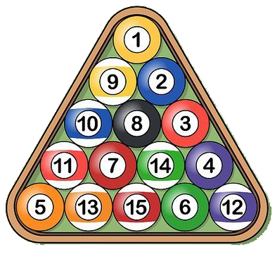
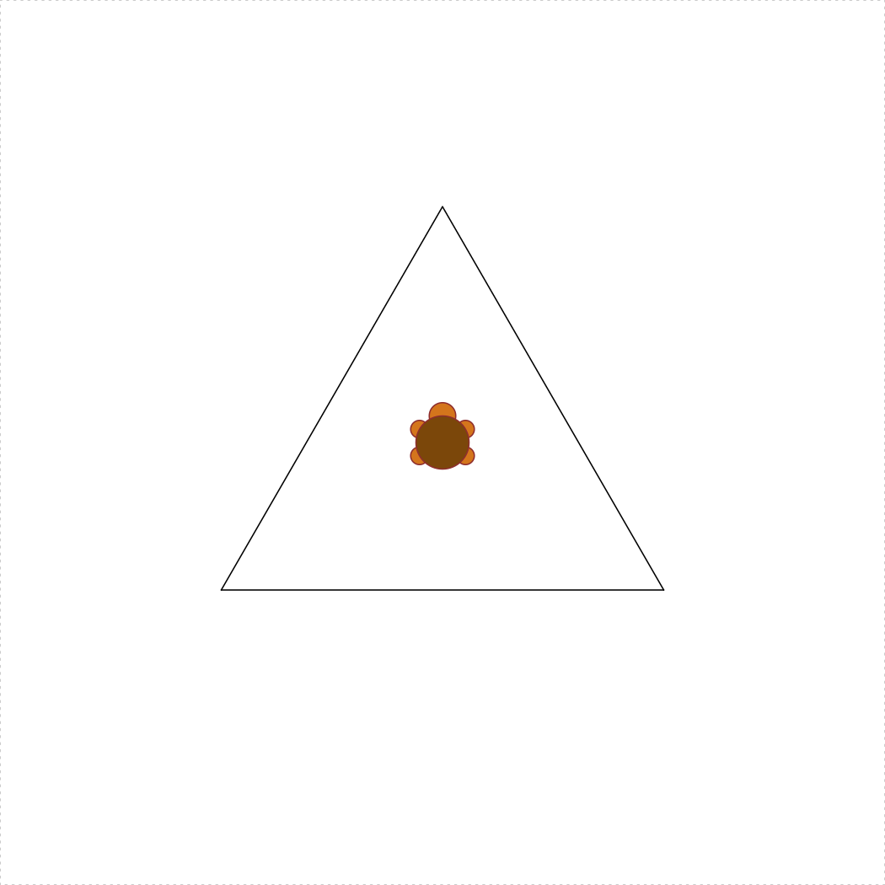

**Due**: Sunday, 22-Sept. at 8pm

**Rules**:

- Problems marked **SOLO** may not be worked on with other classmates, though you may consult instructors for help.
- For problems marked **COLLABORATIVE**, you may work in groups of up to 3 students who are in this course this semester (and then with nobody else except the course instructors). You may not split up the work -- everyone must work on every problem. And you may not simply copy any code but rather truly work together.
- Even though you work collaboratively, you still must submit your own solutions.

**Instructions**:

1) Before beginning this assignment, be sure to have read the [Getting Started](L1.2-getting-started.html), [Programming Basics](L2-programming-basics.html), and [Functions](L3-functions.html) lessons.

2) Open RStudio and create a new project called "hw2-lastName", replacing "lastName" with your last name.

3) Download the [hw2.R template script](https://github.com/emse6574-gwu/2019-Fall/raw/gh-pages/hw/hw2-template.R) and place it in RStudio project folder you just created.

4) Fill out your name, GW Net ID, and the names of anyone you worked with in the header of the "hw2.R" file.

5) Type all of your answers to the questions below in the "hw2.R" script.

6) After completing the questions, create a zip file of all files in your R project folder for this assignment.

7) Submit the zip file on Blackboard by the due deadline.

---

**Write solutions to the following functions in your "hw2.R" script.**

Rules:

- You may **NOT** use loops on any of these functions.
- For functions 1-7, you may **NOT** use loops or conditionals

**Hint**: Read the [Getting Started Tips](L1.2-getting-started.html#tips), [Programming Basics Tips](L2-programming-basics.html#tips), and [Functions Tips](L3-functions.html#tips) - these could come in handy!

### 1) `integerSquareRoot(n)` [SOLO, 5 pts]

Given a non-negative integer `n`, return the integer value that is closest to its square root. For example, `integerSquareRoot(10)` returns `3`.

### 2) `fabricYards(inches)` [SOLO, 5 pts]

Fabric must be purchased in whole yards. Write a function that takes a non-negative number of inches of fabric desired, and returns the smallest number of whole yards of fabric that must be purchased.  Thus, `fabricYards(1)` is `1` (you need a full yard if you buy one inch) and `fabricYards(36)` is also `1`, but `fabricYards(37)` is `2`. Hint: There are 36 inches in a yard!

### 3) `fabricExcess(inches)` [SOLO, 5 pts]

Write a function that takes a non-negative number of inches of fabric desired and returns the number of inches of excess fabric that must be purchased (as purchases must be in whole yards). Thus, since you need a whole yard when you buy 1 inch, `fabricExcess(1)` is `35`. Similarly, `fabricExcess(36)` is `0`, and `fabricExcess(37)` is `35`.

Hint: there are (at least) two good ways to write this. One way involves a simple expression using one of the math operators we have learned. The other way uses `fabricYards(inches)` (which you just wrote!).

### 4) `distance(x1, y1, x2, y2)` [COLLABORATIVE, 10 pts]

Given four numeric values representing the points `(x1, y1)` and `(x2, y2)`, write the function `distance(x1, y1, x2, y2)` returns the Euclidean distance between those points.

### 5) `isRightTriangle(x1, y1, x2, y2, x3, y3)` [COLLABORATIVE, 10 pts]

Given six numeric values representing the points `(x1, y1)`, `(x2, y2)`, and `(x3, y3)`, return `TRUE` if the triangle formed by connecting the 3 points is a right triangle, and `FALSE` otherwise. You may wish to use the `distance(x1, y1, x2, y2)` function as a helper function. You may ignore the case where the 3 points are collinear (and so do not form a triangle). Hint: [Heron's Formula](https://en.wikipedia.org/wiki/Heron%27s_formula).

### 6) `triangleArea(x1, y1, x2, y2, x3, y3)` [COLLABORATIVE, 10 pts]

Given six numeric values representing the points `(x1, y1)`, `(x2, y2)`, and `(x3, y3)`, return the area of the triangle formed by connecting the 3 points. You may wish to use the `distance(x1, y1, x2, y2)` function as a helper function. You may ignore the case where the 3 points are collinear (and so do not form a triangle). Hint: [Heron's Formula](https://en.wikipedia.org/wiki/Heron%27s_formula).

### 7) `numberOfPoolBalls(rows)` [COLLABORATIVE, 10 pts]

{ width=150 }

Pool balls are arranged in rows where the first row contains 1 pool ball and each row contains 1 more pool ball than the previous row. Thus, for example, 3 rows contain 6 total pool balls (1+2+3). With this in mind, write the function numberOfPoolBalls(rows) that takes a non-negative integer value, the number of rows, and returns another int value, the number of pool balls in that number of full rows. For example, `numberOfPoolBalls(3)` returns `6`. We will not limit our analysis to a "rack" of 15 balls; rather, our pool table can contain an unlimited number of rows. Do not use loops. Hint: For this problem you should research [Triangular Numbers](https://en.wikipedia.org/wiki/Triangular_number).

### 8) `isEvenPositiveInt(x)` [COLLABORATIVE, 15 pts]

Given an arbitrary value `x`, return `TRUE` if it is an integer, and it is positive, and it is even (all 3 must be true), or `FALSE` otherwise. Do not crash if the value is not an integer. So, `isEvenPositiveInt("yikes!")` returns `FALSE` (rather than crashing), and `isEvenPositiveInt(123456)` returns `TRUE`. For this problem, consider integer _values_ to be "integers". So, both `3` and `3L` are to be considered integers, even though R will return `FALSE` if you type `is.integer(3)` since `3` is technically a double.

### 9) `getTheCents(n)` [COLLABORATIVE, 15 pts]

Write the function `getTheCents(n)` which takes a value `n` (which represents a payment in US dollars) and returns the number of cents in the payment. For example, if n is 2.45, the function should return 45. If n is an integer, the function should return 0, as it has 0 cents; if it isn't a number, it should return `NULL`, because a non-number payment make no cents (ha!). If the payment has partial cents (for example, 3.953), it should be rounded to the nearest cent (in this example, 95 cents).

### 10) `turtleSquare(s)` [COLLABORATIVE, 15 pts]

Write the function `turtleSquare(s)` which uses the `TurtleGraphics` library to draw a square with side length `s < 100`. The square should be centered in the turtle's terrarium. **Note**: Do not put the `turtle_init()` command inside your function - the turtle must be "initialized" inside the terrarium before calling your `turtleSquare(s)` function. For example, the code below produces a square with side length of 50:

```{r, eval=FALSE}
library(TurtleGraphics)
turtle_init()
turtle_do({
    turtleSquare(50)
})
```
{ width=456 }

---

### Bonus Credit 1) `numberOfPoolBallRows(balls)` [SOLO, 5 pts]

This problem is the inverse of the `numberOfPoolBalls(rows)` problem. In this case, return the number of rows required for the given number of pool balls. Thus, `numberOfPoolBallRows(6)` returns `3`. Note that if any balls must be in a row, then you count that row, and so `numberOfPoolBallRows(7)` returns `4` (since the 4th row must have a single ball in it).

### Bonus Credit 2) `turtleTriangle(s)` [SOLO, 5 pts]

Write the function `turtleTriangle(s)` which uses the `TurtleGraphics` library to draw an equilateral triangle with side length `s < 100`. The triangle should be centered in the turtle's terrarium. Hint: Getting the triangle centered is the tricky part - you may want to read more about [equilateral triangles](https://en.wikipedia.org/wiki/Equilateral_triangle) and [apothems](https://en.wikipedia.org/wiki/Apothem). The code below produces a triangle with side length of 50:

```{r, eval=FALSE}
library(TurtleGraphics)
turtle_init()
turtle_do({
    turtleTriangle(50)
})
```
{ width=456 }
