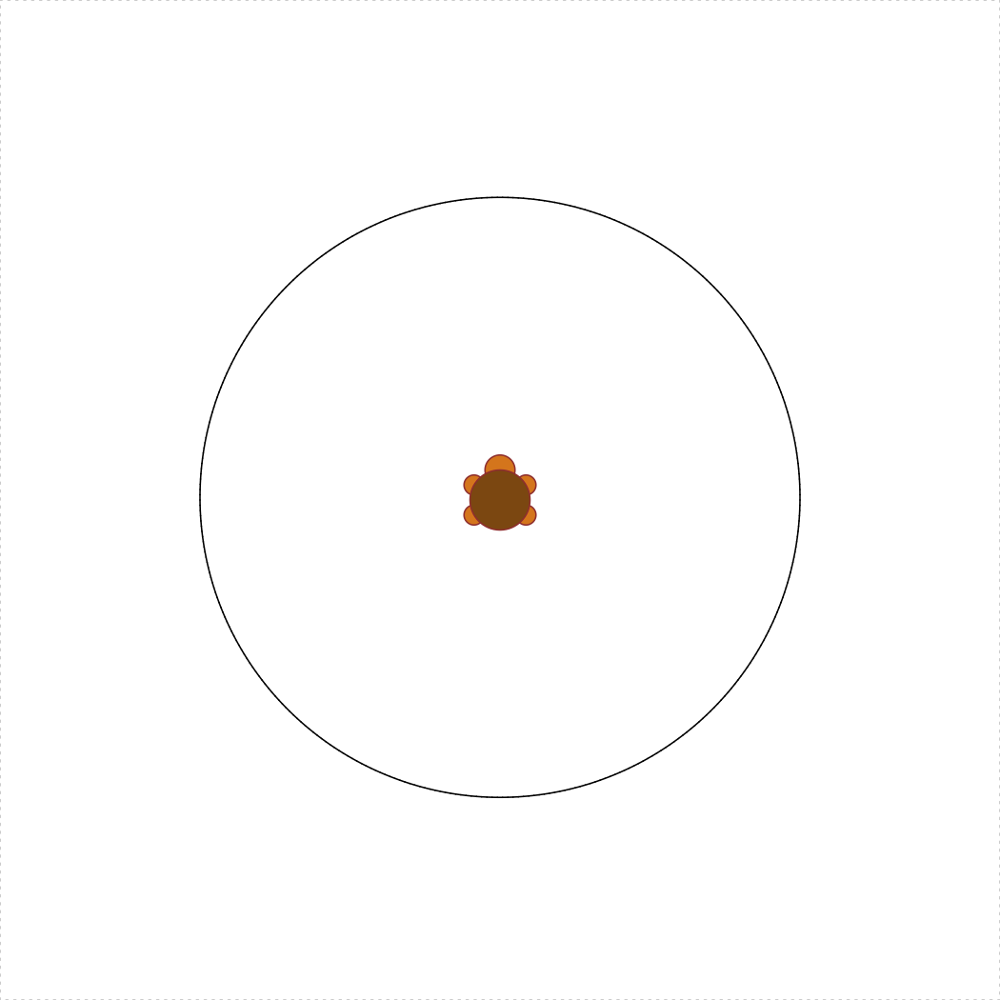
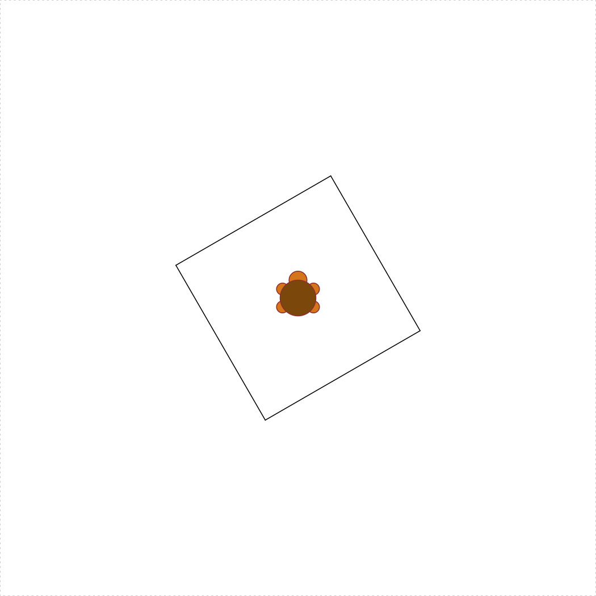
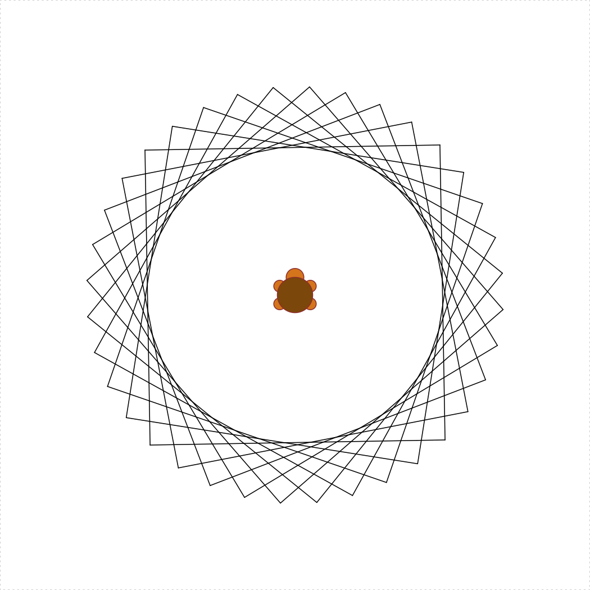

**Due**: Sunday, 06-Oct. at 8pm

**Rules**:

- Problems marked **SOLO** may not be worked on with other classmates, though you may consult instructors for help.
- For problems marked **COLLABORATIVE**, you may work in groups of up to 3 students who are in this course this semester (and then with nobody else except the course instructors). You may not split up the work -- everyone must work on every problem. And you may not simply copy any code but rather truly work together.
- Even though you work collaboratively, you still must submit your own solutions.

**Instructions**:

1) Before beginning this assignment, be sure to have read the [Loops](L5-loops.html) and [Vectors](L6-vectors.html) lessons.

2) Open RStudio and create a new project called "hw3-lastName", replacing "lastName" with your last name.

3) Download the [hw3.R template script](https://github.com/emse6574-gwu/2019-Fall/raw/gh-pages/hw/hw3-template.R){target="_blank"} and place it in RStudio project folder you just created.

4) Fill out your name, GW Net ID, and the names of anyone you worked with in the header of the "hw3.R" file.

5) Type all of your answers to the questions below in the "hw3.R" script.

6) After completing the questions, create a zip file of all files in your R project folder for this assignment.

7) Submit the zip file on Blackboard by the due deadline.

---

**Write solutions to the following functions in your "hw3.R" script.**

Rules:

- You may **NOT** use strings for any of these functions.

### 1) `loopFactorial(n)` [SOLO, 5 pts]

Use a `for` loop to write the function `loopFactorial(n)` that should return `n!`, i.e. "n factorial", which is defined for all non-negative integers. For example, `3! = 3*2*1 = 6`, `4! = 4*3*2*1 = 24`, and `5! = 5*4*3*2*1 = 120`. Note that `0` is a special case, and `0! = 1`. Assume `n >= 0`.

### 2) `vectorFactorial(n)` [SOLO, 5 pts]

Write the function `vectorFactorial(n)`, which again computes the factorial of `n` but use vectors to avoid using a loop. Hint: there are some useful functions listed on the [vectors lesson page](L6-vectors.html#13_numeric_vectors) for performing operators on a vector.

### 3) `printStarTriangle(n)` [SOLO, 10 pts]

Write a function that prints a triangle of asterisks (`*`) where the number of asterisks in each row is equal to the row number. So, `printStarTriangle(5)` should print out:
```
*
**
***
****
*****
```

### 4) `nthHighestValue(n, x)` [SOLO, 10 pts]

Write a function to find the nth highest value in a given vector. For example, `nthHighestValue(1, c(1, 3, 5))` should return 5, because 5 is the 1st highest value in `x`, and `nthHighestValue(2, c(5, 1, 3))` should return 3 because it's the 2nd highest value in `x`. Assume only numeric inputs.

### 5) `numDigits(n)` [SOLO, 10 pts]

Write the function `numDigits(n)` that takes a _possibly-negative_ integer and returns the number of digits in it. So, `numDigits(12345)` returns `5`, `numDigits(0)` returns `1`, and `numDigits(-111)` returns `3`. One way you could do this would be to return `nchar(n)` (which converts the number to a string and returns the number of characters), but you cannot do that, since you may not use strings here! This can also be solved with logarithms, but seeing as this is "loops week", you should instead simply repeatedly remove the ones digit until you run out of digits.

## 6) Happy Numbers  [COLLABORATIVE]

**Background**: Read the first paragraph from the [Wikipedia page](https://en.wikipedia.org/wiki/Happy_number){target="_blank"} on happy numbers. After some thought, we see that no matter what number we start with, when we keep replacing the number by the sum of the squares of its digits, we'll always either arrive at 4 (unhappy) or at 1 (happy). With that in mind, we want to write the function `nthHappyNumber(n)`. However, to write that function, we'll first need to write `isHappyNumber(n)`, which determines whether a number is "happy" or not. And to right that function, we'll first need to write `sumOfSquaresOfDigits(n)`. And that's top-down design! Here we go...

### a) `sumOfSquaresOfDigits(n)` [10 pts]

Write the function `sumOfSquaresOfDigits(n)` which takes a non-negative integer, `n`, and returns the sum of the squares of its digits (assume that `n` will always be a positive integer, so no need to check for bad inputs).

### b) `isHappyNumber(n)` [10 pts]

Write the function `isHappyNumber(n)` which takes a _possibly-negative_ integer and returns `TRUE` if it is happy and `FALSE` otherwise. Note that all numbers less than 1 are not happy.

### c) `nthHappyNumber(n)` [10 pts]

Write the function `nthHappyNumber(n)` which takes a non-negative integer, `n`, and returns the nth happy number, where nthHappyNumber(1) returns the first happy number (1).

## 7) Turtle loops! [COLLABORATIVE]

### a) `turtleSquare(s)` _redux_ [5 pts]

Re-write the `turtleSquare(s)` function from [HW2](hw2-functions.html), but this time use a `for` loop to draw the sides of the square. The following code should produce a square with a side length of 50:

```{r, eval=FALSE}
library(TurtleGraphics)
turtle_init()
turtle_do({
    turtleSquare(50)
})
```
{ width=456 }

### b) `concentricTurtleSquares(spacing = 5)` [10 pts]

Write the function `concentricTurtleSquares(spacing)` that uses the `TurtleGraphics` library to draw concentric squares from the center of the terrarium and outward. The `spacing` argument determines the spacing between each square, and the default value should be `spacing = 5`. Also, `spacing >= 1`, and your function must not allow the turtle to escape the terrarium. Hint: you may want to use `turtleSquare(s)` as a helper function. The following code should produce concentric squares with a spacing of 5:

```{r, eval=FALSE}
library(TurtleGraphics)
turtle_init()
turtle_do({
    concentricTurtleSquares()
})
```
{ width=456 }

### c) `turtleCircle(r)` [15 pts]

Write the function `turtleCircle(r)` that uses the `TurtleGraphics` library to draw a circle with radius ` r < 50`. The circle should be centered in the turtle's terrarium. Hint: To get the circle centered, remember that a circle has 360 degrees, and the circumference of a circle is $2\pi r$. The following code should produce a circle with a radius of 30:

```{r, eval=FALSE}
library(TurtleGraphics)
turtle_init()
turtle_do({
    turtleCircle(30)
})
```
{ width=456 }

---

### Bonus Credit 1) `turtleSquareRotated(s, degrees)` [SOLO, 5 pts]

Write the function `turtleSquareRotated(s, degrees)` that uses the `TurtleGraphics` library to draw a square with side length `s < 100` and rotated by `degrees <= 180` counterclockwise from the horizontal plane. The rotated square should be centered in the turtle's terrarium. Hint: you're going to need to use the cosine (`cos()`) and sine (`sin()`) functions; in R, these functions take angles in **radians** (not degrees), so remember to convert your angles (180 degrees = $\pi$). The following code should produce a square with a side length of 30 and rotated by 30 degrees:

```{r, eval=FALSE}
library(TurtleGraphics)
turtle_init()
turtle_do({
    turtleSquareRotated(30, 30)
})
```
{ width=456 }

### Bonus Credit 2) `turtleSquareStar(s, degreeSpacing = 20)` [SOLO, 5 pts]

Write the function `turtleSquareStar(s, degreeSpacing)` that uses the `TurtleGraphics` library to draw a sequence of overlapping rotated squares with side length `s < 70` to form a star. The `degreeSpacing` argument determines the spacing in degrees between each rotated square, and the default value should be `degreeSpacing = 20`. Also, `spacing >= 1`, and your function must not allow the turtle to escape the terrarium. Hint: you may want to use `turtleSquareRotated(s, degrees)` as a helper function. The following code should produce the star of rotated squares with a side length of 50 and 20 degree spacings between each square:

```{r, eval=FALSE}
library(TurtleGraphics)
turtle_init()
turtle_do({
    turtleSquareStar(50, 20)
})
```
{ width=456 }


---

**Page sources**:

Some content on this page has been modified from other courses, including:

- CMU [15-112: Fundamentals of Programming](http://www.kosbie.net/cmu/spring-13/15-112/handouts/hw1.html)
